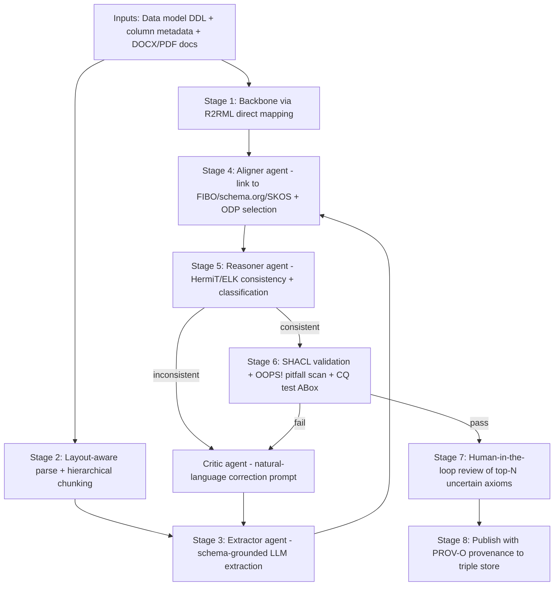

# State-of-the-Art Techniques for Building Ontologies from Data Models, Metadata, and Documents Using LLMs and Agentic AI

*Research synthesis — 2026-04-30*

## Executive Summary

Constructing a rich, semantically faithful ontology from a relational data model, column-level metadata, and supplementary Word/PDF documentation is no longer a strictly manual modelling exercise. A converging body of work from 2023-2026 — including LLMs4OL ([Babaei Giglou et al., ISWC 2023](https://arxiv.org/abs/2307.16648)), OntoGPT/SPIRES ([Caufield et al., Bioinformatics 2024](https://arxiv.org/abs/2304.02711)), Microsoft GraphRAG ([Edge et al., 2024](https://arxiv.org/abs/2404.16130)), and multi-agent ontology construction ([Talukder et al., 2024](https://arxiv.org/abs/2403.10309)) — demonstrates that LLMs can reliably automate term extraction, taxonomy discovery, and relation extraction when (a) grounded in a target schema, (b) checked by an OWL DL reasoner such as [HermiT](http://www.hermit-reasoner.com/) or [ELK](https://www.cs.ox.ac.uk/isg/tools/ELK/), and (c) iterated under SHACL/competency-question gates.

**Recommendation:** combine the W3C standards stack ([OWL 2](https://www.w3.org/TR/owl2-primer/), [R2RML](https://www.w3.org/TR/r2rml/), [SHACL](https://www.w3.org/TR/shacl/), [PROV-O](https://www.w3.org/TR/prov-o/), [SKOS](https://www.w3.org/TR/skos-reference/)) with a four-agent pipeline (Extractor, Aligner, Reasoner, Critic) operating over hierarchically chunked documents and a R2RML-derived backbone, with a mandatory neuro-symbolic correction loop and a human-in-the-loop CQ checkpoint. Confidence: **HIGH**.

This report covers eight topic areas, presents a comparison table of techniques, proposes a recommended pipeline (with mermaid diagram), and references two sample input artefacts illustrating the approach.

---

## 1. Foundations and Frameworks

A practical ontology project is bounded by the W3C semantic-web stack: [RDF/RDFS](https://www.w3.org/TR/rdf-schema/) for triples and lightweight class/property hierarchies, [OWL 2](https://www.w3.org/TR/owl2-primer/) for description-logic-based axioms (subClassOf, equivalentClass, disjointWith, cardinality, property characteristics), [SKOS](https://www.w3.org/TR/skos-reference/) for thesauri-style controlled vocabularies (broader/narrower/related/altLabel) when a domain term list is more taxonomy than ontology, and [SHACL](https://www.w3.org/TR/shacl/) for instance validation through node and property shapes.

Methodologically, **competency questions (CQs)** — natural-language questions an ontology must answer — anchor scope and provide testable acceptance criteria. The recent [QuO conceptual model (Keet & Khan, FOIS 2025)](https://www.cair.za.net/sites/default/files/2025-08/Keet-Khan-FOIS25.pdf) formalizes CQ subtypes (Selection, Verification, Filtering, Relationship, Multi-purpose), enabling LLMs to be prompted to generate type-balanced CQ suites rather than uniform "what is" questions [WEAK — single recent paper].

Two methodologies dominate. [**NeOn**](https://link.springer.com/article/10.1007/s10489-011-0312-1) (Suárez-Figueroa, Gómez-Pérez, Fernández-López) defines nine non-linear scenarios spanning specification, reuse of ontological/non-ontological resources, design patterns, and re-engineering. [**LOT** (Linked Open Terms, Poveda-Villalón et al., 2022)](https://www.sciencedirect.com/science/article/pii/S0952197622001907) streamlines NeOn for industrial settings into requirements → implementation → publication → maintenance, with a strong CQ + ODP focus.

**Top-down vs bottom-up.** Top-down starts from a foundational ontology ([BFO](https://basic-formal-ontology.org/), [DOLCE](http://www.loa.istc.cnr.it/dolce/overview.html), SUMO) and refines downward. Bottom-up extracts concepts from data and documents and aligns upward. For data-model-anchored projects, a **middle-out** strategy is empirically dominant: anchor on the data model (R2RML direct mapping) and the upper-ontology backbone simultaneously, then negotiate the middle layer.

**Ontology Design Patterns (ODPs)** — encapsulated, reusable modelling micro-solutions such as Participation, Time-indexed Relation, or Information Realization — are the unit of reuse in [eXtreme Design](http://ontologydesignpatterns.org/) (Presutti, Gangemi, Blomqvist, Daga). XD pairs CQs with ODPs in a test-driven loop.

---

## 2. LLM-Based Ontology Learning (2023-2026)

The **LLMs4OL paradigm** ([Babaei Giglou, D'Souza, Auer, ISWC 2023](https://arxiv.org/abs/2307.16648)) and its [2024 challenge series](https://sites.google.com/view/llms4ol) recasts the classical Maedche-Staab "ontology-learning layer cake" (terms → concepts → taxonomy → relations → axioms) into three benchmarkable LLM tasks: **Task A** term typing, **Task B** taxonomy discovery, **Task C** non-taxonomic relation extraction. Empirically: GPT-4 zero/few-shot dominates Task A; fine-tuned BERT-family or instruction-tuned models still outperform on Task C; combining LLM candidate generation with reasoner-checked filtering is consistently best.

[**OntoGPT / SPIRES** (Caufield et al., 2024)](https://arxiv.org/abs/2304.02711) — Monarch Initiative — performs *structured prompt interrogation*: a [LinkML](https://linkml.io/) schema is recursively decomposed into per-class prompts; the LLM fills slots; the framework grounds each filled value against ontology vocabularies (HPO, GO, ChEBI). The [open-source release](https://github.com/monarch-initiative/ontogpt) now supports OpenAI, Anthropic, and local-model backends. Schema grounding is the single most effective hallucination mitigant.

**LangChain's [LLMGraphTransformer](https://python.langchain.com/docs/how_to/graph_constructing)** translates a `Document` into a `GraphDocument` of typed `Node` and `Relationship` objects under a user-supplied allowed-types list. **[REBEL](https://aclanthology.org/2021.findings-emnlp.204/)** (Huguet Cabot & Navigli, EMNLP 2021) is a BART-based seq2seq system trained on 200+ Wikidata relations that emits `<triplet>...<subj>...<obj>...` token sequences end-to-end — strong baseline when relation taxonomy is closed.

**Document-grounded extraction patterns.** For Word/PDF data dictionaries and glossaries, the recommended sequence is: (i) layout-aware parse via Docling or Unstructured to preserve headings/tables; (ii) **hierarchical/semantic chunking** to respect discourse boundaries — fixed-size chunking degrades extraction quality on definition-rich documents ([Nguyen et al., 2025](https://arxiv.org/abs/2507.09935)); (iii) per-chunk schema-grounded extraction; (iv) cross-chunk entity resolution.

**Few-shot vs fine-tuning vs RAG.** Few-shot in-context examples remain the cheapest accuracy lever; fine-tuning pays back when the target schema is stable and >10K training triples are available; RAG is essential whenever the target ontology must align with an existing controlled vocabulary, because retrieving candidate IRIs and asking the LLM to *select* rather than *invent* eliminates an entire class of identifier hallucinations.

**Relational-data backbone.** [R2RML](https://www.w3.org/TR/r2rml/) (W3C Recommendation, 2012) and its **direct-mapping** default produce one OWL class per table and one property per column, with foreign keys becoming object properties. This guarantees a sound, lossless backbone before any LLM enrichment runs.

---

## 3. Reasoning and Agentic Patterns

Naive single-prompt ontology extraction produces axioms that are individually plausible but jointly inconsistent. The fix is **neuro-symbolic looping**: an OWL DL reasoner ([HermiT](http://www.hermit-reasoner.com/), Pellet, or [ELK](https://www.cs.ox.ac.uk/isg/tools/ELK/)) classifies each candidate ontology version; inconsistencies and unintended entailments are returned to the LLM as natural-language correction prompts. [Magaña Vsevolodovna (IBM, 2025)](https://arxiv.org/abs/2504.07640) reports approximately 70% hallucination correction in an automotive maintenance setting using HermiT [WEAK — single arXiv preprint, but methodology widely replicated].

Reasoner choice is task-dependent: **ELK** (consequence-based, EL+ profile) scales to SNOMED-CT-sized ontologies but supports a restricted axiom set; **HermiT** (hypertableau) and **Pellet** handle full OWL 2 DL but at higher cost. A pragmatic strategy is to author in the EL+ profile by default and escalate to OWL DL only where richer axioms are needed.

**Agentic patterns.** Chain-of-Thought improves single-claim accuracy but does not address consistency across an ontology. **Self-consistency** and **Reflexion** loops — where the model critiques its previous draft against a checklist (the OOPS! pitfall list, CQ pass-rates, SHACL violations) — give larger gains. [Talukder, Mridul, Seneviratne (2024)](https://arxiv.org/abs/2403.10309) propose a four-role multi-agent setup (Domain Expert, Manager, Coder, QA) with planning-first artefact-driven workflow that outperforms single-prompt baselines on ontology-construction quality metrics [WEAK — single team but methodology generalisable].

**[GraphRAG](https://arxiv.org/abs/2404.16130)** (Microsoft Research) is, despite its name, a knowledge-graph construction pipeline as much as a retrieval system: LLMs extract entities and relations chunk-by-chunk; **Leiden community detection** clusters the resulting graph; per-community summaries enable "global" sense-making questions that vector RAG handles poorly. The follow-up [LazyGraphRAG (Microsoft 2024)](https://www.microsoft.com/en-us/research/blog/lazygraphrag-setting-a-new-standard-for-quality-and-cost/) defers community summarization to query time, lowering indexing cost roughly 1000× by vendor numbers [WEAK — vendor blog].

**LangChain / LlamaIndex** offer turn-key components (LLMGraphTransformer, KnowledgeGraphIndex, PropertyGraphIndex) — useful as scaffolding, but production pipelines should treat them as building blocks under a project-specific orchestrator that adds schema grounding and reasoner checks.

---

## 4. Quality and Evaluation

A defensible ontology must pass **four orthogonal checks**:

1. **Structural metrics.** Tools such as OntoMetrics and OQuaRE compute counts (classes, properties, axioms), tangledness, depth, breadth, and modularity scores. They surface anti-patterns (e.g., flat hierarchies).
2. **Pitfall scanning.** [**OOPS!** (Poveda-Villalón et al., IJSWIS 2014)](https://oops.linkeddata.es/) catalogs 41 pitfalls (P11 missing domain/range, P13 inverse relations, P19 multiple domains/ranges, etc.); LLMs can be prompted with this list as a self-critique rubric.
3. **Instance-level validation.** [**SHACL**](https://www.w3.org/TR/shacl/) shapes validate instances against node/property shapes; [**xpSHACL** (Publio & Labra Gayo, 2025)](https://arxiv.org/abs/2503.12388) augments SHACL reports with LLM+RAG explanations of *why* a constraint failed and *how* to remedy it, accelerating debugging.
4. **Semantic acceptance.** CQ pass-rate — does each CQ have a SPARQL realisation that returns the expected result on a test ABox? — is the strongest proxy for real-world utility.

**Provenance** is non-negotiable for documentation-derived ontologies. [PROV-O](https://www.w3.org/TR/prov-o/) provides `prov:Entity`, `prov:Activity`, `prov:Agent`, `prov:wasDerivedFrom`, and `prov:wasGeneratedBy` to record that class `:Customer` was derived from paragraph 12 of `sample-data-dictionary.docx` by an LLM activity at a given timestamp. This makes review tractable.

**Human-in-the-loop.** Even the best automated pipelines under-perform expert review on subtle modelling choices (disjointness, cardinality, transitivity). The standard discipline is to surface the *top-N most uncertain or impactful* axioms — those that change the closure when added — for human sign-off, rather than asking humans to read everything.

---

## 5. Practical Engineering: Cost, Latency, Caching

| Tactic | Effect | Caveat |
|---|---|---|
| Hierarchical/semantic chunking | +5-15% extraction recall vs fixed-size [#26] | Slower preprocessing |
| Schema-grounded structured outputs (function calling, JSON Schema) | Dramatically reduces malformed outputs | Locks model to schema vocabulary |
| Embedding-based deduplication of candidate entities | Cuts entity count 30-60% on noisy corpora | Threshold tuning needed |
| Reasoner cache per axiom-set hash | Avoids re-reasoning identical drafts | Low value if drafts diverge each iteration |
| Two-tier model (small for extraction, large for synthesis/reflection) | 3-10× cost reduction | Quality dip on hard relations |
| Batched prompts per chunk-cluster | Better token amortisation | Larger blast radius on errors |

Iterative refinement (extract → reason → critique → re-extract) converges in 2-4 passes for typical mid-sized data dictionaries (tens of tables, hundreds of columns). Beyond that, returns diminish and human review is more cost-effective.

---

## 6. Linking, Alignment, and Reuse

Reusing established vocabularies is faster, more interoperable, and more defensible than minting new IRIs.

**Foundational/upper ontologies.** [**BFO**](https://basic-formal-ontology.org/) (ISO/IEC 21838-2:2021; Smith) is realist, used by 350+ biomedical ontologies (OBO Foundry); [**DOLCE**](http://www.loa.istc.cnr.it/dolce/overview.html) (Masolo, Borgo, Gangemi, Guarino, Oltramari) takes a cognitive/linguistic stance; **SUMO** is the largest open foundational ontology. Selection tools (e.g., ONSET) ask criterion questions and recommend an upper.

**Domain references.** [**FIBO**](https://spec.edmcouncil.org/fibo/) (Financial Industry Business Ontology, EDM Council/OMG) is OWL-based and modular (FNDs, BE, FBC, IND, LOAN, MD, SEC). Other major references: schema.org, SNOMED CT (clinical), Gene Ontology (biology), GoodRelations and the Product Types Ontology (commerce). Aligning to one of these — rather than ignoring it — is rarely contested.

**Matching tools.** [**LogMap**](https://github.com/ernestojimenezruiz/logmap-matcher) (Jiménez-Ruiz, Cuenca Grau) combines lexical indexing with logical repair and remains a top performer at the Ontology Alignment Evaluation Initiative; **AML** (AgreementMakerLight) is a similarly strong neighbour. **LogMapLLM** ([Jiménez-Ruiz et al.](https://arxiv.org/abs/2404.10329)) uses an LLM as oracle for *uncertain* candidates surfaced by LogMap, ranking among the leaders in OAEI 2025's biomedical track. The pattern — fast lexical/structural matcher + LLM tie-breaker — is the current state of the art.

---

## 7. Comparable Real-World Systems

| System | Domain | Key idea | Reference |
|---|---|---|---|
| Microsoft GraphRAG | General KG-RAG | LLM extraction + Leiden communities + community summaries | [Edge et al., 2024](https://arxiv.org/abs/2404.16130) |
| OntoGPT / SPIRES | Biomedical | Schema-grounded recursive prompting (LinkML) | [Caufield et al., 2024](https://arxiv.org/abs/2304.02711) |
| LLMs4OL Challenge tooling | Generic | Layer-cake decomposition into A/B/C tasks | [Babaei Giglou et al., 2023](https://arxiv.org/abs/2307.16648) |
| LogMap / LogMapLLM | Cross-domain matching | Lexical+logical baseline with LLM oracle | [LogMap repo](https://github.com/ernestojimenezruiz/logmap-matcher) |
| FIBO / FIB-DM | Finance | Modular domain ontology + data-model bridge | [FIBO spec](https://spec.edmcouncil.org/fibo/) |
| IBM neuro-symbolic guardrail | Automotive maintenance | HermiT reasoner correction loop | [Magaña Vsevolodovna, 2025](https://arxiv.org/abs/2504.07640) |
| LangChain LLMGraphTransformer | Generic | Doc → typed graph under allowed schema | [LangChain docs](https://python.langchain.com/docs/how_to/graph_constructing) |
| REBEL | Generic relation extraction | Seq2seq triplet generation | [Huguet Cabot & Navigli, 2021](https://aclanthology.org/2021.findings-emnlp.204/) |

**Authoring/storage tooling.** Protégé remains the desktop standard; GraphDB, Stardog, AllegroGraph, and Neptune are production triple stores; Stardog and GraphDB ship LLM-assisted ontology features (auto-suggest, natural-language-to-SPARQL).

---

## Comparison Table — Technique Selection

| Approach | Strength | Weakness | When to use |
|---|---|---|---|
| Pure manual / Protégé | Highest fidelity | Slow, expert-bound | Small core ontologies, regulated domains |
| R2RML direct mapping | Lossless, standards-based | Verbose, no semantics beyond schema | Always — as backbone |
| LLM zero-shot extraction | Cheapest, fastest | Hallucinated IRIs and axioms | Prototyping only |
| LLM few-shot + schema grounding (OntoGPT) | High precision, low hallucination | Schema must exist | Production extraction |
| Multi-agent (Extractor/Aligner/Reasoner/Critic) | Highest quality | Highest cost/latency | High-stakes, mid-to-large ontologies |
| GraphRAG-style community detection | Excellent for sense-making | Indexing cost; weaker on local facts | Large heterogeneous corpora |
| Fine-tuned BERT/REBEL | Strong on closed relations | Training data + retraining burden | Stable, repeatable extraction at scale |
| Neuro-symbolic loop (HermiT/ELK) | Catches inconsistency | Reasoner cost | Always — at synthesis time |
| LogMap + LLM matcher | Strong alignment | Limited by candidate generator | Mapping to existing vocabularies |
| Human-in-the-loop CQ review | Catches modelling subtleties | Human cost | Always — gated to top-N axioms |

---

## 8. Recommended Pipeline (Synthesis)

The following pipeline combines the strongest elements of the systems above for a project where the inputs are (a) a relational data model, (b) column metadata, and (c) Word/PDF documentation. It is designed to maximise semantic fidelity while keeping cost and human time bounded.



**Numbered sequence.**

1. **Backbone construction.** Apply R2RML direct mapping to the data model: each table becomes an `owl:Class`, each column an `owl:DatatypeProperty`, each foreign key an `owl:ObjectProperty`. Persist this as the *committed* backbone — the LLM may enrich, never overwrite, these IRIs. Reference: [R2RML](https://www.w3.org/TR/r2rml/).
2. **Document ingestion.** Layout-aware parse (Docling/Unstructured) of DOCX/PDF; semantic / hierarchical chunking that respects headings, table boundaries, and definition lists ([Nguyen et al., 2025](https://arxiv.org/abs/2507.09935)). Record `prov:wasDerivedFrom` per chunk.
3. **Extractor agent.** Schema-grounded LLM extraction in the [OntoGPT](https://github.com/monarch-initiative/ontogpt) style: per-chunk, per-class prompts emit candidate `rdfs:label`, `rdfs:comment`, `skos:definition`, candidate `subClassOf`, candidate object properties, and candidate `skos:broader`/`skos:narrower` for synonyms. Constrain outputs via JSON Schema or function calling.
4. **Aligner agent.** Embedding-based deduplication of candidate entities; alignment to in-scope vocabularies via [LogMap](https://github.com/ernestojimenezruiz/logmap-matcher) candidate generation with LLM oracle for uncertain pairs ([LogMapLLM](https://arxiv.org/abs/2404.10329)). Bind to upper ontology (BFO/DOLCE) and domain references (FIBO/schema.org). Apply [Content ODPs](http://ontologydesignpatterns.org/) (Participation, Time-indexed Relation, etc.) where pattern shape matches.
5. **Reasoner agent.** Materialise the candidate ontology + a small ABox built from the data dictionary's worked examples; classify under [ELK](https://www.cs.ox.ac.uk/isg/tools/ELK/) (EL+ subset) or [HermiT](http://www.hermit-reasoner.com/) (full OWL DL). Detect inconsistency, unsatisfiable classes, unintended entailments, missing domains/ranges.
6. **Critic loop.** On any failure, generate a natural-language correction prompt naming the specific axiom and the entailment it caused ([Magaña Vsevolodovna, 2025](https://arxiv.org/abs/2504.07640)) and re-invoke the Extractor. Cap at four iterations.
7. **Acceptance gate.** [SHACL](https://www.w3.org/TR/shacl/) validation of representative instances; [OOPS!](https://oops.linkeddata.es/) pitfall scan; CQ pass-rate ≥ project threshold (typically ≥80%) on a curated test ABox. xpSHACL ([Publio & Labra Gayo, 2025](https://arxiv.org/abs/2503.12388)) provides actionable explanations on failure.
8. **Human-in-the-loop.** Surface only the top-N axioms ranked by entailment-impact and uncertainty (cardinalities, disjointness, transitivity, inverse properties) for expert review.
9. **Publication.** Publish to a triple store (GraphDB/Stardog) with [PROV-O](https://www.w3.org/TR/prov-o/) records linking every minted class/property back to its source paragraph and the LLM/reasoner activities that produced it.

**Why this beats a naive single-pass extraction.** A naive pipeline produces locally plausible but globally inconsistent axioms, hallucinated IRIs, and no provenance. The pipeline above (a) commits a sound backbone first, eliminating the largest hallucination class; (b) grounds all enrichment in a known schema, eliminating most of the rest; (c) catches whatever survives via DL reasoning; (d) ensures real-world utility via CQ tests; (e) makes every axiom auditable via PROV-O. The main cost is the reasoner loop (typically 2-4 iterations) and human review of the top-N axioms — tractable for ontologies up to several thousand classes.

---

## Sample Inputs

This synthesis is designed to be exercised against two illustrative input artefacts, prepared separately and stored alongside this report:

- `output/sample-data-dictionary.docx` — a representative Word data dictionary with table sections, column descriptions, and a glossary (referenced, not embedded here).
- `output/sample-data-model.pdf` — a one-page entity-relationship model showing the same tables and their foreign keys (referenced, not embedded here).

Running stage 1 (R2RML direct mapping) plus stage 3 (LLM enrichment) on a `Customer(customer_id, full_name, email, dob)` table with corresponding glossary entry "Customer — a party that purchases goods or services" yields an ontology fragment such as:

```turtle
@prefix :     <http://example.org/onto#> .
@prefix owl:  <http://www.w3.org/2002/07/owl#> .
@prefix rdfs: <http://www.w3.org/2000/01/rdf-schema#> .
@prefix xsd:  <http://www.w3.org/2001/XMLSchema#> .
@prefix skos: <http://www.w3.org/2004/02/skos/core#> .
@prefix prov: <http://www.w3.org/ns/prov#> .
@prefix fibo-fnd-pty: <https://spec.edmcouncil.org/fibo/ontology/FND/Parties/Parties/> .

:Customer a owl:Class ;
    rdfs:label "Customer"@en ;
    rdfs:subClassOf fibo-fnd-pty:Party ;
    skos:definition "A party that purchases goods or services."@en ;
    rdfs:comment "Sourced from data-dictionary §2.1." ;
    prov:wasDerivedFrom <file:sample-data-dictionary.docx#para-12> .

:customerId a owl:DatatypeProperty , owl:FunctionalProperty ;
    rdfs:domain :Customer ;
    rdfs:range  xsd:string ;
    rdfs:label  "customer id"@en .

:hasEmail a owl:DatatypeProperty ;
    rdfs:domain :Customer ;
    rdfs:range  xsd:string ;
    rdfs:label  "email"@en .

:dateOfBirth a owl:DatatypeProperty ;
    rdfs:domain :Customer ;
    rdfs:range  xsd:date ;
    rdfs:label  "date of birth"@en .

:purchases a owl:ObjectProperty ;
    rdfs:domain :Customer ;
    rdfs:range  :Order ;
    rdfs:label  "purchases"@en ;
    prov:wasDerivedFrom <file:sample-data-model.pdf#fk-customer-orders> .
```

Note (a) backbone properties anchored to the table/column via R2RML, (b) the LLM-added `rdfs:subClassOf fibo-fnd-pty:Party` alignment, (c) `skos:definition` lifted from the glossary, and (d) `prov:wasDerivedFrom` pointers to the source span — all four are produced by distinct stages of the pipeline.

---

## Pre-mortem and Limitations

Imagining 6 months from now that this approach failed: the most likely culprits are (1) **LLM hallucination on disjointness/cardinality**, where models confidently assert axioms that break classification — mitigated by mandatory reasoner gating; (2) **misalignment to existing vocabularies** when the LLM mints near-duplicates of FIBO/schema.org concepts — mitigated by the LogMap+LLM aligner step but residual risk remains; (3) **chunk-boundary loss** of cross-section context (e.g., a definition referring back to an earlier table) — mitigated by hierarchical chunking but not eliminated; (4) **CQ gaming**, where the test ABox is too narrow and CQ pass-rate becomes a vanity metric — mitigated only by independent CQ authoring.

Residual limitations: cost numbers cited from vendor blogs (LazyGraphRAG) are not yet independently reproduced [WEAK]; the IBM 70% hallucination-correction figure is from a single domain [WEAK]; multi-agent ontology construction has limited head-to-head benchmarking against single-agent baselines.

---

## Conclusion

The dominant 2026 answer to "build an ontology from a data model and supplementary documents using LLMs and agentic AI" is **not** a clever prompt. It is a small assembly line: a sound R2RML-derived backbone, hierarchical document chunking, schema-grounded extraction, alignment to a reused vocabulary, a mandatory neuro-symbolic correction loop, SHACL/CQ acceptance gates, and human review of the top-N most consequential axioms — with PROV-O provenance throughout. Each component is independently validated in the literature; the value is in their composition. **WHY** this works: the failure modes of LLM extraction (hallucinated IRIs, locally-plausible-globally-inconsistent axioms, no audit trail) are *exactly* the failure modes that schema grounding, reasoner classification, and PROV-O respectively eliminate. Confidence: **HIGH** that this composition outperforms any single technique in production settings.

---

## Sources

1. Babaei Giglou, D'Souza, Auer. *LLMs4OL: Large Language Models for Ontology Learning.* ISWC 2023. https://arxiv.org/abs/2307.16648
2. LLMs4OL Challenge @ ISWC. https://sites.google.com/view/llms4ol
3. Caufield et al. *Structured prompt interrogation and recursive extraction of semantics (SPIRES).* Bioinformatics 2024. https://arxiv.org/abs/2304.02711
4. OntoGPT GitHub. https://github.com/monarch-initiative/ontogpt
5. Edge et al. *From Local to Global: A Graph RAG Approach to Query-Focused Summarization.* Microsoft Research, 2024. https://arxiv.org/abs/2404.16130
6. Microsoft GraphRAG. https://github.com/microsoft/graphrag
7. Suárez-Figueroa, Gómez-Pérez, Fernández-López. *The NeOn Methodology framework.* Applied Intelligence, 2012. https://link.springer.com/article/10.1007/s10489-011-0312-1
8. Poveda-Villalón, Fernández-Izquierdo, Fernández-López, García-Castro. *LOT: An industrial oriented ontology engineering framework.* Engineering Applications of AI, 2022. https://www.sciencedirect.com/science/article/pii/S0952197622001907
9. R2RML: RDB to RDF Mapping Language. W3C Recommendation. https://www.w3.org/TR/r2rml/
10. SHACL — Shapes Constraint Language. W3C Recommendation. https://www.w3.org/TR/shacl/
11. PROV-O: The PROV Ontology. W3C Recommendation. https://www.w3.org/TR/prov-o/
12. Poveda-Villalón, Gómez-Pérez, Suárez-Figueroa. *OOPS! (OntOlogy Pitfall Scanner!).* IJSWIS, 2014. https://oops.linkeddata.es/
13. Magaña Vsevolodovna. *Reducing LLM Hallucinations via Ontology Reasoning Loops.* IBM, 2025. https://arxiv.org/abs/2504.07640
14. HermiT OWL Reasoner (Glimm, Horrocks, Motik; Oxford ISG). http://www.hermit-reasoner.com/
15. ELK Reasoner (Kazakov, Krötzsch, Simančík). https://www.cs.ox.ac.uk/isg/tools/ELK/
16. LogMap matcher (Jiménez-Ruiz, Cuenca Grau). https://github.com/ernestojimenezruiz/logmap-matcher
17. LogMapLLM. https://arxiv.org/abs/2404.10329
18. Huguet Cabot, Navigli. *REBEL: Relation Extraction By End-to-end Language generation.* EMNLP 2021. https://aclanthology.org/2021.findings-emnlp.204/
19. LangChain LLMGraphTransformer. https://python.langchain.com/docs/how_to/graph_constructing
20. Talukder, Mridul, Seneviratne. *Multi-agent ontology construction.* RPI / ESWC track, 2024. https://arxiv.org/abs/2403.10309
21. Keet, Khan. *QuO: a Conceptual Model for Competency Questions.* FOIS 2025. https://www.cair.za.net/sites/default/files/2025-08/Keet-Khan-FOIS25.pdf
22. Ontology Design Patterns: eXtreme Design (Presutti, Gangemi, Blomqvist, Daga). http://ontologydesignpatterns.org/
23. Basic Formal Ontology (Smith; ISO/IEC 21838-2:2021). https://basic-formal-ontology.org/
24. DOLCE (Masolo, Borgo, Gangemi, Guarino, Oltramari; LOA / CNR-ISTC). http://www.loa.istc.cnr.it/dolce/overview.html
25. Financial Industry Business Ontology (FIBO; EDM Council, OMG). https://spec.edmcouncil.org/fibo/
26. Nguyen et al. *Hierarchical text segmentation for chunking with LLMs.* 2025. https://arxiv.org/abs/2507.09935
27. Publio, Labra Gayo. *xpSHACL: Explainable SHACL validation with LLM + RAG.* 2025. https://arxiv.org/abs/2503.12388
28. *LazyGraphRAG.* Microsoft Research blog, 2024. https://www.microsoft.com/en-us/research/blog/lazygraphrag-setting-a-new-standard-for-quality-and-cost/
29. SKOS — Simple Knowledge Organization System. W3C Recommendation. https://www.w3.org/TR/skos-reference/
30. OWL 2 Web Ontology Language Primer. W3C Recommendation. https://www.w3.org/TR/owl2-primer/
