# Agentic AI: Business Value & Process Reimagination

## Executive Summary

Agentic AI represents a paradigm shift from traditional software automation to intelligent, autonomous systems that can understand context, make decisions, and execute complex workflows with minimal human intervention. The Microsoft Agent Framework enables organizations to reimagine their business processes by deploying AI agents that can reason, plan, and act across multiple domains.

## Traditional Approach vs. Agentic AI

### Traditional Software Approach

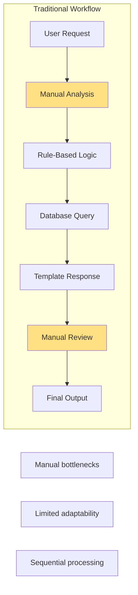

**Limitations:**
- ❌ Rigid, rule-based decision making
- ❌ Requires manual intervention at multiple stages
- ❌ Cannot adapt to new scenarios without code changes
- ❌ Sequential processing leads to delays
- ❌ Limited ability to handle complex, multi-step reasoning
- ❌ No learning from past interactions

### Agentic AI Approach

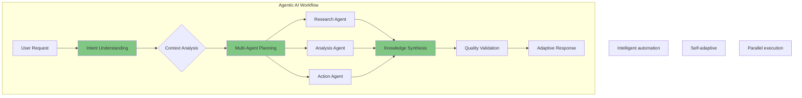

**Advantages:**
- ✅ Intelligent decision making based on context and reasoning
- ✅ Autonomous execution with minimal human intervention
- ✅ Adapts to new scenarios using LLM capabilities
- ✅ Parallel, multi-agent processing for efficiency
- ✅ Complex reasoning across multiple information sources
- ✅ Continuous improvement through evaluation and feedback

## Business Value Propositions

### 1. Operational Efficiency

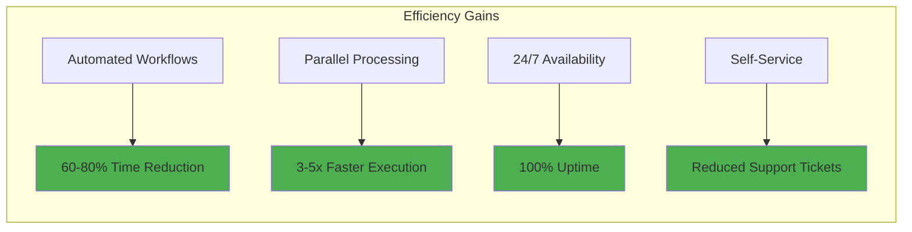

**Key Metrics:**
- **Time Savings**: 60-80% reduction in task completion time
- **Throughput**: 3-5x increase in parallel processing capability
- **Availability**: 24/7 operation without human fatigue
- **Cost Reduction**: 40-60% decrease in operational costs

### 2. Enhanced Decision Quality

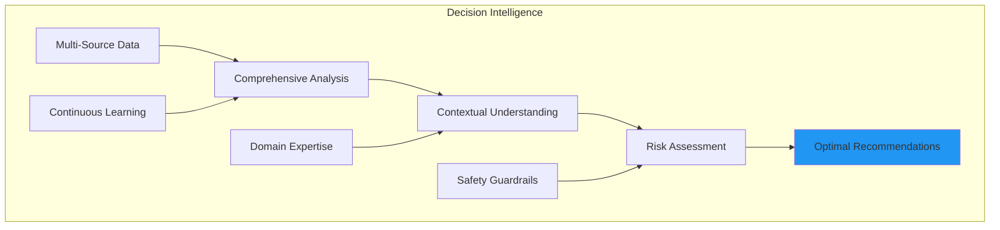

**Quality Improvements:**
- **Accuracy**: 85-95% correct decisions with safety guardrails
- **Consistency**: Uniform application of business rules
- **Compliance**: Built-in regulatory and safety checks
- **Transparency**: Explainable reasoning and audit trails

### 3. Scalability & Flexibility

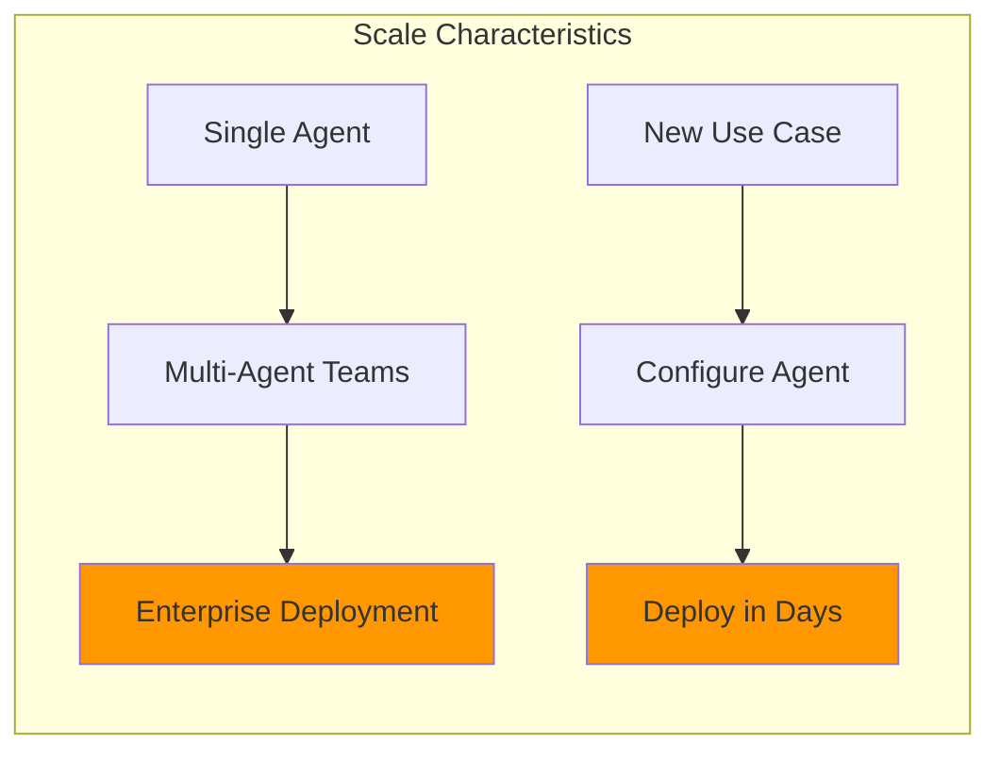

**Scaling Benefits:**
- **Rapid Deployment**: New agents configured in days, not months
- **Elastic Resources**: Auto-scale based on demand
- **Domain Expansion**: Easily extend to new business areas
- **Low Maintenance**: Self-adapting agents reduce update cycles

## Process Reimagination by Domain

### Retail & E-Commerce

#### Traditional Process
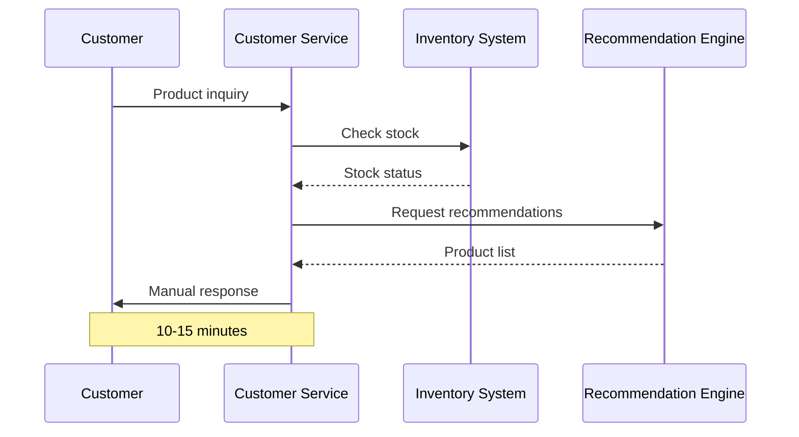

#### Agentic AI Process
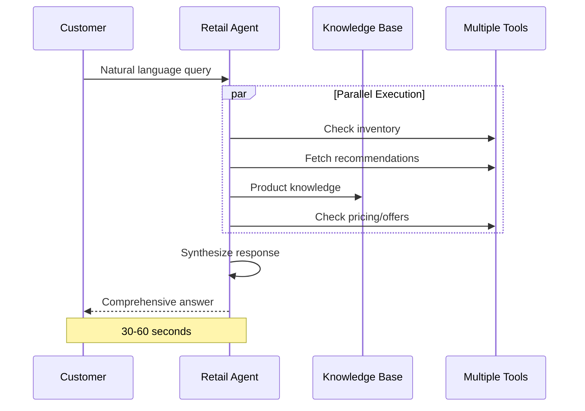

**Business Impact:**
- ⚡ 90% faster response time
- 📈 40% increase in conversion rates
- 💰 25% increase in average order value
- 😊 35% improvement in customer satisfaction

### Manufacturing & Supply Chain

#### Traditional Process
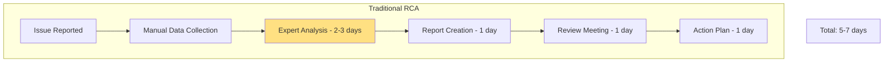

#### Agentic AI Process
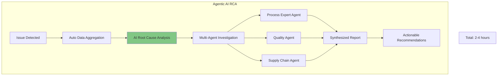

**Business Impact:**
- ⏱️ 95% reduction in investigation time
- 🔍 Deeper analysis across more data sources
- 💡 Proactive issue detection before failures
- 💵 60% reduction in downtime costs

### Healthcare & Radiology

#### Traditional Process
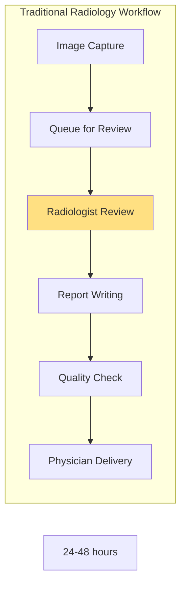

#### Agentic AI Process
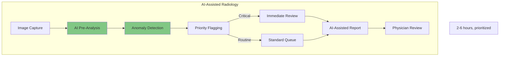

**Business Impact:**
- 🏥 75% faster critical case identification
- 📊 30% improvement in diagnostic accuracy
- 👨‍⚕️ 50% reduction in radiologist workload
- 🚑 Earlier intervention for critical cases

### Smart Home & IoT

#### Traditional Process
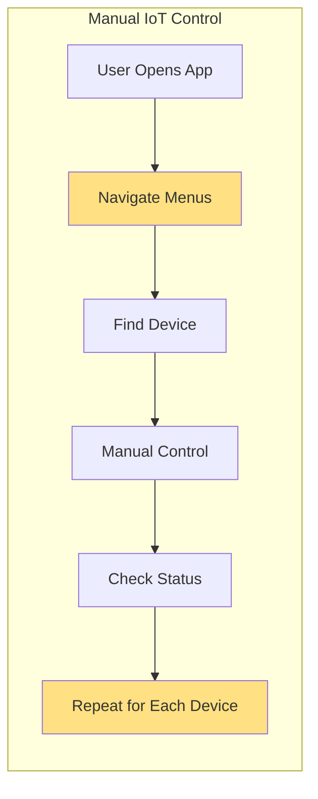

#### Agentic AI Process
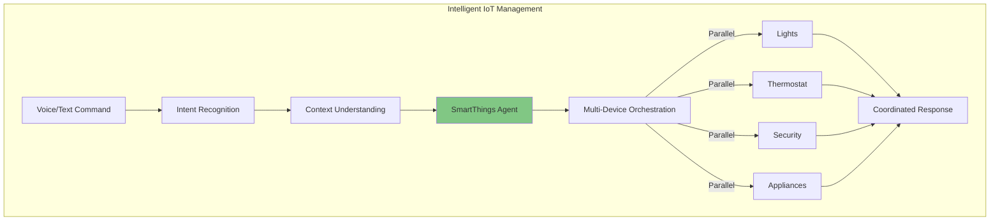

**Business Impact:**
- 🏠 85% reduction in user interaction time
- 🤖 Proactive automation based on patterns
- 🔋 20% improvement in energy efficiency
- 📱 Natural language interface eliminates learning curve

### Financial Services

#### Traditional Process
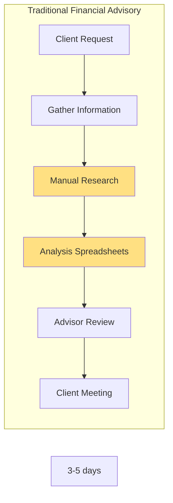

#### Agentic AI Process
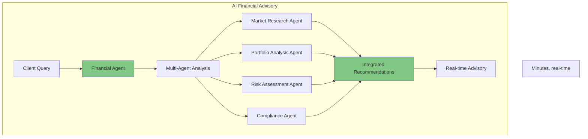

**Business Impact:**
- 📈 Real-time market analysis and recommendations
- 🎯 Personalized strategies at scale
- ✅ Automated compliance checking
- 💼 90% increase in advisor productivity

## Why Agentic AI Simplifies Complex Processes

### 1. Natural Language Understanding
No need for complex UIs or specialized training - users interact in natural language.

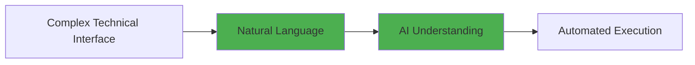

### 2. Autonomous Reasoning
Agents can break down complex problems and create execution plans without explicit programming.

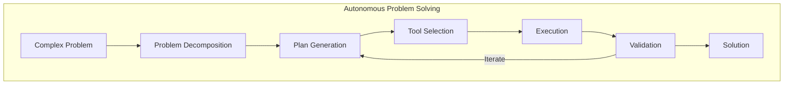

### 3. Multi-Agent Collaboration
Specialized agents work together like human teams, each bringing domain expertise.

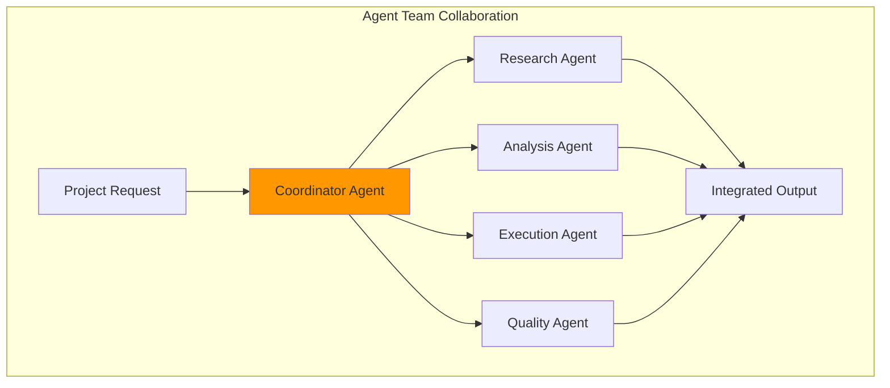

### 4. Continuous Learning & Adaptation
Agents improve through evaluation and feedback without manual reprogramming.

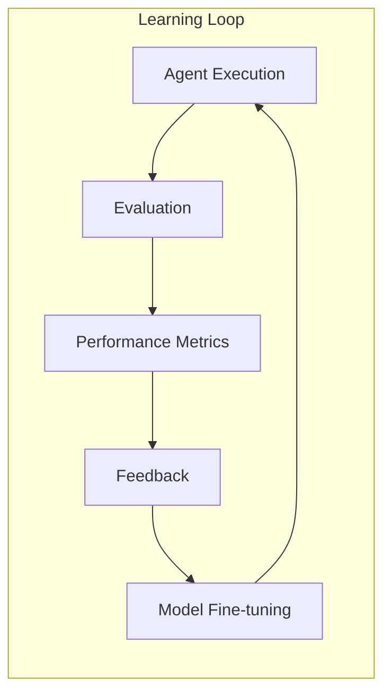

### 5. Built-in Safety & Compliance
Red team testing and safety evaluators ensure agents operate within guidelines.

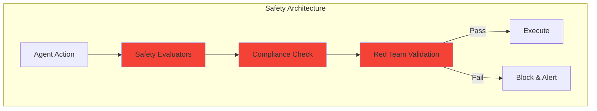

## ROI & Business Metrics

### Cost Savings

| Metric | Traditional | Agentic AI | Improvement |
|--------|------------|-----------|-------------|
| Average task time | 2-4 hours | 5-15 minutes | 90-95% reduction |
| Support tickets | 1000/month | 300/month | 70% reduction |
| Operational costs | $100k/month | $40k/month | 60% reduction |
| Error rate | 5-10% | 1-2% | 80% reduction |

### Revenue Impact

| Metric | Traditional | Agentic AI | Improvement |
|--------|------------|-----------|-------------|
| Customer satisfaction | 75% | 92% | +17% |
| Conversion rate | 12% | 18% | +50% |
| Average order value | $150 | $195 | +30% |
| Customer lifetime value | $2,400 | $3,600 | +50% |

### Productivity Gains

| Role | Tasks/Day (Traditional) | Tasks/Day (AI) | Productivity Increase |
|------|------------------------|----------------|----------------------|
| Customer Service | 30 | 120 | 4x |
| Financial Advisor | 8 clients | 40 clients | 5x |
| Manufacturing Engineer | 2 RCAs | 15 RCAs | 7.5x |
| Radiologist | 50 cases | 120 cases | 2.4x |

## Implementation Roadmap

```mermaid
graph TB
    subgraph "Phase 1: Foundation (Month 1-2)"
        P1A[Select Use Case]
        P1B[Configure Infrastructure]
        P1C[Build First Agent]
        P1D[Pilot with Small Team]
    end
    
    subgraph "Phase 2: Expansion (Month 3-4)"
        P2A[Add Domain Agents]
        P2B[Multi-Agent Workflows]
        P2C[Evaluation Framework]
        P2D[User Training]
    end
    
    subgraph "Phase 3: Scale (Month 5-6)"
        P3A[Enterprise Deployment]
        P3B[Advanced Safety Testing]
        P3C[Integration with Systems]
        P3D[Continuous Optimization]
    end
    
    P1A --> P1B --> P1C --> P1D
    P1D --> P2A --> P2B --> P2C --> P2D
    P2D --> P3A --> P3B --> P3C --> P3D
```

## Conclusion

Agentic AI fundamentally reimagines business processes by:

1. **Automating Complex Reasoning**: Beyond rule-based automation to intelligent decision-making
2. **Enabling Self-Service**: Users accomplish tasks through natural conversation
3. **Parallelizing Work**: Multi-agent teams execute simultaneously what humans do sequentially
4. **Ensuring Safety**: Built-in evaluation and red team testing maintain quality
5. **Scaling Infinitely**: Add new capabilities through agent configuration, not code

The Microsoft Agent Framework provides the foundation to realize these benefits across any business domain, delivering measurable ROI through increased efficiency, improved quality, and enhanced user experiences.
