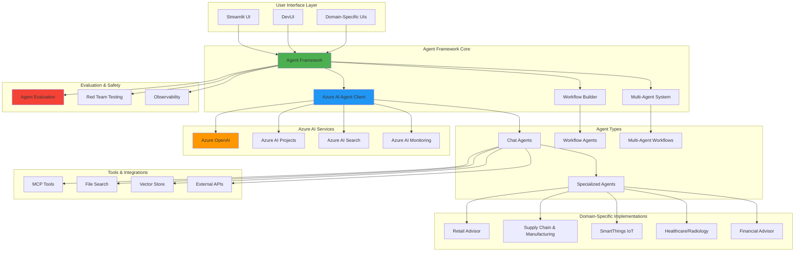
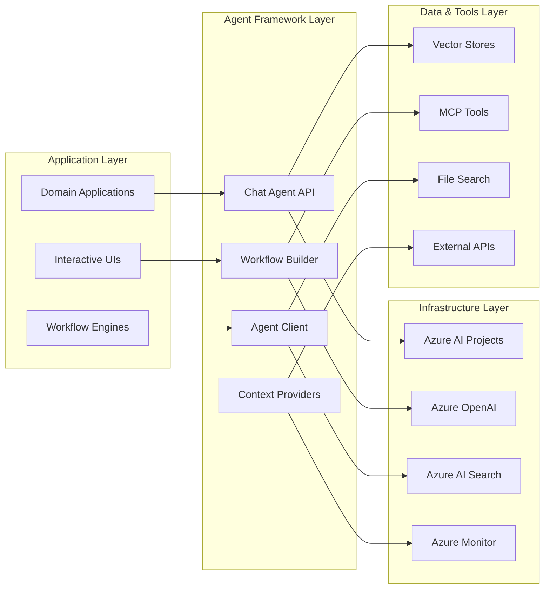
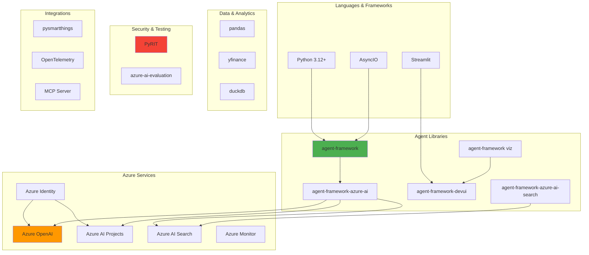
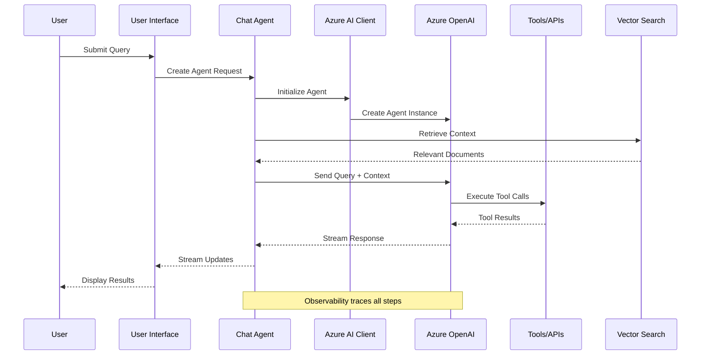
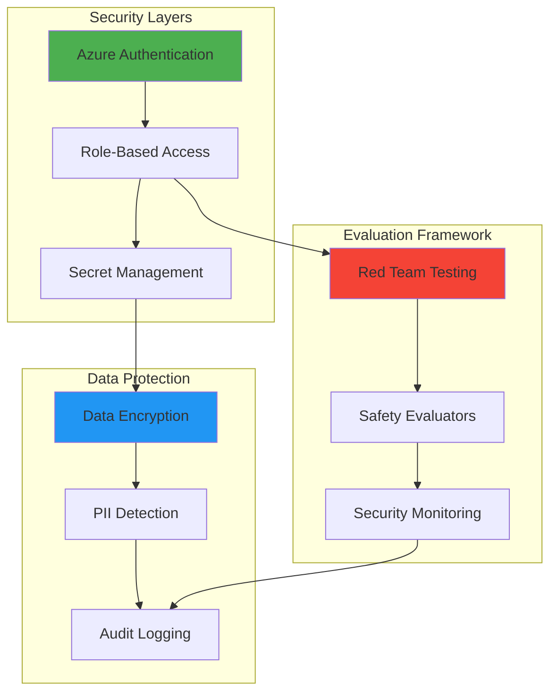
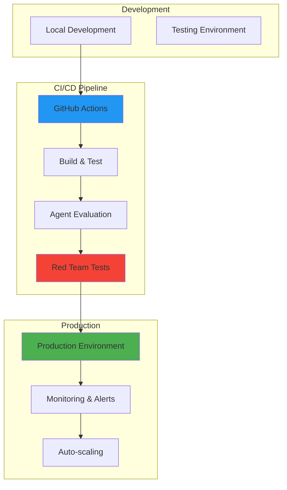

# Microsoft Agent Framework - Architecture Documentation

## Overview

The Microsoft Agent Framework (msagentframework) is a comprehensive platform for building, deploying, and managing AI agents using Azure AI services. This framework leverages the power of Large Language Models (LLMs) and agentic AI to transform how businesses approach complex workflows across multiple domains including retail, manufacturing, healthcare, IoT, and more.

## System Architecture

## High-Level Component Architecture

## Core Components

### 1. Agent Framework Core

The framework provides essential building blocks for creating AI agents:

- **ChatAgent**: Asynchronous chat-based agents with streaming support
- **WorkflowBuilder**: Orchestrates multi-agent workflows with sequential and parallel execution
- **AzureAIAgentClient**: Connects agents to Azure AI infrastructure
- **Context Providers**: Supplies agents with real-time data and knowledge

### 2. Multi-Agent System

Enables coordination between multiple specialized agents:

- **Writer-Reviewer Pattern**: Content generation with iterative feedback
- **Sequential Workflows**: Chain agents for complex multi-step tasks
- **Parallel Execution**: Run independent agent tasks concurrently
- **Event Streaming**: Real-time updates from agent execution

### 3. Evaluation & Safety Framework

Comprehensive testing and validation:

- **Agent Evaluation**: System, RAG, and process evaluation metrics
- **Red Team Testing**: Security and safety vulnerability scanning
- **Observability**: OpenTelemetry integration for tracing and monitoring
- **Quality Metrics**: Task completion, adherence, groundedness, relevance

### 4. Domain-Specific Agents

Pre-built agents for specific business domains:

- **Retail Advisor**: Product recommendations, inventory management
- **Supply Chain & Manufacturing**: Process optimization, RCA analysis
- **SmartThings IoT**: Device control and automation
- **Healthcare**: Radiology analysis, medical imaging
- **Financial Services**: Stock analysis, portfolio management

## Technology Stack

## Data Flow Architecture

## Security Architecture

## Deployment Architecture

## Key Design Principles

### 1. **Asynchronous by Default**
All agent operations use Python's asyncio for non-blocking execution and high concurrency.

### 2. **Context-Aware Processing**
Agents can access multiple context providers (vector search, file stores, APIs) to enhance responses.

### 3. **Streaming-First**
Real-time streaming of agent responses for better user experience and responsiveness.

### 4. **Observability Built-In**
OpenTelemetry integration provides complete visibility into agent execution and performance.

### 5. **Safety & Evaluation**
Comprehensive testing framework ensures agents are safe, accurate, and reliable.

### 6. **Domain-Specific Extensibility**
Easy to create specialized agents for specific business domains and use cases.

## Integration Points

### Azure AI Services
- **Azure OpenAI**: LLM inference and embeddings
- **Azure AI Projects**: Agent lifecycle management
- **Azure AI Search**: Knowledge base and vector search
- **Azure Monitor**: Application insights and telemetry

### External Tools
- **MCP Tools**: Microsoft Learn, documentation access
- **File Search**: Document retrieval and analysis
- **Vector Stores**: Semantic search capabilities
- **REST APIs**: External data sources and services

### Authentication
- **Azure CLI Credentials**: Development authentication
- **Managed Identity**: Production secure access
- **Service Principals**: Application-to-application auth

## Scalability & Performance

### Horizontal Scaling
- Multiple agent instances can run in parallel
- Workflow builders support concurrent agent execution
- Load balancing across Azure AI deployments

### Caching & Optimization
- Context provider caching
- Vector store optimization
- Response streaming for better perceived performance

### Resource Management
- Async context managers for proper cleanup
- Connection pooling for Azure services
- Automatic retry and error handling
