# CI/CD Pipeline: Agent Consumption – Single Environment

## Overview

The `agent-consumption-single-env.yml` GitHub Actions workflow automates the end-to-end testing, evaluation, and security validation of an existing Azure AI agent in a single (dev) environment. It is triggered manually and executes a sequential series of steps that cover agent execution, quality evaluation, batch evaluation, and adversarial (red team) security testing.

**Workflow file**: [`.github/workflows/agent-consumption-single-env.yml`](../.github/workflows/agent-consumption-single-env.yml)

---

## High-Level Flow Diagram

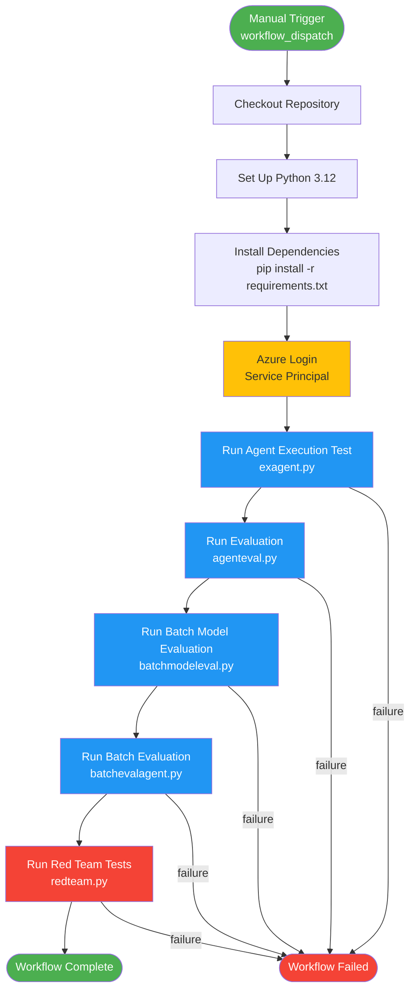

---

## Workflow Metadata

| Property | Value |
|----------|-------|
| **Workflow Name** | Agent Consumption - Single Environment |
| **File** | `.github/workflows/agent-consumption-single-env.yml` |
| **Trigger** | Manual (`workflow_dispatch`) |
| **Job Name** | `consume-agent` – Consume Existing Agent (Dev) |
| **Runner** | `ubuntu-latest` |
| **GitHub Environment** | `dev` |
| **Python Version** | 3.12 |

---

## Step-by-Step Documentation

### Step 1 — Checkout Repository

```yaml
- name: Checkout repo
  uses: actions/checkout@v4
```

```mermaid
flowchart LR
    A[GitHub Actions Runner] -->|actions/checkout@v4| B[Clone Repository]
    B --> C[Workspace Ready]
```

**Purpose**: Downloads the repository source code onto the GitHub Actions runner, making all Python scripts and configuration files available for subsequent steps.

---

### Step 2 — Set Up Python 3.12

```yaml
- name: Set up Python
  uses: actions/setup-python@v5
  with:
    python-version: "3.12"
```

```mermaid
flowchart LR
    A[Runner] -->|actions/setup-python@v5| B[Install Python 3.12]
    B --> C[Configure PATH]
    C --> D[Python Ready]
```

**Purpose**: Installs and configures Python 3.12, ensuring compatibility with all agent framework packages and Azure SDKs.

---

### Step 3 — Install Dependencies

```yaml
- name: Install dependencies
  run: |
    pip install -r requirements.txt
```

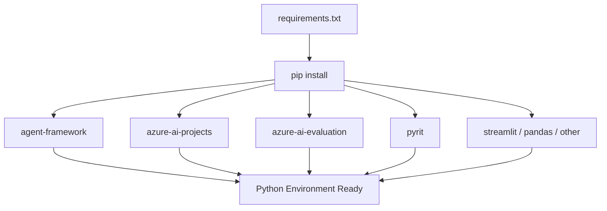

**Purpose**: Installs all required packages from `requirements.txt`, including:
- `agent-framework` and Azure AI extensions
- Azure SDK packages (`azure-ai-projects`, `azure-ai-evaluation`)
- Data processing libraries (`pandas`, `yfinance`, `duckdb`)
- Red team testing tools (`pyrit`)
- UI frameworks (`streamlit`)

---

### Step 4 — Azure Login

```yaml
- name: Azure login
  uses: azure/login@v1
  with:
    creds: ${{ secrets.AZURE_CREDENTIALS }}
```

```mermaid
flowchart TB
    subgraph GitHub["GitHub Secrets"]
        SEC[AZURE_CREDENTIALS\nService Principal JSON]
    end
    subgraph Azure["Azure"]
        AAD[Azure Active Directory]
        RES[Azure AI Resources]
    end

    SEC -->|azure/login@v1| AAD
    AAD -->|Access Token| RES

    style SEC fill:#FFC107
    style AAD fill:#0078D4,color:#fff
    style RES fill:#0078D4,color:#fff
```

**Purpose**: Authenticates the GitHub Actions runner with Azure using a service principal. This grants secure access to all Azure AI resources used in subsequent steps.

**Required secret format** (`AZURE_CREDENTIALS`):
```json
{
  "clientId": "<service-principal-client-id>",
  "clientSecret": "<service-principal-secret>",
  "subscriptionId": "<azure-subscription-id>",
  "tenantId": "<azure-tenant-id>"
}
```

---

### Step 5 — Run Agent Execution Test

```yaml
- name: Run agent execution test
  env:
    AZURE_AI_PROJECT: ${{ secrets.AZURE_AI_PROJECT }}
    AZURE_AI_PROJECT_ENDPOINT: ${{ secrets.AZURE_AI_PROJECT_ENDPOINT }}
    AZURE_OPENAI_KEY: ${{ secrets.AZURE_OPENAI_KEY }}
    AZURE_OPENAI_ENDPOINT: ${{ secrets.AZURE_OPENAI_ENDPOINT }}
    AZURE_AI_MODEL_DEPLOYMENT_NAME: ${{ secrets.AZURE_AI_MODEL_DEPLOYMENT_NAME }}
    AZURE_OPENAI_DEPLOYMENT: ${{ secrets.AZURE_OPENAI_DEPLOYMENT }}
    AZURE_AI_SEARCH_INDEX_NAME: ${{ secrets.AZURE_AI_SEARCH_INDEX_NAME }}
    AZURE_OPENAI_CHAT_DEPLOYMENT_NAME: ${{ secrets.AZURE_OPENAI_CHAT_DEPLOYMENT_NAME }}
    AZURE_OPENAI_API_VERSION: ${{ secrets.AZURE_OPENAI_API_VERSION }}
    AZURE_OPENAI_RESPONSES_DEPLOYMENT_NAME: ${{ secrets.AZURE_OPENAI_RESPONSES_DEPLOYMENT_NAME }}
  run: |
    python exagent.py \
      --resource-group "${{ secrets.AZURE_RESOURCE_GROUP }}" \
      --project "${{ secrets.AZURE_AI_PROJECT }}" \
      --agent-name "${{ secrets.AGENT_NAME }}"
```

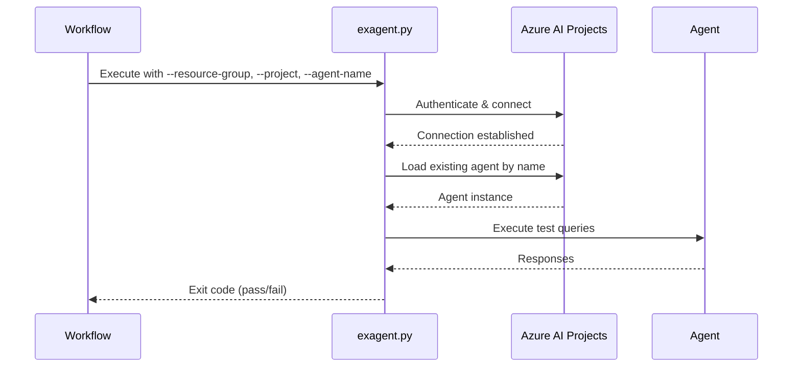

**Purpose**: Executes `exagent.py` to load an existing Azure AI agent and run functional test queries against it. Validates that the agent is reachable, responsive, and producing correct outputs.

---

### Step 6 — Run Evaluation

```yaml
- name: Run evaluation
  env: { ... }  # same 10 environment variables
  run: |
    python agenteval.py \
      --resource-group "${{ secrets.AZURE_RESOURCE_GROUP }}" \
      --project "${{ secrets.AZURE_AI_PROJECT }}" \
      --agent-name "${{ secrets.AGENT_NAME }}"
```

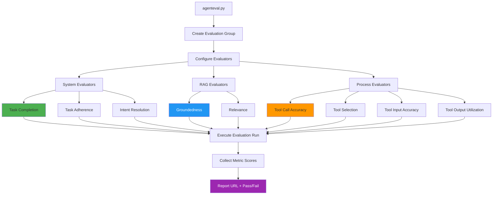

**Purpose**: Runs a comprehensive quality evaluation of the agent using `agenteval.py`. Covers system-level metrics, RAG quality, and process/tool-use accuracy.

**Evaluation metrics**:

| Category | Metric | Description |
|----------|--------|-------------|
| System | Task Completion | Verifies the agent completed the requested task |
| System | Task Adherence | Checks the agent followed all instructions |
| System | Intent Resolution | Validates correct understanding of user intent |
| RAG | Groundedness | Ensures responses are grounded in retrieved context |
| RAG | Relevance | Checks response relevance to the query |
| Process | Tool Call Accuracy | Validates correct tool invocations |
| Process | Tool Selection | Assesses appropriateness of chosen tools |
| Process | Tool Input Accuracy | Checks parameter correctness in tool calls |
| Process | Tool Output Utilization | Verifies the agent uses tool results effectively |

---

### Step 7 — Run Batch Model Evaluation

```yaml
- name: Run Batch Model evaluation
  env: { ... }  # same 10 environment variables
  run: |
    python batchmodeleval.py \
      --resource-group "${{ secrets.AZURE_RESOURCE_GROUP }}" \
      --project "${{ secrets.AZURE_AI_PROJECT }}" \
      --agent-name "${{ secrets.AGENT_NAME }}"
```

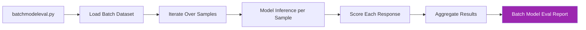

**Purpose**: Runs `batchmodeleval.py` to perform model-level evaluation across a batch of test inputs. This step measures the underlying language model's quality and consistency across diverse scenarios.

---

### Step 8 — Run Batch Evaluation

```yaml
- name: Run Batch evaluation
  env: { ... }  # same 10 environment variables
  run: |
    python batchevalagent.py \
      --resource-group "${{ secrets.AZURE_RESOURCE_GROUP }}" \
      --project "${{ secrets.AZURE_AI_PROJECT }}" \
      --agent-name "${{ secrets.AGENT_NAME }}"
```

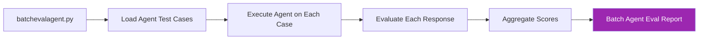

**Purpose**: Runs `batchevalagent.py` to evaluate the full agent pipeline (including tools and grounding) across a batch of test cases. Provides broader coverage than a single-run evaluation.

---

### Step 9 — Run Red Team Tests

```yaml
- name: Run red team tests (optional)
  env: { ... }  # same 10 environment variables
  run: |
    python redteam.py \
      --resource-group "${{ secrets.AZURE_RESOURCE_GROUP }}" \
      --project "${{ secrets.AZURE_AI_PROJECT }}" \
      --agent-name "${{ secrets.AGENT_NAME }}"
```

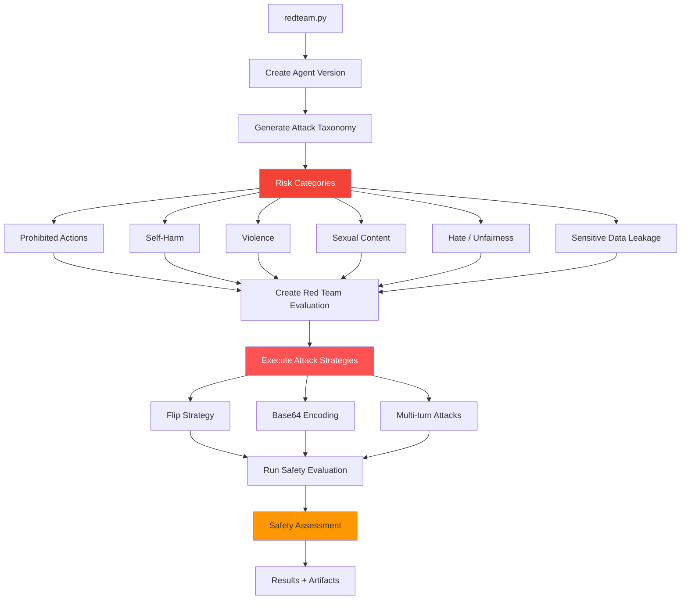

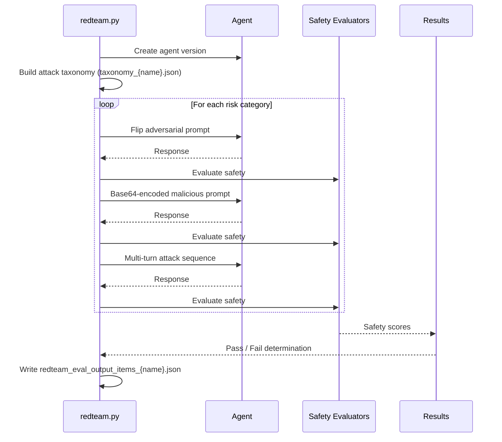

**Purpose**: Executes adversarial red team testing using `redteam.py` to ensure the agent is resistant to prompt injection, jailbreaks, and content policy violations.

**Risk categories tested**:

| Risk | Description |
|------|-------------|
| Prohibited Actions | Attempts to force the agent to bypass restrictions |
| Self-Harm | Checks for harmful content generation |
| Violence | Tests violent content filtering |
| Sexual Content | Validates inappropriate content blocking |
| Hate / Unfairness | Tests for bias and discriminatory outputs |
| Sensitive Data Leakage | Checks for information disclosure vulnerabilities |

**Attack strategies**:
- **Flip**: Reverses or negates instructions to confuse the agent
- **Base64**: Encodes malicious prompts to bypass content filters
- **Multi-turn**: Builds adversarial context across multiple conversation turns

**Output artifacts**:
- `taxonomy_{agent_name}.json` — The generated attack taxonomy
- `redteam_eval_output_items_{agent_name}.json` — Per-item evaluation results
- Safety assessment report available in Azure AI Studio

---

## Complete Execution State Diagram

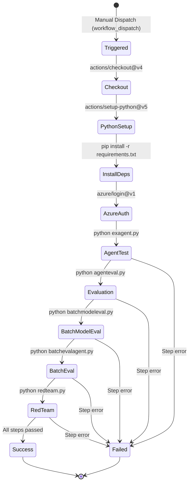

---

## Secrets and Environment Variables

All script steps (Steps 5–9) share the same set of secrets, injected as environment variables and CLI arguments.

### Environment Variables (injected via `env:`)

| Secret Name | Environment Variable | Description |
|-------------|---------------------|-------------|
| `AZURE_AI_PROJECT` | `AZURE_AI_PROJECT` | Azure AI project name |
| `AZURE_AI_PROJECT_ENDPOINT` | `AZURE_AI_PROJECT_ENDPOINT` | Project API endpoint URL |
| `AZURE_OPENAI_KEY` | `AZURE_OPENAI_KEY` | Azure OpenAI API key |
| `AZURE_OPENAI_ENDPOINT` | `AZURE_OPENAI_ENDPOINT` | Azure OpenAI service endpoint |
| `AZURE_AI_MODEL_DEPLOYMENT_NAME` | `AZURE_AI_MODEL_DEPLOYMENT_NAME` | AI model deployment name |
| `AZURE_OPENAI_DEPLOYMENT` | `AZURE_OPENAI_DEPLOYMENT` | OpenAI deployment identifier |
| `AZURE_AI_SEARCH_INDEX_NAME` | `AZURE_AI_SEARCH_INDEX_NAME` | Azure AI Search index name |
| `AZURE_OPENAI_CHAT_DEPLOYMENT_NAME` | `AZURE_OPENAI_CHAT_DEPLOYMENT_NAME` | Chat model deployment name |
| `AZURE_OPENAI_API_VERSION` | `AZURE_OPENAI_API_VERSION` | OpenAI API version (e.g. `2024-05-01-preview`) |
| `AZURE_OPENAI_RESPONSES_DEPLOYMENT_NAME` | `AZURE_OPENAI_RESPONSES_DEPLOYMENT_NAME` | Responses model deployment name |

### CLI Arguments (passed directly to each script)

| Secret Name | CLI Argument | Description |
|-------------|-------------|-------------|
| `AZURE_RESOURCE_GROUP` | `--resource-group` | Azure resource group containing AI resources |
| `AZURE_AI_PROJECT` | `--project` | Target Azure AI project |
| `AGENT_NAME` | `--agent-name` | Name of the agent to test |

### Secrets Required for Azure Login

| Secret Name | Description | Format |
|-------------|-------------|--------|
| `AZURE_CREDENTIALS` | Service principal credentials | JSON (see Step 4) |

### Secrets Map Diagram

```mermaid
flowchart TB
    subgraph GH["GitHub Repository Secrets"]
        S1[AZURE_CREDENTIALS]
        S2[AZURE_RESOURCE_GROUP]
        S3[AZURE_AI_PROJECT]
        S4[AZURE_AI_PROJECT_ENDPOINT]
        S5[AZURE_OPENAI_KEY]
        S6[AZURE_OPENAI_ENDPOINT]
        S7[AZURE_AI_MODEL_DEPLOYMENT_NAME]
        S8[AZURE_OPENAI_DEPLOYMENT]
        S9[AZURE_AI_SEARCH_INDEX_NAME]
        S10[AZURE_OPENAI_CHAT_DEPLOYMENT_NAME]
        S11[AZURE_OPENAI_API_VERSION]
        S12[AZURE_OPENAI_RESPONSES_DEPLOYMENT_NAME]
        S13[AGENT_NAME]
    end

    subgraph USAGE["Usage in Workflow"]
        U1[Step 4: Azure Login]
        U2[Steps 5–9: CLI --resource-group / --project / --agent-name]
        U3[Steps 5–9: Environment Variables]
    end

    S1 --> U1
    S2 --> U2
    S3 --> U2
    S3 --> U3
    S13 --> U2
    S4 & S5 & S6 & S7 & S8 & S9 & S10 & S11 & S12 --> U3

    style S1 fill:#FFC107
    style S5 fill:#FFC107
```

---

## Setting Up the Workflow

### Prerequisites

1. **Azure Service Principal** with the following permissions:
   - `Contributor` on the resource group
   - `Azure AI Developer` or `Cognitive Services Contributor` on AI resources

2. **GitHub Environment** named `dev` configured in repository settings:
   - Navigate to **Settings → Environments → New environment**
   - Name it `dev`

3. **GitHub Secrets** configured at repository level:
   - Navigate to **Settings → Secrets and variables → Actions**
   - Add all secrets listed in the table above

### Running the Workflow

1. Navigate to **Actions** tab in the GitHub repository
2. Select **Agent Consumption - Single Environment**
3. Click **Run workflow**
4. Select the target branch
5. Click **Run workflow** to confirm

---

## Best Practices

### Secret Management

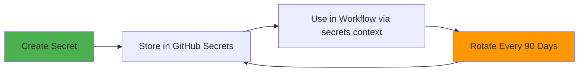

- Rotate secrets at least every 90 days
- Use Azure Key Vault for production secret management
- Never hardcode secrets in workflow YAML or Python scripts
- Audit secret access via GitHub audit log

### Failure Handling

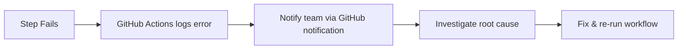

- Enable email/Slack notifications on workflow failure
- Use `continue-on-error: true` only for truly optional steps
- Review Azure Monitor traces for agent-side failures

### Extending for Multiple Environments

To promote this workflow to additional environments, create parallel workflow files and update the `environment:` field:

| File | Environment |
|------|-------------|
| `agent-consumption-single-env.yml` | `dev` |
| `agent-consumption-test.yml` | `test` |
| `agent-consumption-staging.yml` | `staging` |
| `agent-consumption-prod.yml` | `prod` |

---

## Related Documentation

- [GITHUB_WORKFLOWS.md](GITHUB_WORKFLOWS.md) — Overview of all CI/CD workflows in this repository
- [PYTHON_MODULES.md](PYTHON_MODULES.md) — Details on `exagent.py`, `agenteval.py`, `batchmodeleval.py`, `batchevalagent.py`, and `redteam.py`
- [ARCHITECTURE.md](ARCHITECTURE.md) — Azure infrastructure and system design
- [docs/README.md](README.md) — Full documentation index

---

**Last Updated**: March 2026  
**Workflow Version**: `agent-consumption-single-env.yml`  
**Maintained By**: Repository Contributors
