# GitHub Workflows Documentation

## Overview

The repository uses GitHub Actions for Continuous Integration and Continuous Deployment (CI/CD). The workflows automate agent deployment, testing, evaluation, and security validation.

## Workflow Architecture

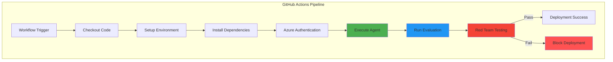

## agent-consumption-single-env.yml

**Purpose**: Consumes and tests an existing Azure AI agent in a single environment (dev).

### Workflow Configuration

```yaml
name: Agent Consumption - Single Environment
on:
  workflow_dispatch:  # Manual trigger only
```

**Trigger Type**: Manual (`workflow_dispatch`)
- Provides controlled deployment
- Allows on-demand testing
- Prevents accidental executions

### Workflow Structure

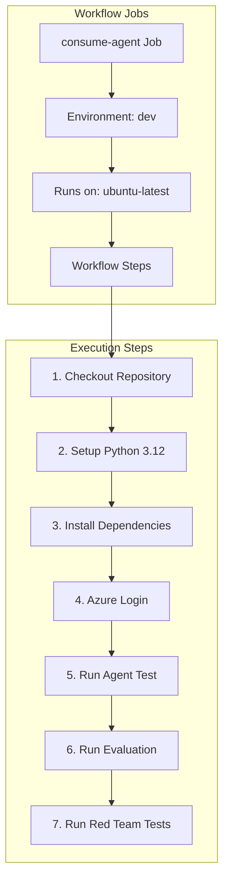

### Step-by-Step Breakdown

#### Step 1: Checkout Repository

```yaml
- name: Checkout repo
  uses: actions/checkout@v4
```

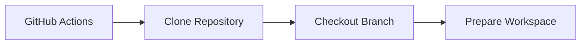

**Purpose**:
- Downloads repository code
- Provides access to Python scripts
- Ensures latest code version

---

#### Step 2: Setup Python Environment

```yaml
- name: Set up Python
  uses: actions/setup-python@v5
  with:
    python-version: "3.12"
```

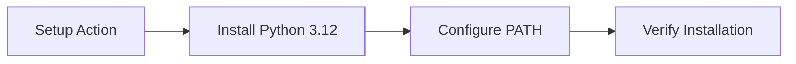

**Purpose**:
- Installs Python 3.12 runtime
- Configures environment variables
- Ensures compatibility with agent framework

---

#### Step 3: Install Dependencies

```yaml
- name: Install dependencies
  run: |
    pip install -r requirements.txt
```

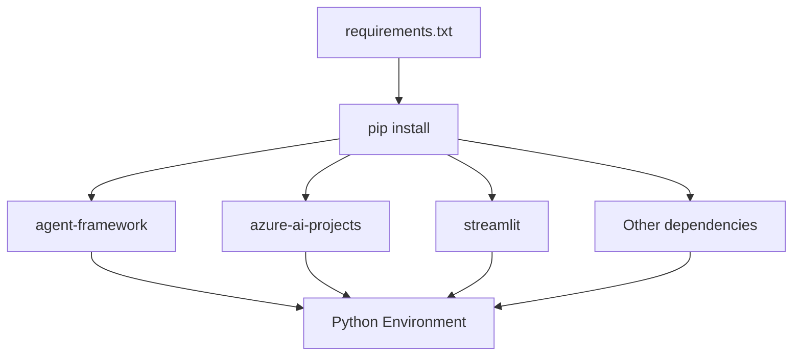

**Dependencies Installed**:
- agent-framework and extensions
- Azure SDK packages
- Data processing libraries (pandas, yfinance, duckdb)
- Evaluation tools (azure-ai-evaluation, pyrit)
- UI frameworks (streamlit)

---

#### Step 4: Azure Authentication

```yaml
- name: Azure login
  uses: azure/login@v1
  with:
    creds: ${{ secrets.AZURE_CREDENTIALS }}
```

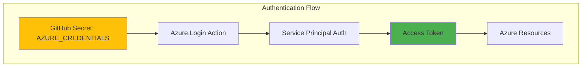

**Purpose**:
- Authenticates with Azure using service principal
- Grants access to Azure AI resources
- Enables secure resource operations

**Required Secret Format**:
```json
{
  "clientId": "<service-principal-client-id>",
  "clientSecret": "<service-principal-secret>",
  "subscriptionId": "<azure-subscription-id>",
  "tenantId": "<azure-tenant-id>"
}
```

---

#### Step 5: Run Agent Execution Test

```yaml
- name: Run agent execution test
  env:
    AZURE_AI_PROJECT: ${{ secrets.AZURE_AI_PROJECT }}
    AZURE_AI_PROJECT_ENDPOINT: ${{ secrets.AZURE_AI_PROJECT_ENDPOINT }}
    AZURE_OPENAI_KEY: ${{ secrets.AZURE_OPENAI_KEY }}
    AZURE_OPENAI_ENDPOINT: ${{ secrets.AZURE_OPENAI_ENDPOINT }}
    # ... additional environment variables
  run: |
    python exagent.py \
      --resource-group "${{ secrets.AZURE_RESOURCE_GROUP }}" \
      --project "${{ secrets.AZURE_AI_PROJECT }}" \
      --agent-name "${{ secrets.AGENT_NAME }}"
```

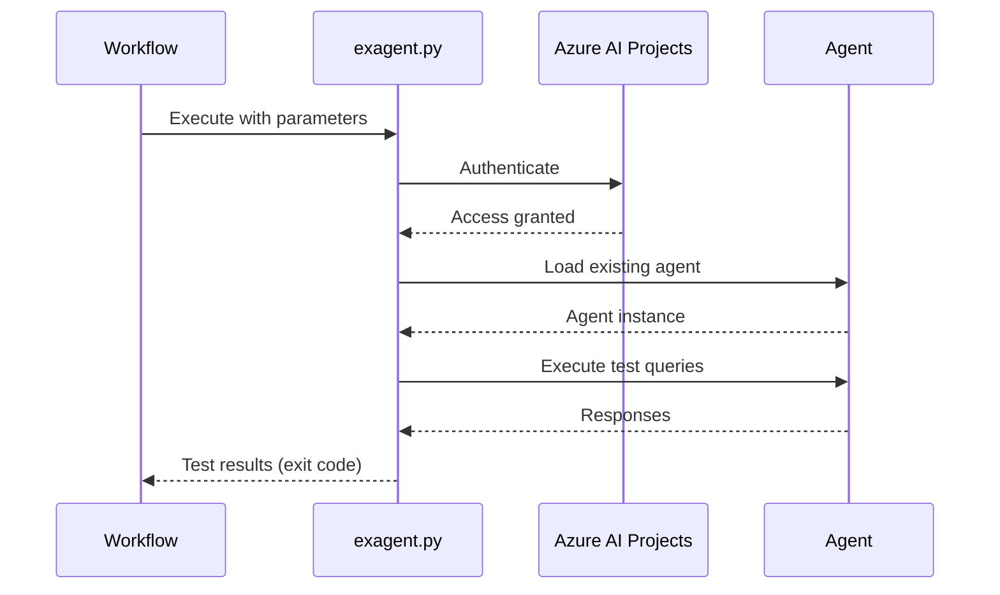

**Purpose**:
- Tests agent functionality
- Validates connectivity to Azure
- Ensures agent responds correctly
- Verifies tool calling capabilities

**Environment Variables Used**:
- `AZURE_AI_PROJECT`: Azure AI project name
- `AZURE_AI_PROJECT_ENDPOINT`: Project API endpoint
- `AZURE_OPENAI_KEY`: OpenAI API key
- `AZURE_OPENAI_ENDPOINT`: OpenAI service endpoint
- `AZURE_AI_MODEL_DEPLOYMENT_NAME`: Model deployment name
- `AZURE_OPENAI_DEPLOYMENT`: Deployment identifier

---

#### Step 6: Run Evaluation

```yaml
- name: Run evaluation
  env:
    # Same environment variables as Step 5
  run: |
    python agenteval.py \
      --resource-group "${{ secrets.AZURE_RESOURCE_GROUP }}" \
      --project "${{ secrets.AZURE_AI_PROJECT }}" \
      --agent-name "${{ secrets.AGENT_NAME }}"
```

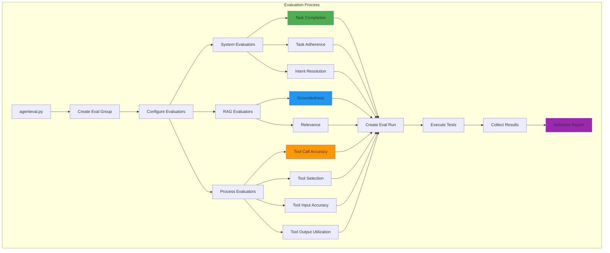

**Evaluation Metrics**:

| Category | Metric | Purpose |
|----------|--------|---------|
| System | Task Completion | Verify task was completed |
| System | Task Adherence | Check instruction following |
| System | Intent Resolution | Validate intent understanding |
| RAG | Groundedness | Ensure factual responses |
| RAG | Relevance | Check response relevance |
| Process | Tool Call Accuracy | Validate correct tool usage |
| Process | Tool Selection | Assess tool choice appropriateness |
| Process | Tool Input Accuracy | Check parameter correctness |
| Process | Tool Output Utilization | Verify result usage |

**Output**:
- Evaluation scores for each metric
- Report URL for detailed analysis
- Pass/fail status

---

#### Step 7: Run Red Team Tests

```yaml
- name: Run red team tests (optional)
  env:
    # Same environment variables
  run: |
    python redteam.py \
      --resource-group "${{ secrets.AZURE_RESOURCE_GROUP }}" \
      --project "${{ secrets.AZURE_AI_PROJECT }}" \
      --agent-name "${{ secrets.AGENT_NAME }}"
```

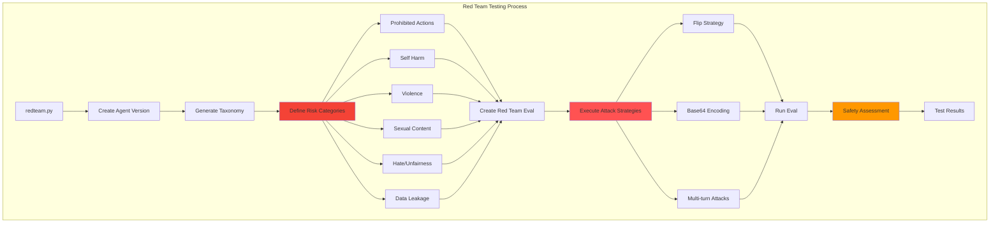

**Security Testing**:

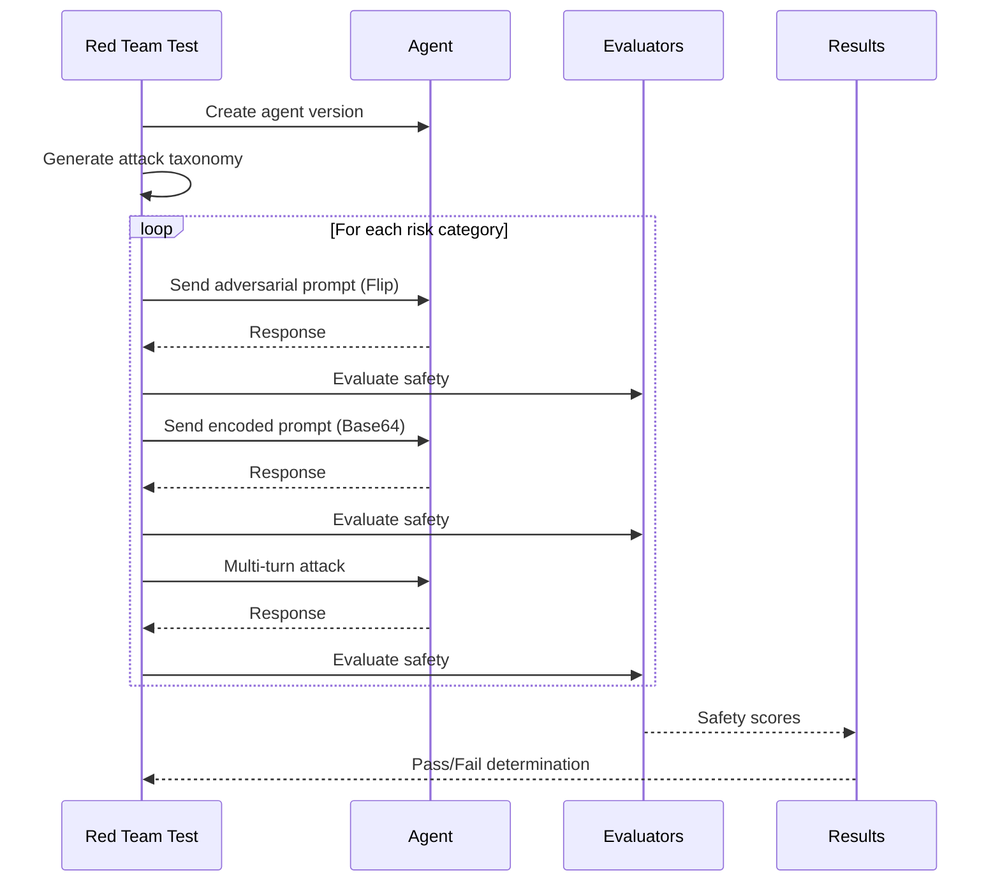

**Red Team Evaluators**:
1. **Prohibited Actions**: Attempts to bypass restrictions
2. **Task Adherence**: Ensures agent stays on task during attacks
3. **Sensitive Data Leakage**: Tests for information disclosure
4. **Self Harm**: Checks for harmful content generation
5. **Violence**: Tests violent content filtering
6. **Sexual**: Validates inappropriate content blocking
7. **Hate/Unfairness**: Tests for bias and discrimination

**Attack Strategies**:
- **Flip**: Reverses or negates instructions
- **Base64**: Encodes malicious prompts to bypass filters
- **Multi-turn**: Complex multi-step conversation attacks

**Output Artifacts**:
- `taxonomy_{agent_name}.json`: Attack taxonomy
- `redteam_eval_output_items_{agent_name}.json`: Detailed results
- Safety assessment report

---

## Workflow Secrets Configuration

### Required Secrets

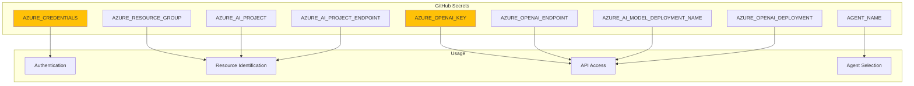

| Secret | Description | Example Format |
|--------|-------------|----------------|
| `AZURE_CREDENTIALS` | Service principal JSON | `{"clientId":"...","clientSecret":"...","subscriptionId":"...","tenantId":"..."}` |
| `AZURE_RESOURCE_GROUP` | Resource group name | `my-ai-agents-rg` |
| `AZURE_AI_PROJECT` | AI project name | `my-agent-project` |
| `AZURE_AI_PROJECT_ENDPOINT` | Project endpoint URL | `https://account.services.ai.azure.com/api/projects/project-name` |
| `AZURE_OPENAI_KEY` | OpenAI API key | `abc123...` |
| `AZURE_OPENAI_ENDPOINT` | OpenAI endpoint | `https://my-openai.openai.azure.com` |
| `AZURE_AI_MODEL_DEPLOYMENT_NAME` | Model deployment | `gpt-4o` |
| `AZURE_OPENAI_DEPLOYMENT` | OpenAI deployment ID | `gpt-4o-deployment` |
| `AGENT_NAME` | Target agent name | `CustomerServiceAgent` |

---

## Workflow Execution Flow

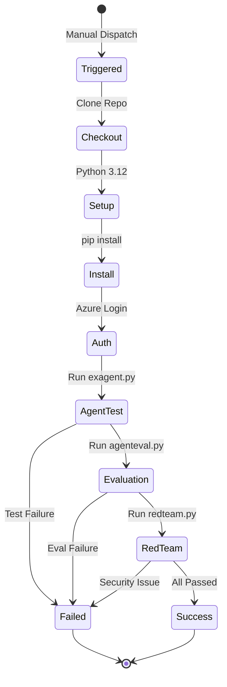

---

## Best Practices

### 1. Environment Isolation

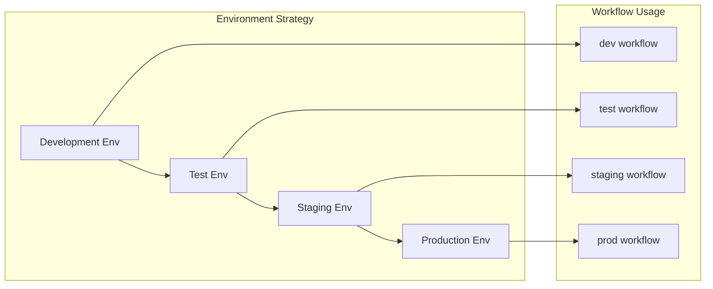

**Recommendation**: Create separate workflows for each environment:
- `agent-consumption-dev.yml`
- `agent-consumption-test.yml`
- `agent-consumption-staging.yml`
- `agent-consumption-prod.yml`

### 2. Secret Management

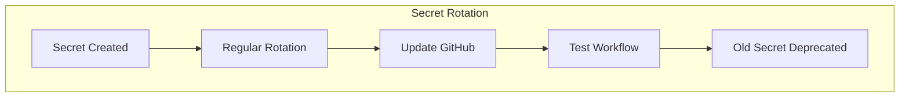

**Guidelines**:
- Rotate secrets every 90 days
- Use Azure Key Vault for production
- Never commit secrets to code
- Audit secret access regularly

### 3. Failure Handling

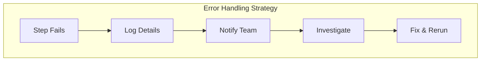

**Recommendations**:
- Enable workflow notifications
- Store artifacts on failure
- Implement retry logic for transient errors
- Log comprehensive error details

### 4. Performance Optimization

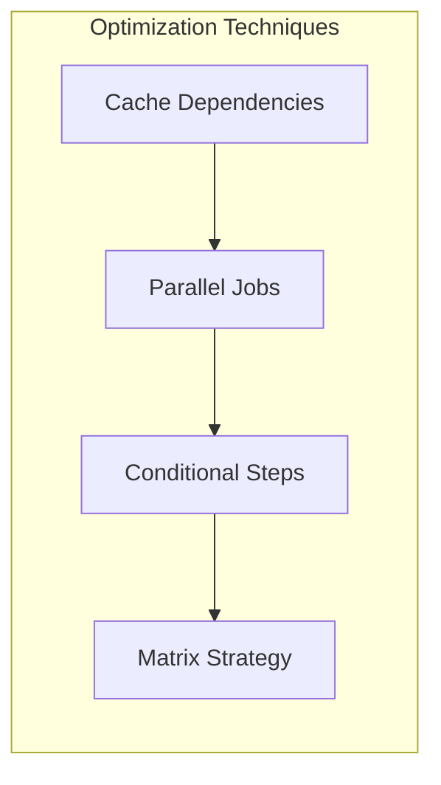

**Techniques**:
- Cache pip dependencies
- Run independent jobs in parallel
- Skip optional steps on PR workflows
- Use matrix builds for multi-environment testing

---

## Monitoring & Observability

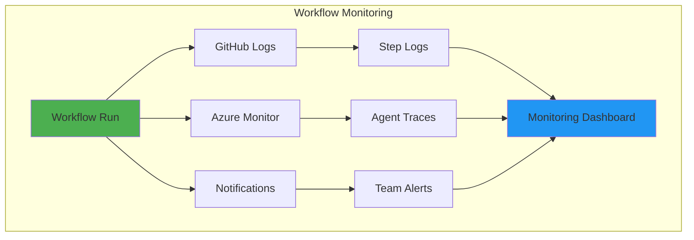

**Monitoring Points**:
- GitHub Actions workflow status
- Azure AI agent execution traces
- Evaluation metric trends
- Red team test results over time

---

## Extension Opportunities

### Future Workflow Enhancements

1. **Multi-Environment Deployment**
```yaml
strategy:
  matrix:
    environment: [dev, test, staging, prod]
    python-version: [3.11, 3.12]
```

2. **Automated PR Testing**
```yaml
on:
  pull_request:
    branches: [main]
```

3. **Scheduled Regression Testing**
```yaml
on:
  schedule:
    - cron: '0 0 * * *'  # Daily at midnight
```

4. **Performance Benchmarking**
```yaml
- name: Run performance tests
  run: python benchmark.py
```

5. **Artifact Publishing**
```yaml
- name: Upload test results
  uses: actions/upload-artifact@v3
  with:
    name: evaluation-results
    path: data_folder/*.json
```

---

## Summary

The GitHub Actions workflow provides:

✅ **Automated Testing**: Validates agent functionality  
✅ **Quality Assurance**: Comprehensive evaluation metrics  
✅ **Security Validation**: Red team adversarial testing  
✅ **Environment Consistency**: Reproducible deployments  
✅ **Audit Trail**: Complete execution logs  
✅ **Secure Authentication**: Azure service principal integration  

This CI/CD pipeline ensures that only thoroughly tested and secure agents are deployed to production environments.
