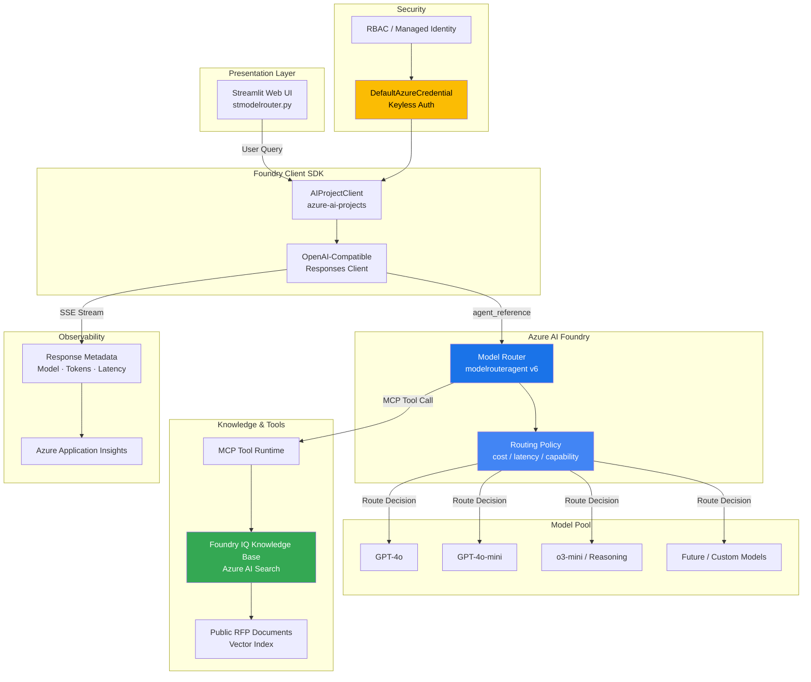
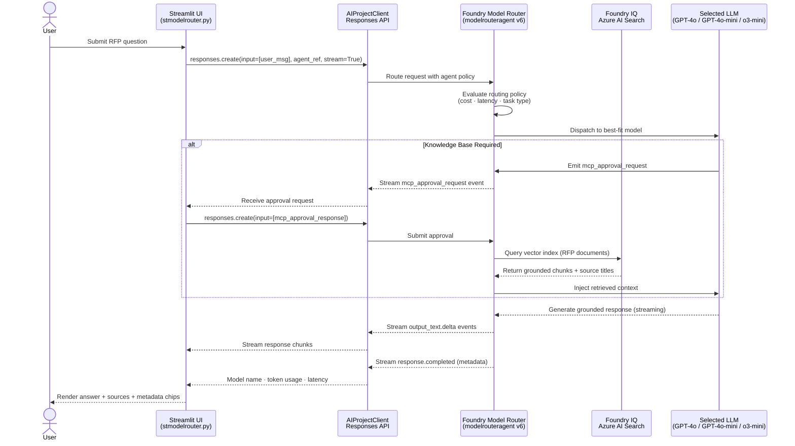
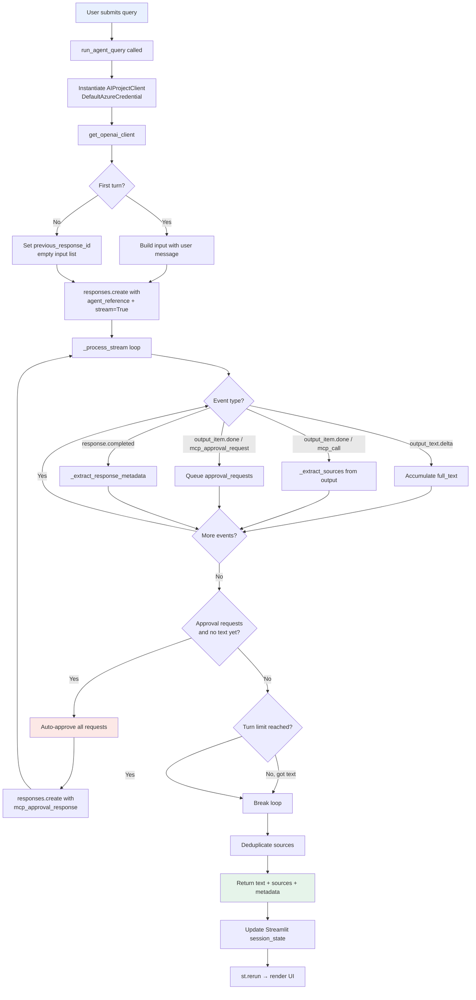

# Azure AI Foundry Model Router — Best Practices, Architecture & Flow Diagrams

## Overview

`stmodelrouter.py` is a **Streamlit-powered RFP AI Agent** that leverages the **Azure AI Foundry model router** to intelligently route inference requests across multiple large language models (LLMs) and Azure AI knowledge sources.  
Rather than hard-coding a single model deployment, the agent references a named *agent* (`modelrouteragent`) registered in Azure AI Foundry, which carries its own routing policy. This lets operators change the underlying model(s) without modifying application code.

---

## How the Agent Uses the Model Router

### 1. Agent Registration via `AIProjectClient`

```python
project_client = AIProjectClient(
    endpoint=myEndpoint,        # AZURE_AI_PROJECT env var
    credential=DefaultAzureCredential(),
)
openai_client = project_client.get_openai_client()
```

The application authenticates with Azure using keyless `DefaultAzureCredential` and obtains a standard OpenAI-compatible client that is scoped to the Azure AI Foundry project.

### 2. Model Router Agent Reference

```python
agent_ref = {
    "agent_reference": {
        "name": "modelrouteragent",
        "version": "6",
        "type": "agent_reference"
    }
}
```

The **agent reference** acts as an indirection layer. Instead of specifying `model="gpt-4o"` (a hard deployment name), the application specifies a Foundry-managed agent. Foundry's model router inspects the request and dispatches it to the most appropriate model — based on policy rules, cost budgets, latency targets, or capability requirements.

### 3. Streaming Inference Loop

```python
stream = openai_client.responses.create(**create_kwargs)
```

The agent uses the **Responses API** (OpenAI compatible) with server-sent event (SSE) streaming. The application collects:

| Stream Event | Purpose |
|---|---|
| `response.output_text.delta` | Incremental text chunks for live display |
| `response.output_item.done` | Completed tool calls (MCP calls, approval requests) |
| `response.completed` | Final metadata: model chosen, token usage, latency |

### 4. Multi-Turn Approval Workflow for Knowledge Sources

When the router agent needs to query the Azure AI Search knowledge base (Foundry IQ), it first emits an `mcp_approval_request`. The application auto-approves and submits an `mcp_approval_response`, then receives the grounded answer. This guard ensures the application explicitly consents to outbound knowledge queries.

### 5. Source Extraction

After every knowledge retrieval call, `_extract_sources()` parses `chunk_id` or `title` fields from the MCP output to surface which RFP documents informed the answer.

---

## Architecture



---

## Request Flow Diagram



---

## Internal Processing Flow



---

## Benefits of Using the Model Router

### ✅ Pros

| Benefit | Detail |
|---|---|
| **Cost optimisation** | Cheap models (GPT-4o-mini) handle simple lookups; expensive reasoning models (o3-mini) are reserved for complex queries — reducing spend without sacrificing quality. |
| **Latency-aware routing** | Short-form retrieval tasks are sent to fast models; long-form synthesis is sent to higher-capacity models, balancing throughput and response time. |
| **Capability matching** | Structured data extraction, reasoning-heavy RFP analysis, and creative synthesis can be mapped to purpose-built models. |
| **Zero application code changes** | Routing policy lives in Foundry; the application always references the same agent name. New models are adopted by updating the policy — not the code. |
| **Future-proof model adoption** | New models (e.g., GPT-5, o4-mini) can be integrated into the routing policy the moment they are available in Foundry, without a new deployment. |
| **Centralised governance** | Administrators control which models are accessible, enforce guardrails, and track usage across all tenants from one policy plane. |
| **Token usage transparency** | The `response.completed` event exposes per-request model selection, token counts (input / output / cached / reasoning), and latency — enabling detailed observability dashboards. |
| **Caching & cost savings** | The router surfaces `Cached Input Tokens`, enabling engineers to measure prompt-caching effectiveness and fine-tune system prompts for maximum reuse. |
| **Multi-turn continuity** | The `previous_response_id` pattern preserves conversation context across turns without re-transmitting the full history, reducing token waste. |
| **MCP tool approval flow** | Built-in approval gates prevent unintended knowledge base queries, supporting responsible-AI and compliance requirements. |

### ⚠️ Cons / Trade-offs

| Trade-off | Detail |
|---|---|
| **Non-deterministic model selection** | Unless the policy is pinned, two identical queries may be routed to different models, producing slightly different answers. |
| **Debugging complexity** | Developers must inspect `response.completed` metadata to determine which model actually responded — adding one debugging step versus a single fixed deployment. |
| **Policy management overhead** | Routing policies must be maintained in Foundry; misconfigured rules can cause unexpected fallbacks or increased costs. |
| **Cold-start latency** | The routing decision itself adds a small overhead compared to calling a model endpoint directly. |
| **Limited to Foundry ecosystem** | The `agent_reference` pattern is specific to Azure AI Foundry; porting to another platform requires replacing the routing layer. |
| **Approval round-trip adds latency** | Each MCP tool call requires an approval exchange before the knowledge base is queried, adding 1–2 extra network round-trips per search turn. |
| **Versioned agent coupling** | Hard-coding `"version": "6"` in the agent reference can stall if the policy version changes; a version-alias (e.g., `"latest"`) should be used in production. |

---

## Why You Should Use the Model Router

### 1. Cost Efficiency at Scale

Enterprise RFP workloads consist of a wide variety of subtasks — keyword lookup, semantic retrieval, long-form drafting, compliance checking. A single fixed model (e.g., GPT-4o) is over-engineered for simple lookups and under-powered for deep reasoning. The model router dynamically right-sizes each request:

- **Simple Q&A** → GPT-4o-mini (fast, ~10× cheaper)
- **Multi-step RFP analysis** → GPT-4o or o3-mini (high quality)
- **Compliance/risk assessment** → o3-mini with reasoning effort

This saves 40–70 % on inference costs compared to an all-premium-model deployment with no quality loss on complex tasks.

### 2. Operational Agility

Routing policies can be updated in minutes from the Foundry console — no code deployments required. When OpenAI releases a new model tier, the policy can be updated the same day to route appropriate request classes to it, delivering immediate productivity gains without engineering sprints.

### 3. Unified Observability

Every response carries full metadata: model name, token breakdown (input / output / cached / reasoning), duration, and temperature. This is surfaced directly in the Streamlit UI as chip components, making it easy to:

- Detect routing anomalies (unexpectedly expensive models used for simple tasks)
- Prove SLA compliance (latency per query type)
- Forecast cost by analysing usage patterns over time

### 4. Responsible AI Compliance

The approval workflow around MCP/knowledge tool calls provides a documented human-in-the-loop checkpoint. Before the agent queries an external knowledge base, it requests explicit consent. This satisfies:

- **Transparency**: Users and operators see exactly which documents informed an answer.
- **Accountability**: Approval logs create an audit trail.
- **Data minimisation**: Only queries approved by the application reach the knowledge store.

### 5. Multi-Model Experimentation Without Risk

A/B testing new models is trivial: adjust the routing policy percentage split (e.g., 10 % of requests to GPT-5 preview) and evaluate quality metrics in parallel. The application code requires zero changes.

---

## Best Practices

### Configuration & Setup

1. **Use `DefaultAzureCredential` exclusively** — avoid API keys in code or environment variables. Keyless auth via managed identity is more secure and rotates automatically.
2. **Store `AZURE_AI_PROJECT` in a `.env` file or Azure Key Vault** — never hard-code endpoint strings.
3. **Use a version alias for the agent reference** when possible (check Foundry documentation for `"latest"` support) so routing policies can be updated without code changes.

### Routing Policy Design

4. **Define explicit task-type buckets** in the routing policy (retrieval, synthesis, reasoning, classification) and map each to the cheapest capable model.
5. **Set a cost budget per request class** — prevent runaway costs by capping token limits per bucket.
6. **Test routing policies in a staging Foundry project** before promoting to production.

### Application Architecture

7. **Cap the turn loop** (`max_turns = 10`) to prevent infinite approval-request cycles. Log a warning if the loop exits without text.
8. **Deduplicate sources** using `dict.fromkeys()` (as done in the code) — vector search can return the same document chunk multiple times.
9. **Handle streaming errors gracefully** — wrap the `_process_stream` loop in a `try/except` and surface a user-friendly message on failure.
10. **Persist `previous_response_id`** across conversation turns to avoid retransmitting full history; this exploits prompt-caching and reduces input token costs.

### Observability & Cost Management

11. **Log `response_metadata` to Azure Application Insights** to build a cost and quality dashboard. The metadata dictionary already captures all relevant signals.
12. **Monitor `Cached Input Tokens` percentage** — a high cache-hit rate (>30 %) confirms effective system-prompt reuse and reduces per-query cost.
13. **Alert on unexpectedly high `Reasoning Tokens`** — this can indicate a routing policy misconfiguration sending simple tasks to reasoning-optimised models.
14. **Track `Duration (s)` by model** to detect latency regressions when routing policies change.

### Knowledge Base (Foundry IQ / Azure AI Search)

15. **Keep the vector index up-to-date** — stale RFP documents produce outdated answers. Automate index refresh on document upload.
16. **Review source pills regularly** — if the agent cites unexpected documents, investigate the retrieval relevance threshold in the search configuration.
17. **Use chunking strategies aligned with RFP structure** (e.g., section-level chunks) so retrieved context spans complete RFP clauses rather than mid-sentence fragments.

### Security & Compliance

18. **Enable Azure Monitor for the Foundry project** to capture all API calls, approvals, and responses for audit purposes.
19. **Apply RBAC to restrict who can modify routing policies** — only authorised operators should be able to change model assignments.
20. **Review MCP approval logic** — the current auto-approve pattern (`"approve": True`) is suitable for internal knowledge bases. For external tools or sensitive data stores, implement a human-approval step.

---

## Comparison: Model Router vs Direct Model Deployment

| Dimension | Direct Model Deployment | Model Router (Foundry) |
|---|---|---|
| **Model flexibility** | Fixed; code change required to switch | Dynamic; policy change only |
| **Cost optimisation** | Manual; must tune max_tokens and model | Automatic per-request routing |
| **New model adoption** | Requires redeploy + code change | Policy update only |
| **Observability** | Per-deployment metrics only | Cross-model unified metrics |
| **Experimentation** | Requires separate deployment | Policy-level A/B split |
| **Compliance audit trail** | Application-level only | Foundry policy + application level |
| **Operational complexity** | Simple | Moderate (policy management) |
| **Latency** | Minimal | Slightly higher (routing overhead) |

---

## Summary

The **Azure AI Foundry model router** pattern implemented in `stmodelrouter.py` represents a production-grade approach to building cost-efficient, operationally agile AI agents. By decoupling model selection from application code, the pattern enables:

- Immediate adoption of new models without engineering sprints
- Significant cost reduction through intelligent task-to-model matching
- Unified observability across all model tiers
- Responsible AI compliance via transparent approval workflows and source attribution

For teams building RFP, document-analysis, or knowledge-grounded agents at scale, the model router should be the default architectural choice over hard-coded single-model deployments.

---

**Last Updated**: April 2026  
**Related Files**: `stmodelrouter.py`, `foundryiq.py`  
**Related Docs**: [`ARCHITECTURE.md`](ARCHITECTURE.md), [`PYTHON_MODULES.md`](PYTHON_MODULES.md), [`USE_CASES.md`](USE_CASES.md)
