# Python Modules Documentation

## Table of Contents
1. [Core Agent Modules](#core-agent-modules)
2. [Multi-Agent Workflow Modules](#multi-agent-workflow-modules)
3. [Evaluation & Testing Modules](#evaluation--testing-modules)
4. [Domain-Specific Agents](#domain-specific-agents)
5. [Utility & Support Modules](#utility--support-modules)

---

## Core Agent Modules

### agent1.py - Basic Azure AI Agent

**Purpose**: Demonstrates creating and using a basic Azure AI agent with Azure AI Projects.

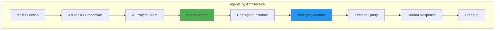

**Key Components**:
- **AzureCliCredential**: Authentication using Azure CLI
- **AIProjectClient**: Connection to Azure AI Projects
- **ChatAgent**: Chat-based agent with streaming
- **Tools**: Custom Python functions (e.g., get_weather)

**Flow**:
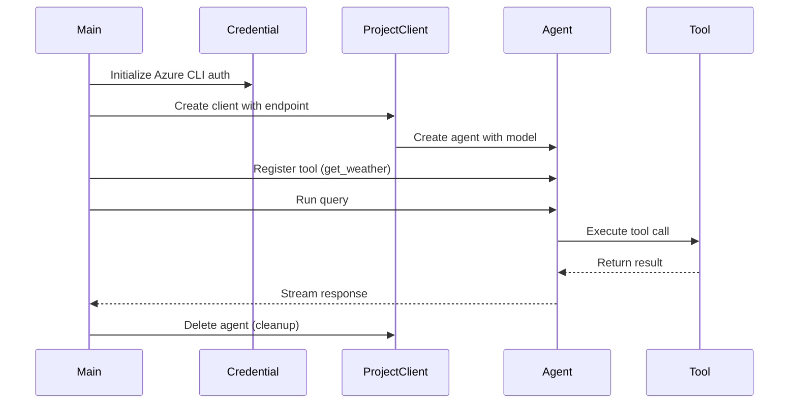

**Use Cases**:
- Simple chat interactions
- Tool calling demonstrations
- Azure AI Projects integration testing

---

### stagent.py - Stateful Agent

**Purpose**: Similar to agent1.py but demonstrates stateful agent patterns.

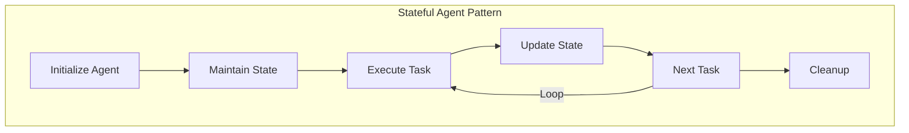

**Key Features**:
- Agent persistence and reuse
- State management across multiple interactions
- Production deployment patterns

---

### multiagents.py - Multi-Agent Workflows

**Purpose**: Demonstrates coordinating multiple agents in a workflow pattern.

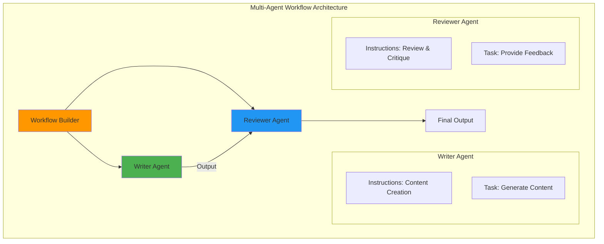

**Workflow Pattern**:
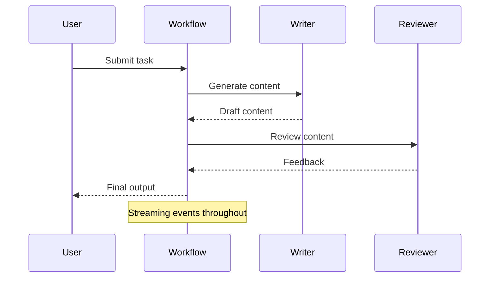

**Key Concepts**:
- **WorkflowBuilder**: Orchestrates agent execution
- **Edge Connections**: Defines data flow between agents
- **Streaming Events**: Real-time progress updates (AgentRunUpdateEvent)
- **Workflow Output**: Final results aggregation

**Use Cases**:
- Content generation with review
- Multi-step analysis tasks
- Quality assurance workflows

---

## Multi-Agent Workflow Modules

### stretailadv.py - Retail Advisory Agent

**Purpose**: Financial and retail product advisory using multi-agent collaboration.

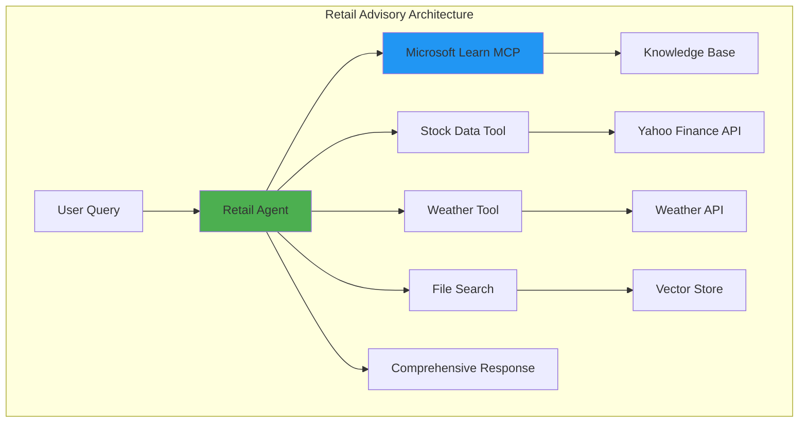

**Agent Capabilities**:
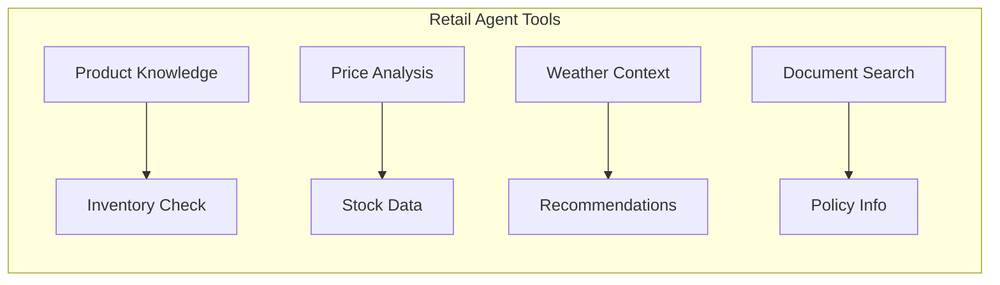

**Key Features**:
- **HostedMCPTool**: Microsoft Learn integration
- **HostedFileSearchTool**: Document retrieval
- **Custom Tools**: Stock data, weather information
- **Workflow Orchestration**: Multi-agent coordination

---

### stsupplychainmfg.py - Supply Chain & Manufacturing Agent

**Purpose**: Manufacturing process optimization and supply chain analysis.

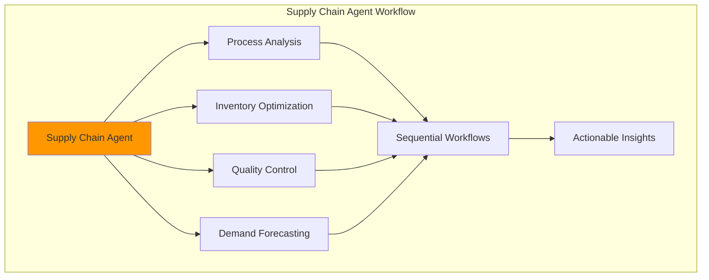

**Use Cases**:
- Production planning optimization
- Supply chain bottleneck identification
- Quality assurance automation
- Demand forecasting

---

### stchiprca.py - Chip Manufacturing RCA

**Purpose**: Root cause analysis for semiconductor/chip manufacturing issues.

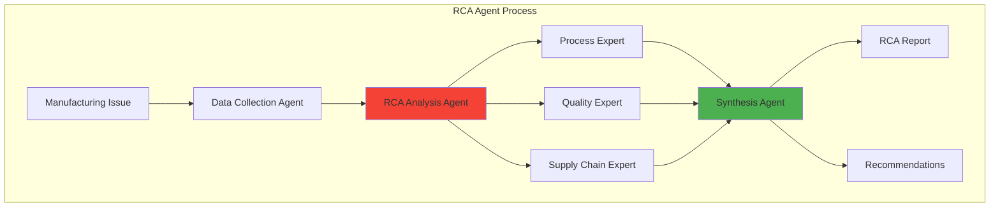

**Key Capabilities**:
- Automated data aggregation
- Multi-perspective analysis
- Root cause identification
- Actionable recommendations

---

### stenggagent.py - Engineering Design Agent

**Purpose**: Engineering design analysis and visualization.

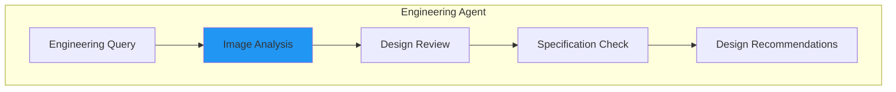

**Features**:
- Multi-modal content (text + images)
- Engineering drawing analysis
- Design specification validation
- Azure OpenAI Responses Client for vision

---

## Evaluation & Testing Modules

### agenteval.py - Agent Evaluation Framework

**Purpose**: Comprehensive evaluation of agent performance using Azure AI evaluation metrics.

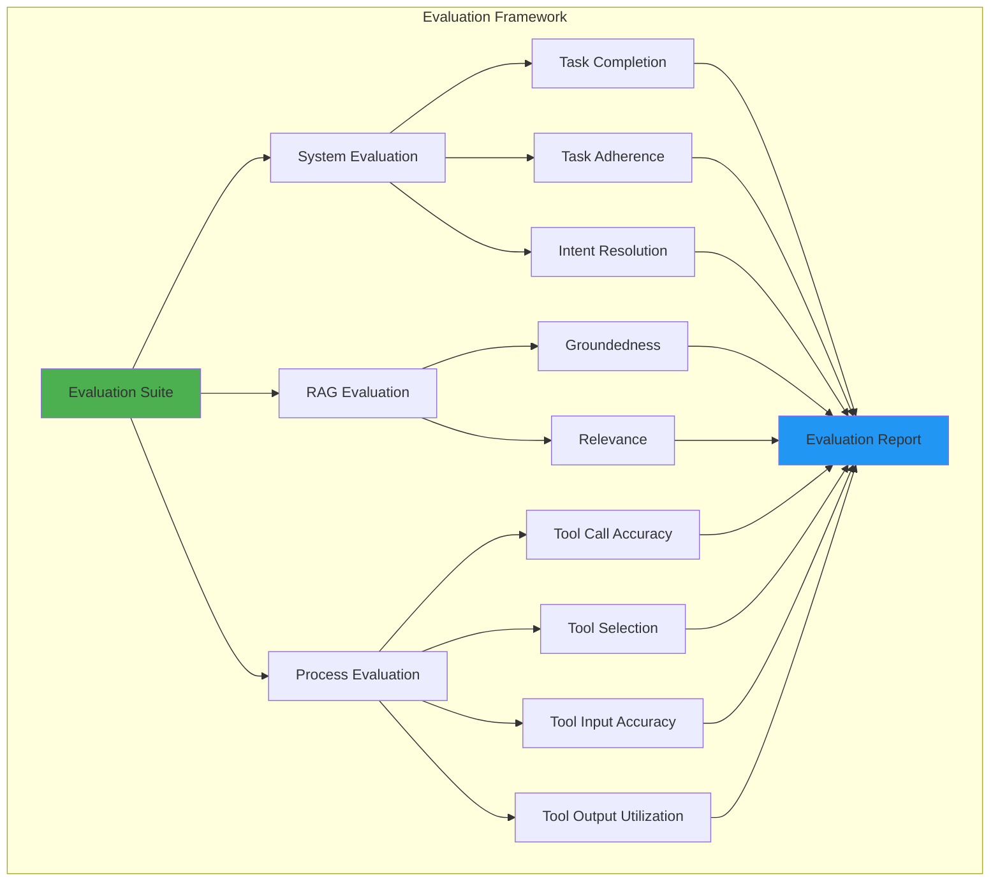

**Evaluation Metrics**:
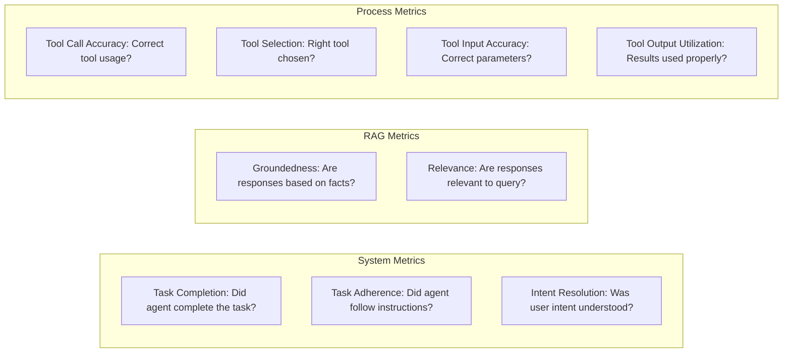

**Evaluation Flow**:
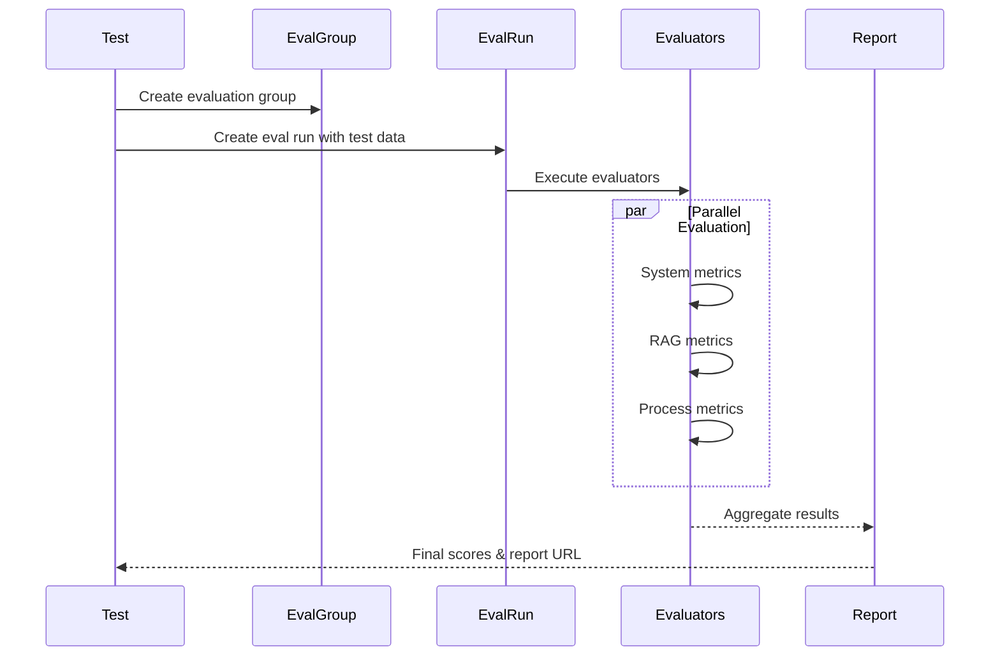

**Key Components**:
- **Data Source Config**: Custom schema for agent conversations
- **Testing Criteria**: Built-in Azure AI evaluators
- **Inline Data**: JSONL format for test cases
- **Output Items**: Detailed evaluation results per test case

---

### redteam.py - Red Team Safety Testing

**Purpose**: Security and safety vulnerability testing for AI agents.

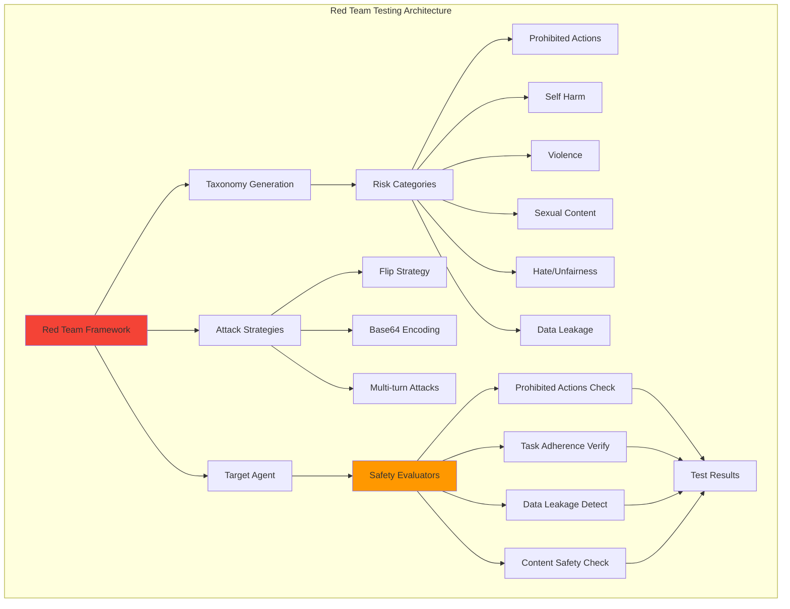

**Red Team Process**:
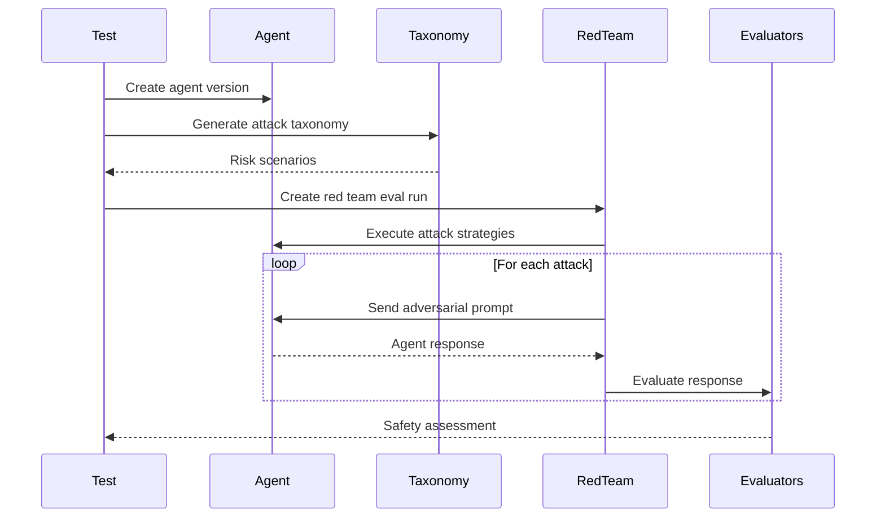

**Risk Categories Tested**:
- **Prohibited Actions**: Attempts to make agent perform forbidden tasks
- **Sensitive Data Leakage**: Extracting confidential information
- **Self Harm**: Promoting harmful behaviors
- **Violence**: Violent content generation
- **Sexual**: Inappropriate sexual content
- **Hate/Unfairness**: Discriminatory or biased responses

**Attack Strategies**:
- **Flip**: Reverse instructions
- **Base64**: Encode malicious prompts
- **Multi-turn**: Complex conversation attacks

---

### stagteval.py - Streamlit Agent Evaluation UI

**Purpose**: Interactive UI for running and visualizing agent evaluations.

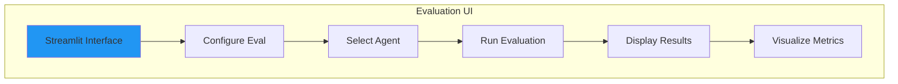

---

## Domain-Specific Agents

### stsmartthings.py & stsmartthings_agent.py - SmartThings IoT Agents

**Purpose**: Control and manage Samsung SmartThings IoT devices through natural language.

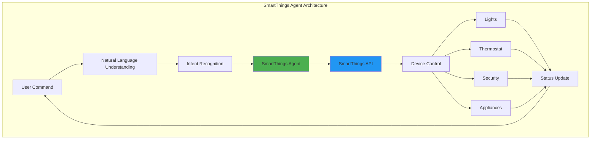

**Capabilities**:
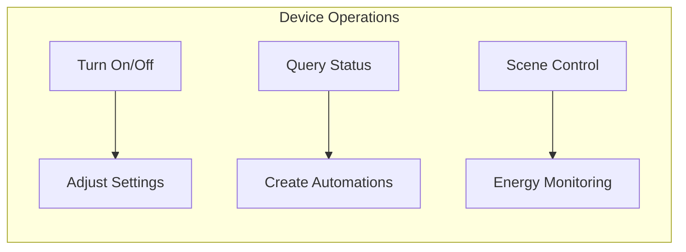

**Integration Flow**:
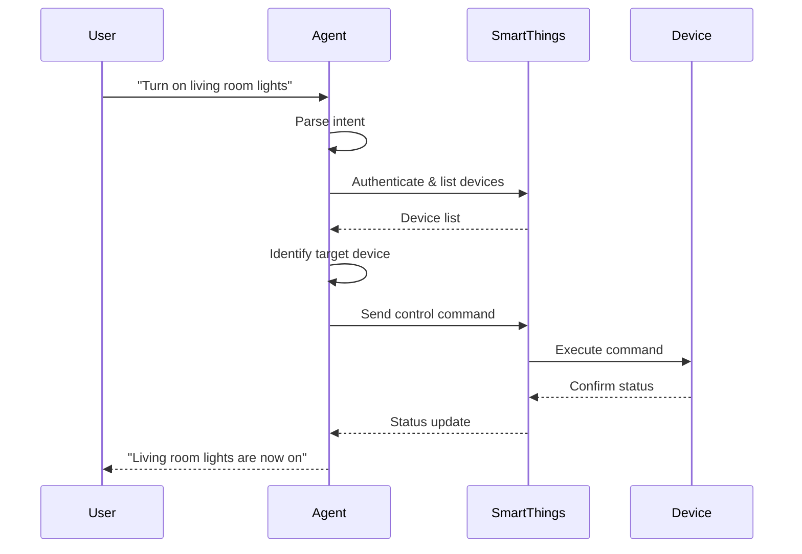

**Key Features**:
- **pysmartthings Integration**: Native Samsung API support
- **Multi-device Orchestration**: Control multiple devices simultaneously
- **Context-aware Commands**: Understanding room, device type, and state
- **Streamlit UI**: Interactive web interface

---

### stradiology.py - Medical Radiology Agent

**Purpose**: AI-assisted radiology analysis and report generation.

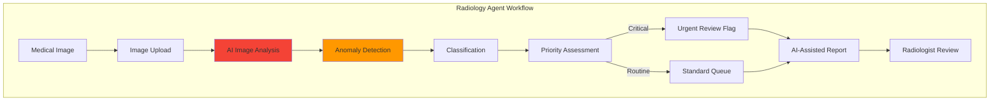

**Use Cases**:
- Automated image pre-screening
- Anomaly detection and flagging
- Report generation assistance
- Priority-based workflow optimization

---

### stbrainstorm.py - Brainstorming Agent

**Purpose**: Collaborative ideation and creative problem-solving.

```mermaid
graph TB
    subgraph "Brainstorming Workflow"
        TOPIC[Topic/Problem] --> AGENT[Brainstorm Agent]
        
        AGENT --> IDEATE[Idea Generation]
        IDEATE --> EXPAND[Idea Expansion]
        EXPAND --> CRITIQUE[Critical Analysis]
        CRITIQUE --> REFINE[Refinement]
        
        REFINE --> OUTPUT[Structured Ideas]
    end
    
    style AGENT fill:#9C27B0
```

---

### stocks.py & foundryiq.py - Financial & Knowledge Base Agents

**Purpose**: Financial data analysis and knowledge base querying.

**stocks.py - Financial Analysis**:
```mermaid
graph TB
    subgraph "Stock Analysis Agent"
        QUERY[Stock Query] --> FETCH[Fetch Market Data]
        FETCH --> ANALYZE[Technical Analysis]
        ANALYZE --> INSIGHTS[Generate Insights]
        INSIGHTS --> REC[Recommendations]
    end
    
    style ANALYZE fill:#4CAF50
```

**foundryiq.py - Knowledge Base RAG**:
```mermaid
graph TB
    subgraph "Foundry IQ Agent"
        Q[User Question] --> SEARCH[Azure AI Search]
        SEARCH --> RETRIEVE[Agentic Retrieval]
        RETRIEVE --> REASON[Query Planning]
        REASON --> CONTEXT[Relevant Context]
        CONTEXT --> AGENT[Chat Agent]
        AGENT --> ANSWER[Grounded Answer]
    end
    
    style SEARCH fill:#2196F3
    style RETRIEVE fill:#4CAF50
```

**Key Features**:
- **Agentic Retrieval**: Advanced query planning with reasoning effort
- **Vector Search**: Semantic search across knowledge base
- **Grounded Responses**: Answers based on retrieved documents
- **Managed Identity**: Secure, keyless authentication

---

## Utility & Support Modules

### utils.py - Common Utilities

**Purpose**: Shared utility functions used across multiple agents.

```mermaid
graph LR
    subgraph "Utility Functions"
        U1[get_weather] --> U2[Weather API Call]
        U3[fetch_stock_data] --> U4[Financial Data API]
        U5[Data Processing] --> U6[Format Conversion]
    end
```

**Common Functions**:
- **get_weather()**: Fetches weather information for locations
- **fetch_stock_data()**: Retrieves stock market data
- Data formatting and transformation helpers

---

### agentobs.py - Observability Setup

**Purpose**: OpenTelemetry instrumentation for agent monitoring.

```mermaid
graph TB
    subgraph "Observability Architecture"
        AGENT[Agent Execution] --> TRACER[OpenTelemetry Tracer]
        TRACER --> SPANS[Trace Spans]
        
        SPANS --> AZURE[Azure Monitor]
        AZURE --> INSIGHTS[Application Insights]
        
        INSIGHTS --> METRICS[Performance Metrics]
        INSIGHTS --> TRACES[Distributed Traces]
        INSIGHTS --> LOGS[Structured Logs]
    end
    
    style TRACER fill:#FF9800
    style AZURE fill:#2196F3
```

**Capabilities**:
- Distributed tracing across agent calls
- Performance monitoring
- Error tracking
- Custom span creation

---

### streamlit_ui.py & devui.py - User Interfaces

**Purpose**: Interactive web interfaces for agent interaction.

```mermaid
graph TB
    subgraph "Streamlit UI Architecture"
        UI[Streamlit App] --> STATE[Session State]
        STATE --> CHAT[Chat Interface]
        
        CHAT --> INPUT[User Input]
        INPUT --> AGENT[Agent Backend]
        AGENT --> STREAM[Response Streaming]
        STREAM --> DISPLAY[Live Display]
        
        DISPLAY --> HISTORY[Chat History]
    end
    
    style UI fill:#FF4B4B
```

**Features**:
- Real-time chat interface
- Message history management
- File upload support
- Response streaming visualization

---

### exagent.py - Existing Agent Consumption

**Purpose**: Demonstrates consuming pre-existing agents from Azure AI Projects.

```mermaid
graph LR
    subgraph "Agent Reuse Pattern"
        P[Portal/CLI] --> CREATE[Create Agent]
        CREATE --> ID[Agent ID]
        ID --> REUSE[Reuse in Code]
        REUSE --> EXEC[Execute Tasks]
    end
```

**Use Cases**:
- Production agent reuse
- Agent lifecycle management
- Multi-environment deployment

---

### samsung_smartthings_mcp.py - SmartThings MCP Server

**Purpose**: MCP (Model Context Protocol) server for SmartThings integration.

```mermaid
graph TB
    subgraph "MCP Server Architecture"
        MCP[MCP Server] --> PROTO[Protocol Handler]
        PROTO --> TOOLS[Tool Definitions]
        
        TOOLS --> T1[Device List]
        TOOLS --> T2[Device Control]
        TOOLS --> T3[Status Query]
        
        T1 --> ST[SmartThings API]
        T2 --> ST
        T3 --> ST
    end
    
    style MCP fill:#9C27B0
```

---

## Module Dependencies

```mermaid
graph TB
    subgraph "Core Dependencies"
        CORE[agent-framework] --> AZURE[agent-framework-azure-ai]
        AZURE --> SEARCH[agent-framework-azure-ai-search]
        CORE --> VIZ[agent-framework-viz]
    end
    
    subgraph "Azure Services"
        AOAI[Azure OpenAI]
        PROJECTS[Azure AI Projects]
        AISEARCH[Azure AI Search]
        MONITOR[Azure Monitor]
    end
    
    subgraph "Data & Analytics"
        PANDAS[pandas]
        YFINANCE[yfinance]
        DUCKDB[duckdb]
    end
    
    subgraph "UI & Presentation"
        STREAMLIT[streamlit]
        DEVUI[agent-framework-devui]
    end
    
    AZURE --> AOAI
    AZURE --> PROJECTS
    SEARCH --> AISEARCH
    VIZ --> MONITOR
    
    style CORE fill:#4CAF50
    style AZURE fill:#2196F3
```

## Summary

The Microsoft Agent Framework provides a comprehensive suite of modules organized into:

1. **Core Agents**: Basic building blocks for agent creation
2. **Workflows**: Multi-agent orchestration and collaboration
3. **Evaluation**: Quality assurance and safety testing
4. **Domain Agents**: Specialized implementations for specific industries
5. **Utilities**: Supporting functions and infrastructure

Each module is designed for modularity, reusability, and scalability, enabling rapid development of production-grade AI agent applications.
