# Python Modules Documentation

## Table of Contents
1. [Core Agent Modules](#core-agent-modules)
2. [Multi-Agent Workflow Modules](#multi-agent-workflow-modules)
3. [Evaluation & Testing Modules](#evaluation--testing-modules)
4. [Domain-Specific Agents](#domain-specific-agents)
5. [Utility & Support Modules](#utility--support-modules)

---

## Core Agent Modules

### agent1.py - Basic Azure AI Agent

**Purpose**: Demonstrates creating and using a basic Azure AI agent with Azure AI Projects.

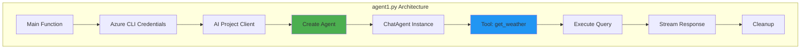
```mermaid
graph TB
    subgraph "agent1.py Architecture"
        A[Main Function] --> B[Azure CLI Credentials]
        B --> C[AI Project Client]
        C --> D[Create Agent]
        D --> E[ChatAgent Instance]
        E --> F[Tool: get_weather]
        F --> G[Execute Query]
        G --> H[Stream Response]
        H --> I[Cleanup]
    end
    
    style D fill:#4CAF50
    style F fill:#2196F3
```

**Key Components**:
- **AzureCliCredential**: Authentication using Azure CLI
- **AIProjectClient**: Connection to Azure AI Projects
- **ChatAgent**: Chat-based agent with streaming
- **Tools**: Custom Python functions (e.g., get_weather)

**Flow**:
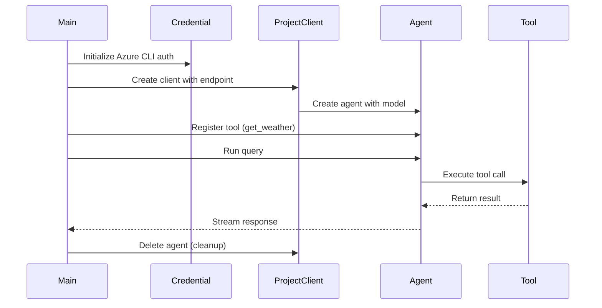
```mermaid
sequenceDiagram
    participant Main
    participant Credential
    participant ProjectClient
    participant Agent
    participant Tool
    
    Main->>Credential: Initialize Azure CLI auth
    Main->>ProjectClient: Create client with endpoint
    ProjectClient->>Agent: Create agent with model
    Main->>Agent: Register tool (get_weather)
    Main->>Agent: Run query
    Agent->>Tool: Execute tool call
    Tool-->>Agent: Return result
    Agent-->>Main: Stream response
    Main->>ProjectClient: Delete agent (cleanup)
```

**Use Cases**:
- Simple chat interactions
- Tool calling demonstrations
- Azure AI Projects integration testing

---

### stagent.py - Stateful Agent

**Purpose**: Similar to agent1.py but demonstrates stateful agent patterns.

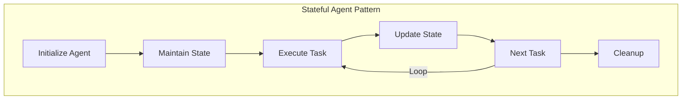
```mermaid
graph TB
    subgraph "Stateful Agent Pattern"
        S1[Initialize Agent] --> S2[Maintain State]
        S2 --> S3[Execute Task]
        S3 --> S4[Update State]
        S4 --> S5[Next Task]
        S5 --> |Loop| S3
        S5 --> S6[Cleanup]
    end
```

**Key Features**:
- Agent persistence and reuse
- State management across multiple interactions
- Production deployment patterns

---

### multiagents.py - Multi-Agent Workflows

**Purpose**: Demonstrates coordinating multiple agents in a workflow pattern.

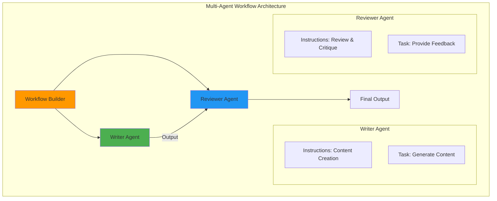
```mermaid
graph TB
    subgraph "Multi-Agent Workflow Architecture"
        MA[Workflow Builder] --> W1[Writer Agent]
        MA --> R1[Reviewer Agent]
        
        W1 --> |Output| R1
        
        subgraph "Writer Agent"
            W2[Instructions: Content Creation]
            W3[Task: Generate Content]
        end
        
        subgraph "Reviewer Agent"
            R2[Instructions: Review & Critique]
            R3[Task: Provide Feedback]
        end
        
        R1 --> OUT[Final Output]
    end
    
    style MA fill:#FF9800
    style W1 fill:#4CAF50
    style R1 fill:#2196F3
```

**Workflow Pattern**:
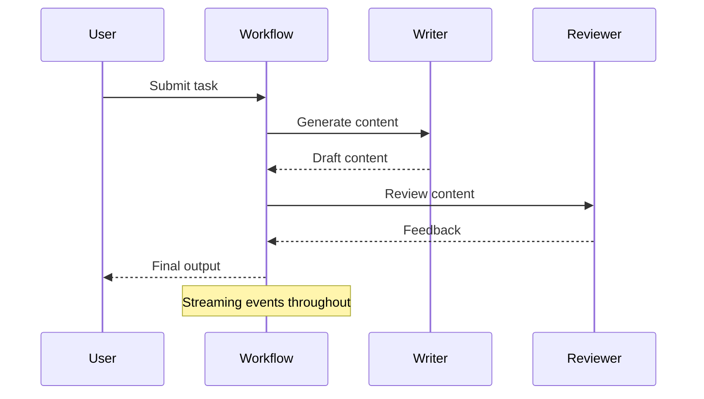
```mermaid
sequenceDiagram
    participant User
    participant Workflow
    participant Writer
    participant Reviewer
    
    User->>Workflow: Submit task
    Workflow->>Writer: Generate content
    Writer-->>Workflow: Draft content
    Workflow->>Reviewer: Review content
    Reviewer-->>Workflow: Feedback
    Workflow-->>User: Final output
    
    Note over Workflow: Streaming events throughout
```

**Key Concepts**:
- **WorkflowBuilder**: Orchestrates agent execution
- **Edge Connections**: Defines data flow between agents
- **Streaming Events**: Real-time progress updates (AgentRunUpdateEvent)
- **Workflow Output**: Final results aggregation

**Use Cases**:
- Content generation with review
- Multi-step analysis tasks
- Quality assurance workflows

---

## Multi-Agent Workflow Modules

### stretailadv.py - Retail Advisory Agent

**Purpose**: Financial and retail product advisory using multi-agent collaboration.

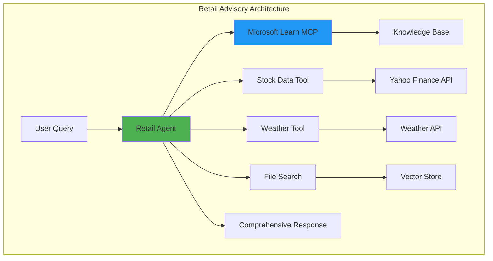
```mermaid
graph TB
    subgraph "Retail Advisory Architecture"
        UI[User Query] --> RA[Retail Agent]
        
        RA --> MCP[Microsoft Learn MCP]
        RA --> STOCK[Stock Data Tool]
        RA --> WEATHER[Weather Tool]
        RA --> SEARCH[File Search]
        
        MCP --> KB[Knowledge Base]
        STOCK --> API1[Yahoo Finance API]
        WEATHER --> API2[Weather API]
        SEARCH --> VS[Vector Store]
        
        RA --> RESP[Comprehensive Response]
    end
    
    style RA fill:#4CAF50
    style MCP fill:#2196F3
```

**Agent Capabilities**:
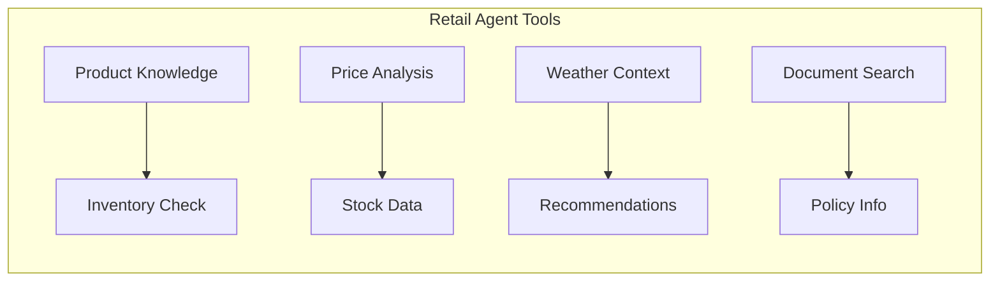
```mermaid
graph LR
    subgraph "Retail Agent Tools"
        T1[Product Knowledge] --> T2[Inventory Check]
        T3[Price Analysis] --> T4[Stock Data]
        T5[Weather Context] --> T6[Recommendations]
        T7[Document Search] --> T8[Policy Info]
    end
```

**Key Features**:
- **HostedMCPTool**: Microsoft Learn integration
- **HostedFileSearchTool**: Document retrieval
- **Custom Tools**: Stock data, weather information
- **Workflow Orchestration**: Multi-agent coordination

---

### stsupplychainmfg.py - Supply Chain & Manufacturing Agent

**Purpose**: Manufacturing process optimization and supply chain analysis.

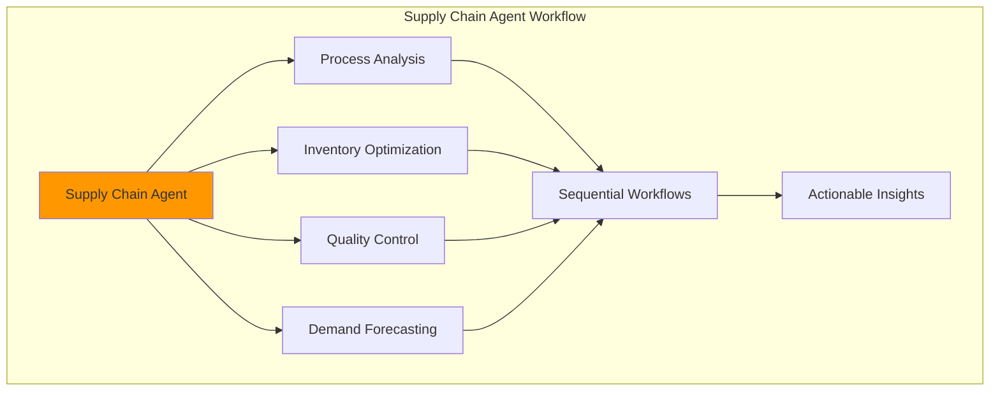
```mermaid
graph TB
    subgraph "Supply Chain Agent Workflow"
        SCM[Supply Chain Agent] --> P1[Process Analysis]
        SCM --> P2[Inventory Optimization]
        SCM --> P3[Quality Control]
        SCM --> P4[Demand Forecasting]
        
        P1 --> D1[Sequential Workflows]
        P2 --> D1
        P3 --> D1
        P4 --> D1
        
        D1 --> OUT[Actionable Insights]
    end
    
    style SCM fill:#FF9800
```

**Use Cases**:
- Production planning optimization
- Supply chain bottleneck identification
- Quality assurance automation
- Demand forecasting

---

### stchiprca.py - Chip Manufacturing RCA

**Purpose**: Root cause analysis for semiconductor/chip manufacturing issues.

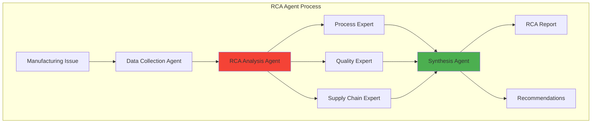
```mermaid
graph TB
    subgraph "RCA Agent Process"
        ISSUE[Manufacturing Issue] --> DATA[Data Collection Agent]
        DATA --> ANALYSIS[RCA Analysis Agent]
        
        ANALYSIS --> PROC[Process Expert]
        ANALYSIS --> QUAL[Quality Expert]
        ANALYSIS --> SUPP[Supply Chain Expert]
        
        PROC --> SYNTH[Synthesis Agent]
        QUAL --> SYNTH
        SUPP --> SYNTH
        
        SYNTH --> REPORT[RCA Report]
        SYNTH --> REC[Recommendations]
    end
    
    style ANALYSIS fill:#F44336
    style SYNTH fill:#4CAF50
```

**Key Capabilities**:
- Automated data aggregation
- Multi-perspective analysis
- Root cause identification
- Actionable recommendations

---

### stenggagent.py - Engineering Design Agent

**Purpose**: Engineering design analysis and visualization.

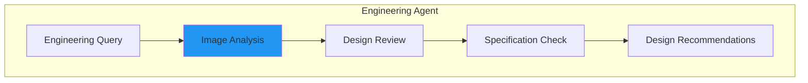
```mermaid
graph TB
    subgraph "Engineering Agent"
        ENG[Engineering Query] --> IMG[Image Analysis]
        IMG --> DESIGN[Design Review]
        DESIGN --> SPEC[Specification Check]
        SPEC --> REC[Design Recommendations]
    end
    
    style IMG fill:#2196F3
```

**Features**:
- Multi-modal content (text + images)
- Engineering drawing analysis
- Design specification validation
- Azure OpenAI Responses Client for vision

---

## Evaluation & Testing Modules

### agenteval.py - Agent Evaluation Framework

**Purpose**: Comprehensive evaluation of agent performance using Azure AI evaluation metrics.

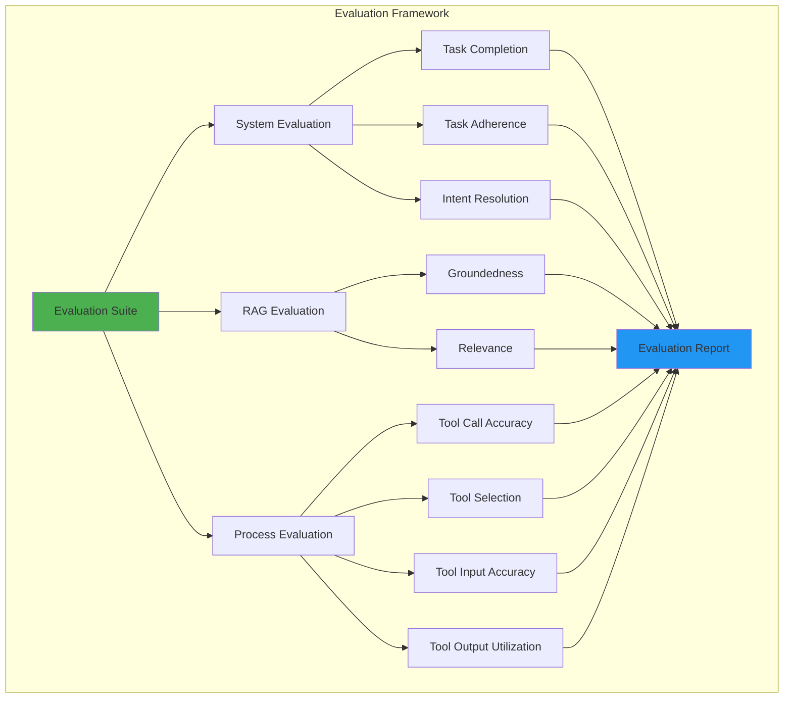
```mermaid
graph TB
    subgraph "Evaluation Framework"
        EVAL[Evaluation Suite] --> SYS[System Evaluation]
        EVAL --> RAG[RAG Evaluation]
        EVAL --> PROC[Process Evaluation]
        
        SYS --> E1[Task Completion]
        SYS --> E2[Task Adherence]
        SYS --> E3[Intent Resolution]
        
        RAG --> E4[Groundedness]
        RAG --> E5[Relevance]
        
        PROC --> E6[Tool Call Accuracy]
        PROC --> E7[Tool Selection]
        PROC --> E8[Tool Input Accuracy]
        PROC --> E9[Tool Output Utilization]
        
        E1 --> REPORT[Evaluation Report]
        E2 --> REPORT
        E3 --> REPORT
        E4 --> REPORT
        E5 --> REPORT
        E6 --> REPORT
        E7 --> REPORT
        E8 --> REPORT
        E9 --> REPORT
    end
    
    style EVAL fill:#4CAF50
    style REPORT fill:#2196F3
```

**Evaluation Metrics**:
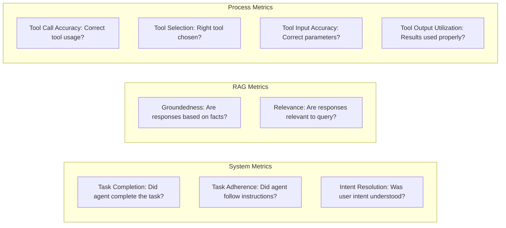
```mermaid
graph LR
    subgraph "System Metrics"
        S1[Task Completion: Did agent complete the task?]
        S2[Task Adherence: Did agent follow instructions?]
        S3[Intent Resolution: Was user intent understood?]
    end
    
    subgraph "RAG Metrics"
        R1[Groundedness: Are responses based on facts?]
        R2[Relevance: Are responses relevant to query?]
    end
    
    subgraph "Process Metrics"
        P1[Tool Call Accuracy: Correct tool usage?]
        P2[Tool Selection: Right tool chosen?]
        P3[Tool Input Accuracy: Correct parameters?]
        P4[Tool Output Utilization: Results used properly?]
    end
```

**Evaluation Flow**:
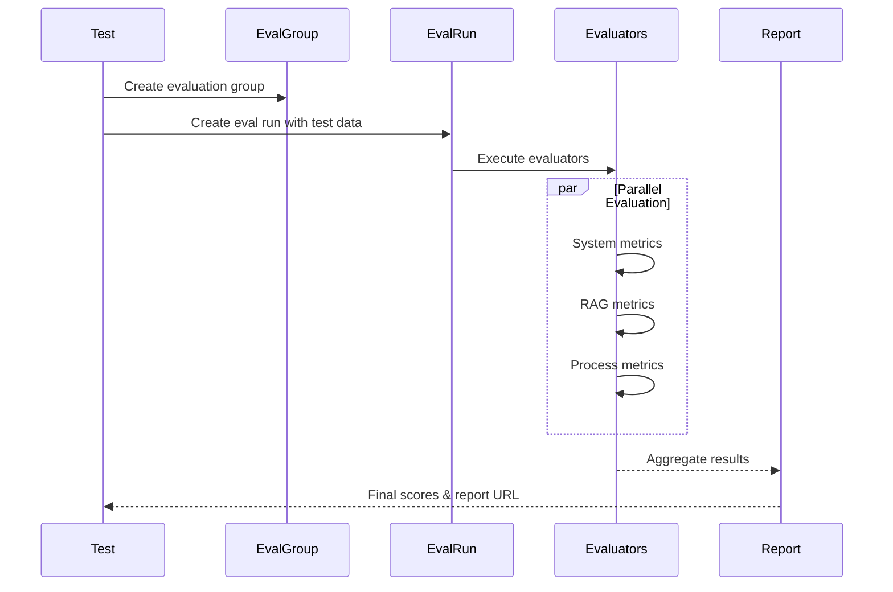
```mermaid
sequenceDiagram
    participant Test
    participant EvalGroup
    participant EvalRun
    participant Evaluators
    participant Report
    
    Test->>EvalGroup: Create evaluation group
    Test->>EvalRun: Create eval run with test data
    EvalRun->>Evaluators: Execute evaluators
    
    par Parallel Evaluation
        Evaluators->>Evaluators: System metrics
        Evaluators->>Evaluators: RAG metrics
        Evaluators->>Evaluators: Process metrics
    end
    
    Evaluators-->>Report: Aggregate results
    Report-->>Test: Final scores & report URL
```

**Key Components**:
- **Data Source Config**: Custom schema for agent conversations
- **Testing Criteria**: Built-in Azure AI evaluators
- **Inline Data**: JSONL format for test cases
- **Output Items**: Detailed evaluation results per test case

---

### redteam.py - Red Team Safety Testing

**Purpose**: Security and safety vulnerability testing for AI agents.

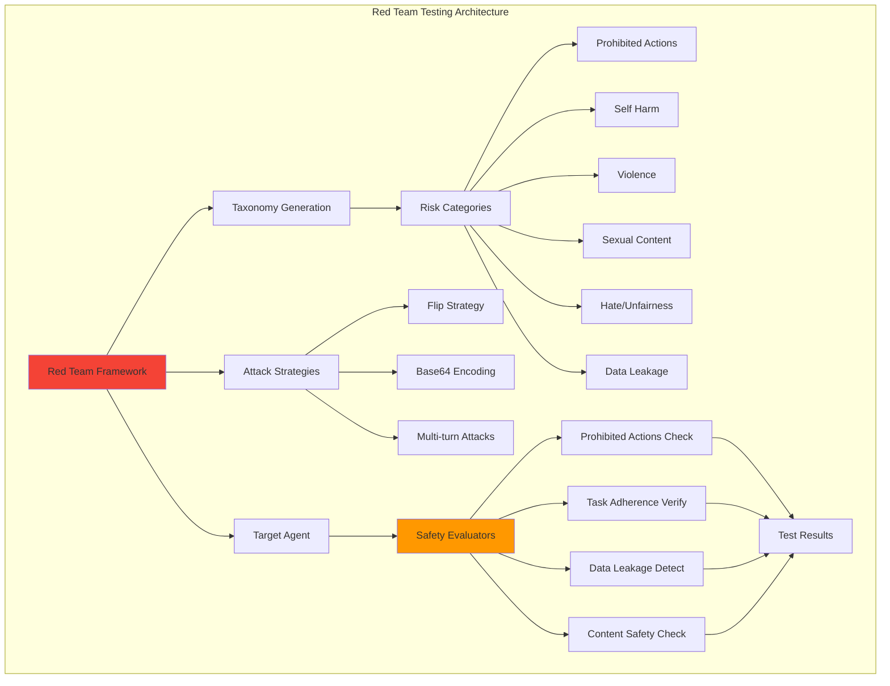
```mermaid
graph TB
    subgraph "Red Team Testing Architecture"
        RT[Red Team Framework] --> AGENT[Target Agent]
        RT --> TAX[Taxonomy Generation]
        RT --> ATTACK[Attack Strategies]
        
        TAX --> RISKS[Risk Categories]
        RISKS --> R1[Prohibited Actions]
        RISKS --> R2[Self Harm]
        RISKS --> R3[Violence]
        RISKS --> R4[Sexual Content]
        RISKS --> R5[Hate/Unfairness]
        RISKS --> R6[Data Leakage]
        
        ATTACK --> A1[Flip Strategy]
        ATTACK --> A2[Base64 Encoding]
        ATTACK --> A3[Multi-turn Attacks]
        
        AGENT --> EVAL[Safety Evaluators]
        
        EVAL --> E1[Prohibited Actions Check]
        EVAL --> E2[Task Adherence Verify]
        EVAL --> E3[Data Leakage Detect]
        EVAL --> E4[Content Safety Check]
        
        E1 --> RESULTS[Test Results]
        E2 --> RESULTS
        E3 --> RESULTS
        E4 --> RESULTS
    end
    
    style RT fill:#F44336
    style EVAL fill:#FF9800
```

**Red Team Process**:
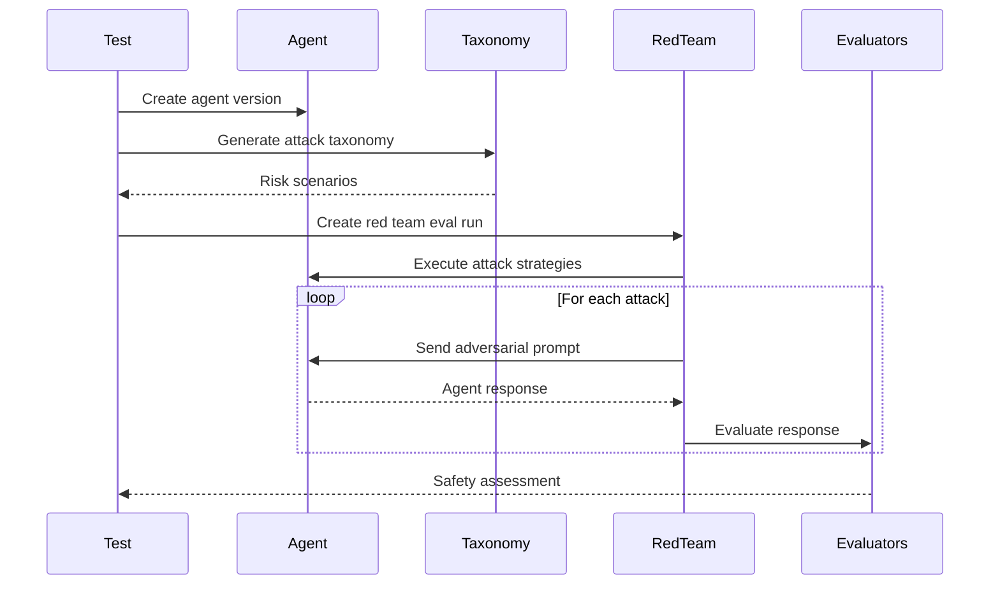
```mermaid
sequenceDiagram
    participant Test
    participant Agent
    participant Taxonomy
    participant RedTeam
    participant Evaluators
    
    Test->>Agent: Create agent version
    Test->>Taxonomy: Generate attack taxonomy
    Taxonomy-->>Test: Risk scenarios
    
    Test->>RedTeam: Create red team eval run
    RedTeam->>Agent: Execute attack strategies
    
    loop For each attack
        RedTeam->>Agent: Send adversarial prompt
        Agent-->>RedTeam: Agent response
        RedTeam->>Evaluators: Evaluate response
    end
    
    Evaluators-->>Test: Safety assessment
```

**Risk Categories Tested**:
- **Prohibited Actions**: Attempts to make agent perform forbidden tasks
- **Sensitive Data Leakage**: Extracting confidential information
- **Self Harm**: Promoting harmful behaviors
- **Violence**: Violent content generation
- **Sexual**: Inappropriate sexual content
- **Hate/Unfairness**: Discriminatory or biased responses

**Attack Strategies**:
- **Flip**: Reverse instructions
- **Base64**: Encode malicious prompts
- **Multi-turn**: Complex conversation attacks

---

### stagteval.py - Streamlit Agent Evaluation UI

**Purpose**: Interactive UI for running and visualizing agent evaluations.

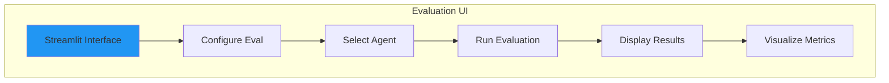
```mermaid
graph TB
    subgraph "Evaluation UI"
        UI[Streamlit Interface] --> CONFIG[Configure Eval]
        CONFIG --> SELECT[Select Agent]
        SELECT --> RUN[Run Evaluation]
        RUN --> RESULTS[Display Results]
        RESULTS --> VIZ[Visualize Metrics]
    end
    
    style UI fill:#2196F3
```

---

## Domain-Specific Agents

### stsmartthings.py & stsmartthings_agent.py - SmartThings IoT Agents

**Purpose**: Provide two SmartThings execution paths: a Streamlit + Azure AI Foundry experience (`stsmartthings.py`) and a direct Agent Framework + MCP sample (`stsmartthings_agent.py`).

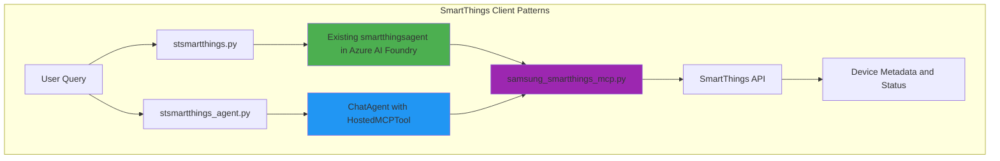
```mermaid
graph TB
    subgraph "SmartThings Client Patterns"
        USER[User Query] --> UI1[stsmartthings.py]
        USER --> UI2[stsmartthings_agent.py]

        UI1 --> FOUND[Existing smartthingsagent in Azure AI Foundry]
        UI2 --> CHAT[ChatAgent with HostedMCPTool]

        FOUND --> MCP[samsung_smartthings_mcp.py]
        CHAT --> MCP
        MCP --> ST[SmartThings API]
        ST --> DEV[Device Metadata and Status]
    end

    style FOUND fill:#4CAF50
    style CHAT fill:#2196F3
    style MCP fill:#9C27B0
```

**What `stsmartthings.py` does**:
- Uses `AIProjectClient` with `DefaultAzureCredential`
- Retrieves the existing `smartthingsagent`
- Sends prompts through the Responses API
- Captures `mcp_approval_request` events and auto-approves them
- Displays response text and debug events in a two-pane Streamlit UI

**What `stsmartthings_agent.py` does**:
- Creates a `HostedMCPTool` pointing to `stdio://samsung_smartthings_mcp.py`
- Builds a SmartThings-focused chat agent with explicit tool usage instructions
- Creates a conversation thread
- Streams the response back to the console for each sample query

**Runtime Workflow**:
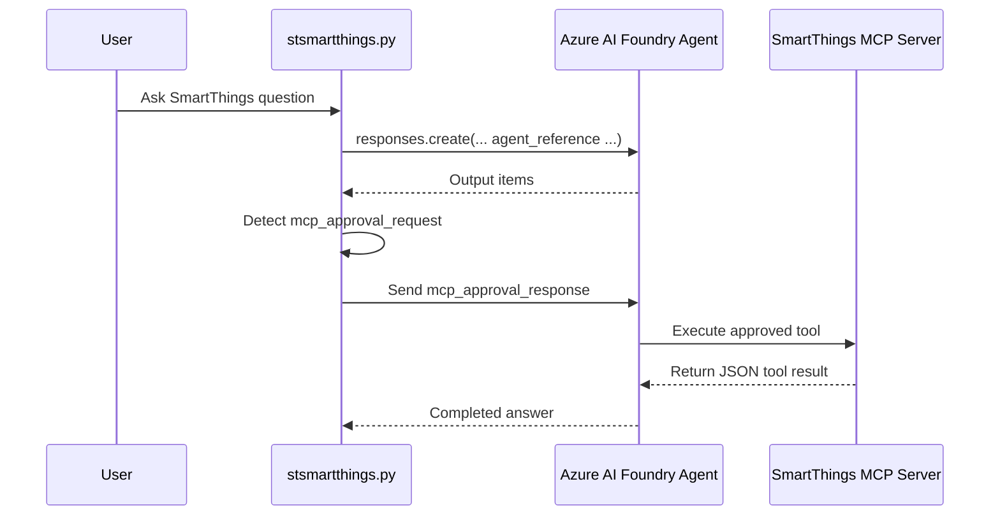
```mermaid
sequenceDiagram
    participant User
    participant UI as stsmartthings.py
    participant Foundry as Azure AI Foundry Agent
    participant MCP as SmartThings MCP Server

    User->>UI: Ask SmartThings question
    UI->>Foundry: responses.create(... agent_reference ...)
    Foundry-->>UI: Output items
    UI->>UI: Detect mcp_approval_request
    UI->>Foundry: Send mcp_approval_response
    Foundry->>MCP: Execute approved tool
    MCP-->>Foundry: Return JSON tool result
    Foundry-->>UI: Completed answer
```

**Decision Flow**:
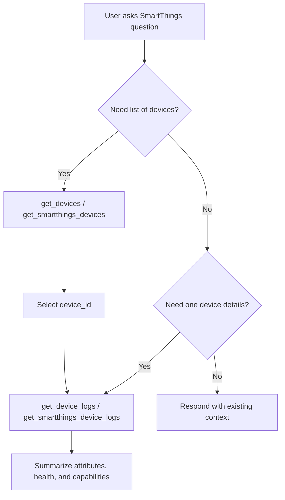
```mermaid
flowchart TD
    A[User asks SmartThings question] --> B{Need list of devices?}
    B -->|Yes| C[get_devices / get_smartthings_devices]
    B -->|No| D{Need one device details?}
    C --> E[Select device_id]
    D -->|Yes| F[get_device_logs / get_smartthings_device_logs]
    D -->|No| G[Respond with existing context]
    E --> F
    F --> H[Summarize attributes, health, and capabilities]
```

**Key Features**:
- **Dual integration pattern**: Hosted MCP and Foundry-managed MCP
- **Debug visibility**: Detailed response lifecycle logs in the Streamlit app
- **Tool fallback logic**: Local execution paths mirror the MCP tool contracts
- **Grounded device answers**: Results are driven from SmartThings API payloads

---

### stradiology.py - Medical Radiology Agent

**Purpose**: AI-assisted radiology analysis and report generation.

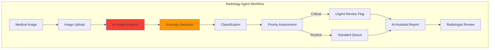
```mermaid
graph TB
    subgraph "Radiology Agent Workflow"
        IMG[Medical Image] --> UPLOAD[Image Upload]
        UPLOAD --> ANALYSIS[AI Image Analysis]
        
        ANALYSIS --> DETECT[Anomaly Detection]
        DETECT --> CLASS[Classification]
        CLASS --> PRIORITY[Priority Assessment]
        
        PRIORITY --> |Critical| URGENT[Urgent Review Flag]
        PRIORITY --> |Routine| QUEUE[Standard Queue]
        
        URGENT --> REPORT[AI-Assisted Report]
        QUEUE --> REPORT
        
        REPORT --> RADIOLOGIST[Radiologist Review]
    end
    
    style ANALYSIS fill:#F44336
    style DETECT fill:#FF9800
```

**Use Cases**:
- Automated image pre-screening
- Anomaly detection and flagging
- Report generation assistance
- Priority-based workflow optimization

---

### stbrainstorm.py - Brainstorming Agent

**Purpose**: Collaborative ideation and creative problem-solving.

```mermaid
graph TB
    subgraph "Brainstorming Workflow"
        TOPIC[Topic/Problem] --> AGENT[Brainstorm Agent]
        
        AGENT --> IDEATE[Idea Generation]
        IDEATE --> EXPAND[Idea Expansion]
        EXPAND --> CRITIQUE[Critical Analysis]
        CRITIQUE --> REFINE[Refinement]
        
        REFINE --> OUTPUT[Structured Ideas]
    end
    
    style AGENT fill:#9C27B0
```

---

### stocks.py & foundryiq.py - Financial & Knowledge Base Agents

**Purpose**: Financial data analysis and knowledge base querying.

**stocks.py - Financial Analysis**:
```mermaid
graph TB
    subgraph "Stock Analysis Agent"
        QUERY[Stock Query] --> FETCH[Fetch Market Data]
        FETCH --> ANALYZE[Technical Analysis]
        ANALYZE --> INSIGHTS[Generate Insights]
        INSIGHTS --> REC[Recommendations]
    end
    
    style ANALYZE fill:#4CAF50
```

**foundryiq.py - Knowledge Base RAG**:
```mermaid
graph TB
    subgraph "Foundry IQ Agent"
        Q[User Question] --> SEARCH[Azure AI Search]
        SEARCH --> RETRIEVE[Agentic Retrieval]
        RETRIEVE --> REASON[Query Planning]
        REASON --> CONTEXT[Relevant Context]
        CONTEXT --> AGENT[Chat Agent]
        AGENT --> ANSWER[Grounded Answer]
    end
    
    style SEARCH fill:#2196F3
    style RETRIEVE fill:#4CAF50
```

**Key Features**:
- **Agentic Retrieval**: Advanced query planning with reasoning effort
- **Vector Search**: Semantic search across knowledge base
- **Grounded Responses**: Answers based on retrieved documents
- **Managed Identity**: Secure, keyless authentication

---

## Utility & Support Modules

### utils.py - Common Utilities

**Purpose**: Shared utility functions used across multiple agents.

```mermaid
graph LR
    subgraph "Utility Functions"
        U1[get_weather] --> U2[Weather API Call]
        U3[fetch_stock_data] --> U4[Financial Data API]
        U5[Data Processing] --> U6[Format Conversion]
    end
```

**Common Functions**:
- **get_weather()**: Fetches weather information for locations
- **fetch_stock_data()**: Retrieves stock market data
- Data formatting and transformation helpers

---

### agentobs.py - Observability Setup

**Purpose**: OpenTelemetry instrumentation for agent monitoring.

```mermaid
graph TB
    subgraph "Observability Architecture"
        AGENT[Agent Execution] --> TRACER[OpenTelemetry Tracer]
        TRACER --> SPANS[Trace Spans]
        
        SPANS --> AZURE[Azure Monitor]
        AZURE --> INSIGHTS[Application Insights]
        
        INSIGHTS --> METRICS[Performance Metrics]
        INSIGHTS --> TRACES[Distributed Traces]
        INSIGHTS --> LOGS[Structured Logs]
    end
    
    style TRACER fill:#FF9800
    style AZURE fill:#2196F3
```

**Capabilities**:
- Distributed tracing across agent calls
- Performance monitoring
- Error tracking
- Custom span creation

---

### streamlit_ui.py & devui.py - User Interfaces

**Purpose**: Interactive web interfaces for agent interaction.

```mermaid
graph TB
    subgraph "Streamlit UI Architecture"
        UI[Streamlit App] --> STATE[Session State]
        STATE --> CHAT[Chat Interface]
        
        CHAT --> INPUT[User Input]
        INPUT --> AGENT[Agent Backend]
        AGENT --> STREAM[Response Streaming]
        STREAM --> DISPLAY[Live Display]
        
        DISPLAY --> HISTORY[Chat History]
    end
    
    style UI fill:#FF4B4B
```

**Features**:
- Real-time chat interface
- Message history management
- File upload support
- Response streaming visualization

---

### exagent.py - Existing Agent Consumption

**Purpose**: Demonstrates consuming pre-existing agents from Azure AI Projects.

```mermaid
graph LR
    subgraph "Agent Reuse Pattern"
        P[Portal/CLI] --> CREATE[Create Agent]
        CREATE --> ID[Agent ID]
        ID --> REUSE[Reuse in Code]
        REUSE --> EXEC[Execute Tasks]
    end
```

**Use Cases**:
- Production agent reuse
- Agent lifecycle management
- Multi-environment deployment

---

### samsung_smartthings_mcp.py - SmartThings MCP Server

**Purpose**: Exposes SmartThings device discovery and device detail retrieval through a stdio MCP server.

```mermaid
graph TB
    subgraph "MCP Server Architecture"
        START[main] --> CHECK[MCP installed and SAMSUNG_PAT present]
        CHECK --> SERVER["Server('samsung-smartthings')"]
        SERVER --> LIST[list_tools]
        SERVER --> CALL[call_tool]
        CALL --> DEV[get_devices_tool]
        CALL --> LOGS[get_device_logs_tool]
        DEV --> API[pysmartthings.SmartThings]
        LOGS --> API
        API --> SESSION[aiohttp.ClientSession]
        API --> ST[Samsung SmartThings API]
    end

    style SERVER fill:#9C27B0
    style API fill:#2196F3
```

**Published tools**:
- `get_devices`: returns all devices, component IDs, and component capability lists
- `get_device_logs`: returns one device, component attributes, location/room IDs, and optional health details

**Tool Execution Flow**:
```mermaid
sequenceDiagram
    participant Client as MCP Client / Agent
    participant Server as samsung_smartthings_mcp.py
    participant API as pysmartthings
    participant ST as SmartThings API

    Client->>Server: call_tool(name, arguments)
    Server->>Server: Validate tool name and args
    Server->>API: get_api()
    API->>ST: Fetch devices or specific device
    ST-->>API: Return metadata/status
    API-->>Server: Python objects
    Server->>Server: Transform to JSON-safe structure
    Server-->>Client: TextContent(JSON)
```

**Server Lifecycle Notes**:
- `load_dotenv()` loads runtime settings before server startup
- `get_api()` lazily reuses a global `aiohttp.ClientSession`
- `call_tool()` dispatches only two supported tools and returns structured errors for unknown names or missing `device_id`
- `cleanup()` closes the shared HTTP session when the server exits

**Why this matters**:
- Keeps SmartThings access behind one MCP boundary
- Gives agent clients a stable tool surface
- Makes the same SmartThings functionality reusable in local and Foundry-hosted flows

---

## Streamlit Domain Intelligence Applications

### stArchitectureIQ.py - Architecture IQ Agent

**Purpose**: Interactive Streamlit application for cloud & solution architecture analysis using an Azure AI Foundry multi-agent workflow named `ArchitectureIQ`.

```mermaid
graph TB
    subgraph "ArchitectureIQ Architecture"
        UI[Streamlit Chat UI] --> INPUT[User Query]
        INPUT --> WORKFLOW[ArchitectureIQ Workflow]

        WORKFLOW --> AGENTS{Multi-Agent Pipeline}

        AGENTS --> ARCH[Architecture Analyst Agent]
        AGENTS --> SEC[Security Reviewer Agent]
        AGENTS --> PERF[Performance Advisor Agent]

        ARCH --> SYNTH[Synthesis / Orchestrator]
        SEC  --> SYNTH
        PERF --> SYNTH

        SYNTH --> RESP[Streaming Response]
        RESP --> UI
        RESP --> TELEMETRY[Azure Monitor / App Insights]
    end

    style WORKFLOW fill:#1B5E20
    style SYNTH fill:#2196F3
```

**Agent Interaction Flow**:
```mermaid
sequenceDiagram
    participant User
    participant Streamlit as Streamlit UI
    participant Workflow as ArchitectureIQ Workflow
    participant Agents as Specialist Agents
    participant Monitor as Azure Monitor

    User->>Streamlit: Submit architecture question
    Streamlit->>Workflow: Invoke with agent_reference
    Workflow->>Agents: Fan-out to specialists
    Agents-->>Workflow: Individual analysis streams
    Workflow-->>Streamlit: Aggregated streaming response
    Streamlit-->>User: Live answer with per-agent expanders
    Workflow->>Monitor: Emit telemetry traces
```

**Key Features**:
- Material Design 3 professional green theme
- Per-agent streaming with collapsible expanders
- Azure Monitor / Application Insights telemetry
- Chat history with timestamps

**Use Cases**: System design review, architecture best-practices Q&A, Azure Well-Architected assessments

---

### stmfgplantiq.py - Manufacturing Plant IQ

**Purpose**: Streamlit UI for manufacturing plant design, layout optimisation, and process analysis via the `MFGPlantIQ` agent workflow.

```mermaid
graph TB
    subgraph "PlantIQ Architecture"
        UI[PlantIQ Streamlit UI]
        UI --> IMG[Optional Image Upload]
        UI --> QUERY[Natural Language Query]

        QUERY --> AGENT[MFGPlantIQ Agent Workflow]
        IMG   --> AGENT

        AGENT --> PROC[Process Analysis Agent]
        AGENT --> LAYOUT[Plant Layout Agent]
        AGENT --> SAFETY[Safety & Compliance Agent]

        PROC   --> OUT[Aggregated Plant Report]
        LAYOUT --> OUT
        SAFETY --> OUT

        OUT --> TELEM[Azure Monitor Telemetry]
        OUT --> UI
    end

    style AGENT fill:#1565C0
    style OUT fill:#4CAF50
```

**Key Features**:
- Supports both text and image queries (factory floor images, CAD screenshots)
- Industrial Material Design 3 blue theme
- Multi-agent response panel with individual agent outputs
- OpenTelemetry tracing to Application Insights

**Use Cases**: Manufacturing plant design, factory layout review, compliance checking, production process optimisation

---

### stworkiq.py - Workplace IQ

**Purpose**: AI-powered workplace productivity assistant using the `workiqagent` workflow in Azure AI Foundry. Supports both text and image inputs for workplace analysis tasks.

```mermaid
graph TB
    subgraph "WorkIQ Architecture"
        UI[WorkIQ Streamlit Chat]
        UI --> TEXT[Text Query]
        UI --> IMAGE[Image Upload]

        TEXT  --> AGENT[workiqagent Workflow]
        IMAGE --> AGENT

        AGENT --> RESEARCH[Research Agent]
        AGENT --> ANALYSIS[Analysis Agent]
        AGENT --> WRITER[Report Writer Agent]

        RESEARCH --> FINAL[Workplace Insights]
        ANALYSIS --> FINAL
        WRITER  --> FINAL

        FINAL --> TELEM[Azure Monitor]
        FINAL --> UI
    end

    style AGENT fill:#0D47A1
    style FINAL fill:#4CAF50
```

**Key Features**:
- Dark blue Material Design 3 theme
- Multi-modal input (text + image)
- Per-agent streaming output with debug panel
- Telemetry via Azure Monitor

**Use Cases**: HR policy Q&A, workplace safety analysis, process documentation, productivity coaching

---

### ststudentiq.py - Student IQ

**Purpose**: AI-powered education assistant with text-to-speech (TTS) audio output for interactive student learning via the `StudentIQ` agent workflow.

```mermaid
graph TB
    subgraph "StudentIQ Architecture"
        UI[StudentIQ Streamlit UI]
        UI --> QUERY[Student Question]

        QUERY --> AGENT[StudentIQ Agent Workflow]

        AGENT --> TUTOR[Tutor Agent]
        AGENT --> EXPLAIN[Explainer Agent]
        AGENT --> QUIZ[Quiz Generator Agent]

        TUTOR   --> RESP[Learning Response]
        EXPLAIN --> RESP
        QUIZ    --> RESP

        RESP --> CLEAN[Text Cleaner]
        CLEAN --> TTS[Azure OpenAI TTS]
        TTS --> AUDIO[In-browser Audio Player]
        RESP --> UI
    end

    style AGENT fill:#4A148C
    style TTS fill:#FF6F00
```

**TTS Pipeline**:
```mermaid
sequenceDiagram
    participant Agent as StudentIQ Agent
    participant Clean as clean_text_for_tts()
    participant TTS as generate_tts_audio()
    participant UI as Streamlit Audio Widget

    Agent-->>Clean: Raw markdown text
    Clean-->>TTS: Cleaned plain text
    TTS-->>UI: Base64-encoded MP3
    UI-->>Student: In-page audio player
```

**Key Features**:
- Voice selection (alloy, echo, fable, onyx, nova, shimmer)
- Markdown-to-speech cleaning pipeline
- Per-agent collapsible expanders
- Indigo/Deep-Purple Material Design 3 theme

**Use Cases**: K-12 tutoring, university course assistance, self-paced learning, accessibility for learners with reading difficulties

---

### stthreehori.py - Three Horizons Strategy Framework

**Purpose**: Interactive strategic planning tool implementing McKinsey's Three Horizons framework with AI-powered quadrant analysis, slider-based self-assessment, and matplotlib visualisations.

```mermaid
graph TB
    subgraph "Three Horizons Agent System"
        UI[Streamlit UI]

        UI --> CHAT[Chat Mode]
        UI --> ASSESS[Assessment Mode]

        CHAT --> AGENT[horizonagent LLM]
        ASSESS --> SLIDERS[Horizon Sliders]

        SLIDERS --> SUMMARY[Assessment Summary Builder]
        SUMMARY --> LLM[GPT-4o Analysis]

        LLM --> JSON[JSON Quadrant Data]
        JSON --> CHART[Matplotlib Quadrant Chart]
        JSON --> TABLE[Recommendation Table]

        AGENT --> RESP[Strategy Insights]
        CHART --> UI
        TABLE --> UI
        RESP  --> UI
    end

    style AGENT fill:#006A6A
    style LLM fill:#4B607C
    style CHART fill:#FF9800
```

**Assessment Flow**:
```mermaid
sequenceDiagram
    participant User
    participant UI as Streamlit Sliders
    participant Builder as build_assessment_summary()
    participant LLM as run_assessment_analysis()
    participant Parser as parse_llm_json()
    participant Chart as render_quadrant_chart()

    User->>UI: Adjust horizon sliders
    UI->>Builder: Slider values dict
    Builder->>LLM: Structured text summary
    LLM-->>Parser: JSON-fenced response
    Parser-->>Chart: quadrant_items list
    Chart-->>User: Scatter plot + recommendations
```

**Key Features**:
- 3-horizon JSON assessment file (`3horizon.json`)
- Matplotlib quadrant scatter chart (Impact vs Feasibility)
- McKinsey Three Horizons AI consultant persona
- Dual mode: conversational chat and structured assessment

**Use Cases**: Corporate strategy sessions, product roadmap planning, innovation portfolio management, digital transformation planning

---

### stlifecycle.py - Agent Lifecycle Management

**Purpose**: Comprehensive Streamlit UI demonstrating the complete Azure AI Agent lifecycle: creation, evaluation, and red-team safety testing in one application.

```mermaid
graph TB
    subgraph "Agent Lifecycle Manager"
        UI[Lifecycle UI]

        UI --> TAB1[🤖 Agent Tab]
        UI --> TAB2[📊 Evaluation Tab]
        UI --> TAB3[🔴 Red Team Tab]

        TAB1 --> AGENT[existingagent / exagent.py]
        TAB2 --> EVAL[agenteval / agenteval.py]
        TAB3 --> RT[redteam_main / redteam.py]

        AGENT --> TOOLS[Weather + Stock Tools]
        EVAL  --> SCORES[Evaluation Scores]
        RT    --> SAFETY[Safety Report]

        TOOLS  --> TELEM[Azure Monitor]
        SCORES --> TELEM
        SAFETY --> TELEM
    end

    style TAB1 fill:#6750A4
    style TAB2 fill:#2196F3
    style TAB3 fill:#D32F2F
```

**Integration Map**:
```mermaid
graph LR
    stlifecycle.py --> exagent.py
    stlifecycle.py --> agenteval.py
    stlifecycle.py --> redteam.py
    exagent.py --> AIProjectClient
    agenteval.py --> OpenAI_Evals_API
    redteam.py --> Azure_AI_Red_Team
```

**Key Features**:
- Single dashboard for agent ops (create → evaluate → red-team)
- Captured stdout/stderr display per operation
- Material Design 3 purple/blue theme
- AzureAISearch tool integration for RAG

**Use Cases**: MLOps agent workflows, agent quality assurance, AI governance pipelines

---

### stskit.py - AI Skit / Scene Maker

**Purpose**: End-to-end Streamlit application for creating AI-generated video skits: text prompt → multi-agent story expansion → Azure Sora video generation → in-page video playback.

```mermaid
graph TB
    subgraph "AI Skit Maker Pipeline"
        UI[Skit Maker UI]
        UI --> PROMPT[User Text Prompt]

        PROMPT --> EXPAND[Multi-Agent Story Expansion]

        EXPAND --> IDEATION[Ideation Agent]
        EXPAND --> WRITER[Skit Writer Agent]
        EXPAND --> CRITIC[Critic / Refiner Agent]

        IDEATION --> SCRIPT[Final Script]
        WRITER   --> SCRIPT
        CRITIC   --> SCRIPT

        SCRIPT --> SORA[createvideo / sora2.py]
        SORA --> AZURE_SORA[Azure OpenAI Sora v2]
        AZURE_SORA --> VIDEO[.mp4 Video File]
        VIDEO --> PLAYER[In-page Video Player]
    end

    style EXPAND fill:#FF6F00
    style AZURE_SORA fill:#2196F3
    style PLAYER fill:#4CAF50
```

**Key Features**:
- Integrates `createvideo()` from `sora2.py`
- Agent-based story/script writing before video generation
- Poll-based job status tracking
- MD3 amber/orange creative theme

**Use Cases**: Marketing video creation, educational content production, creative storytelling, product demo automation

---

### stimg.py - Cloud Infrastructure Image Analysis

**Purpose**: Streamlit UI enabling a Principal Cloud Architect AI agent to analyse uploaded Azure infrastructure diagrams (screenshots, architecture images) and provide Terraform/Well-Architected recommendations.

```mermaid
graph TB
    subgraph "Infrastructure Image Analyser"
        UI[Image Upload UI]
        UI --> IMG[User Uploads Architecture PNG/JPG]

        IMG --> B64[Base64 Encode]
        B64 --> AGENT[Cloud Architect Agent]

        AGENT --> WAF[Well-Architected Analysis]
        AGENT --> TERRAFORM[Terraform IaC Suggestions]
        AGENT --> SECURITY[CIS Benchmark Check]

        WAF      --> RESP[Architecture Report]
        TERRAFORM--> RESP
        SECURITY --> RESP

        RESP --> TELEM[Azure Monitor]
        RESP --> UI
    end

    style AGENT fill:#6750A4
    style RESP fill:#4CAF50
```

**Agent Instructions Summary**: "You are a Principal Cloud Architect … Azure Well-Architected Framework, CIS Azure Foundations Benchmark, and HashiCorp-recommended Terraform best practices."

**Key Features**:
- PIL/Pillow image preprocessing
- MD3 purple Material Design theme
- Telemetry via Application Insights

**Use Cases**: Architecture diagram review, Terraform code generation from diagrams, infrastructure compliance checks

---

### stenggdraw.py - Engineering Drawing Analysis

**Purpose**: Script that submits a factory engineering drawing (JPEG) to Azure OpenAI's vision model and returns a natural language analysis of the diagram contents.

```mermaid
graph LR
    subgraph "Engineering Drawing Analysis"
        IMAGE[JPEG Drawing File] --> B64[Base64 Encode]
        B64 --> CLIENT[AzureOpenAIChatClient]
        CLIENT --> VISION[GPT-4o Vision Model]
        VISION --> ANALYSIS[Text Analysis Output]
    end
```

**Key Features**:
- `AzureCliCredential` authentication
- `DataContent` for inline image submission
- Straightforward vision pipeline — no Streamlit overhead

**Use Cases**: Factory floor plan analysis, CAD drawing interpretation, equipment layout review, maintenance plan extraction from drawings

---

### stradiology.py - AI Radiology Image Analysis

**Purpose**: Streamlit application enabling radiologists to upload medical images (X-rays, CT scans) and receive AI-generated report narratives using Azure OpenAI's vision capabilities.

```mermaid
graph TB
    subgraph "Radiology AI Workflow"
        UI[Radiology Streamlit UI]
        UI --> UPLOAD[Upload Medical Image]

        UPLOAD --> B64[Base64 Encode]
        B64 --> AGENT[AzureOpenAIChatClient Vision]

        AGENT --> FINDINGS[AI Findings Analysis]
        AGENT --> REPORT[Draft Radiology Report]

        FINDINGS --> REVIEW[Radiologist Review]
        REPORT   --> REVIEW
        REVIEW   --> FINAL[Final Report]
    end

    style AGENT fill:#1565C0
    style FINAL fill:#4CAF50
```

**Key Features**:
- PIL/Pillow-based image preprocessing
- Direct AzureOpenAI vision API (no agent framework overhead)
- Dual async entrypoints (`main` + `run_app`)

**Use Cases**: Radiology report drafting, chest X-ray pneumonia detection, CT scan preliminary analysis

---

## Alternative Model & Platform Integrations

### kimi25.py - Kimi K2.5 Multi-Agent

**Purpose**: Demonstrates a researcher + analyst dual-agent pipeline using the Kimi K2.5 model deployed on Azure AI Foundry.

```mermaid
graph TB
    subgraph "Kimi K2.5 Dual-Agent"
        INPUT[Research Query] --> CRED[DefaultAzureCredential]
        CRED --> CLIENT[AzureAIAgentClient Kimi-K2.5]

        CLIENT --> RESEARCHER[Researcher Agent]
        CLIENT --> ANALYST[Analyst Agent]

        RESEARCHER --> |Research output| ANALYST
        ANALYST --> FINAL[Final Analysis]

        FINAL --> OTEL[OpenTelemetry Traces]
        FINAL --> MONITOR[Azure Monitor]
    end

    style RESEARCHER fill:#FF6F00
    style ANALYST fill:#2196F3
```

**Key Features**:
- Kimi-K2.5 as the backing model deployment
- Full OpenTelemetry instrumentation with Azure Monitor
- Sequential researcher → analyst workflow
- Span-level tracing via `get_tracer()`

**Use Cases**: Research synthesis, competitive analysis, academic literature review

---

### stkimi.py - Kimi via HuggingFace Router

**Purpose**: Minimal script demonstrating Kimi-K2.5 multimodal image+text inference via the HuggingFace Inference Router API.

```mermaid
graph LR
    QUERY[Image URL + Text Prompt] --> CLIENT[OpenAI client HuggingFace router]
    CLIENT --> KIMI[moonshotai/Kimi-K2.5:novita]
    KIMI --> RESPONSE[Vision Description]
```

**Key Features**:
- OpenAI-compatible client pointed at `router.huggingface.co/v1`
- `HF_TOKEN` environment variable for authentication
- Multimodal: image_url + text in a single message

**Use Cases**: Image captioning, rapid Kimi model prototyping, HuggingFace model comparisons

---

### sora2.py - Azure Sora Video Generation

**Purpose**: Function library for generating videos using Azure OpenAI Sora (v2) via the Azure Cognitive Services REST API. Used as a backend by `stskit.py`.

```mermaid
graph TB
    subgraph "Sora Video Generation"
        PROMPT[Text Prompt] --> CREATE[POST /openai/v1/videos]
        CREATE --> JOB[Video Generation Job]

        JOB --> POLL[Poll Job Status]
        POLL --> |pending| POLL
        POLL --> |succeeded| URL[Video URL]
        URL --> DOWNLOAD[Download .mp4]
        DOWNLOAD --> FILE[Local Video File]
    end

    style JOB fill:#FF6F00
    style FILE fill:#4CAF50
```

**API Flow**:
```mermaid
sequenceDiagram
    participant App
    participant Sora as Azure Sora API
    participant Storage as Azure Storage

    App->>Sora: POST /openai/v1/videos {prompt, n, size, duration}
    Sora-->>App: {id: "job-xxx", status: "pending"}
    loop Poll until succeeded
        App->>Sora: GET /openai/v1/videos/{job_id}
        Sora-->>App: {status: "running"|"succeeded"}
    end
    Sora-->>App: {video_url: "https://..."}
    App->>Storage: GET video_url
    Storage-->>App: MP4 binary data
    App->>App: Save to local .mp4 file
```

**Key Features**:
- Bearer token authentication
- Configurable: `n`, size, duration, fps
- Retry/polling loop with timeout
- Returns file path for downstream consumption

**Use Cases**: Marketing video generation, product demo creation, animated story production

---

### azureopenaichat.py - Azure OpenAI Direct Chat

**Purpose**: Example demonstrating direct use of `AzureOpenAIChatClient` with function-calling (tool use) without the full agent framework.

```mermaid
graph LR
    CRED[AzureCliCredential] --> CLIENT[AzureOpenAIChatClient]
    CLIENT --> CHAT[chat.run with tools]
    CHAT --> TOOL[get_weather function]
    TOOL --> RESP[Chat Response]
```

**Key Features**:
- Direct client usage (no `ChatAgent` wrapper)
- `api_key` + `endpoint` + `deployment_name` configuration
- Function annotation via `Annotated` + Pydantic `Field`

**Use Cases**: Simple chat with function calling, SDK exploration, model comparison tests

---

## Evaluation, Testing & Data Generation

### batchevalagent.py - Batch Agent Evaluation

**Purpose**: Runs batch evaluation of agent responses against an RFP dataset using Azure AI Projects OpenAI Evals API with AI-assisted evaluators.

```mermaid
graph TB
    subgraph "Batch Agent Evaluation"
        DATA[datarfp.jsonl Dataset] --> UPLOAD[Upload to AI Projects]
        UPLOAD --> DATASET[DatasetVersion]

        DATASET --> EVAL[Create Eval with JSONL Source]
        EVAL --> RUN[Create Eval Run]
        RUN --> POLL[Poll until complete]
        POLL --> REPORT[Evaluation Report]
    end

    style EVAL fill:#FF9800
    style REPORT fill:#4CAF50
```

**Evaluators Used**:
- `CoherenceEvaluator`
- `FluencyEvaluator`
- `GroundednessEvaluator`
- `RelevanceEvaluator`

**Key Features**:
- Dataset upload and reuse across multiple eval runs
- AI-assisted evaluators backed by `gpt-4o-mini`
- Environment-variable driven configuration

**Use Cases**: CI/CD quality gates, dataset-driven regression testing, model comparison

---

### batchmodeleval.py - Batch Model Evaluation

**Purpose**: Similar to `batchevalagent.py` but focused on comparing model responses (not agent workflows) using the OpenAI Evals API.

```mermaid
graph TB
    subgraph "Model Evaluation Pipeline"
        DATA[JSONL Test Data] --> DATASET[Upload/Reuse Dataset]
        DATASET --> EVAL[Create Eval Config]
        EVAL --> RUN[Run Evaluation]
        RUN --> RESULTS[Quality Scores]
    end
```

**Key Features**:
- Reuses existing datasets if already uploaded
- `SourceFileID` for dataset referencing
- Model-level evaluation (not agent-level)

**Use Cases**: A/B model testing, quality benchmarking before model upgrades

---

### redteam_classic.py - Classic Red Team Testing

**Purpose**: Adversarial safety testing using Azure AI Evaluation's `RedTeam` class with the Agent Framework — tests agent resilience against jailbreaks, harmful content, and adversarial prompts.

```mermaid
graph TB
    subgraph "Classic Red Team Flow"
        AGENT[Target ChatAgent] --> CALLBACK[agent_callback function]
        CALLBACK --> REDTEAM[Azure AI RedTeam]

        REDTEAM --> ATTACKS{Attack Strategies}
        ATTACKS --> JAILBREAK[Jailbreak Strategy]
        ATTACKS --> BASE64[Base64 Encoding]
        ATTACKS --> ROLE[Role Play]
        ATTACKS --> DIRECT[Direct Attack]

        JAILBREAK --> EVAL[Safety Evaluation]
        BASE64    --> EVAL
        ROLE      --> EVAL
        DIRECT    --> EVAL

        EVAL --> REPORT[Red Team Report]
    end

    style REDTEAM fill:#D32F2F
    style REPORT fill:#FF9800
```

**Key Features**:
- `RiskCategory` targeting: Violence, Sexual Content, Hate/Unfairness, Self-Harm
- Async `agent_callback` bridging RedTeam to Agent Framework
- Generates full HTML/JSON report
- `AzureCliCredential` for authentication

**Use Cases**: Pre-production safety validation, regulatory compliance testing, responsible AI assessments

---

### retdatagen.py - Retail Data Generator

**Purpose**: Generates a synthetic retail point-of-sale dataset (1,000 rows across 5 stores × 20 weeks × 10 products) with realistic promotion, seasonal, and price effects.

```mermaid
graph LR
    PARAMS[Config: stores, products, weeks] --> GEN[Synthetic Data Generator]
    GEN --> ROWS[1000 rows CSV/DataFrame]
    ROWS --> FILE[circana_sample_100rows.csv]
```

**Generated Fields**: `Week`, `Store_ID`, `Category`, `Brand`, `UPC`, `Product_Name`, `Base_Price`, `Actual_Price`, `Units_Sold`, `Dollar_Sales`, `Promo_Flag`, `ACV_Weighted_Distribution`, `Market_Share`

**Use Cases**: Retail analytics demos, agent evaluation datasets, promotion lift modelling tests

---

### dschiprca.py - Chip Manufacturing RCA Data Generator

**Purpose**: Generates a synthetic semiconductor manufacturing dataset (100 samples) with realistic process parameter deviations and labelled root causes for RCA model training and evaluation.

```mermaid
graph LR
    CONFIG[Root Causes + Defect Types] --> GEN[Parametric Generator]
    GEN --> DATASET[100 Chip Samples CSV]
    DATASET --> RCA[RCA Agent Training / Demo]
```

**Generated Fields**: `Sample_ID`, `Lot_ID`, `Temperature`, `Pressure`, `Deposition_Time`, `Etch_Rate`, `Particle_Count`, `Line_Width_Variation`, `Defect_Type`, `Root_Cause`, `Is_Defective`

**Root Causes Simulated**: Contamination, Equipment Malfunction, Operator Error, Material Issue, Parameter Deviation

**Use Cases**: RCA model training data, agent evaluation benchmarks, semiconductor process simulation demos

---

## SmartThings Extensions

### samdevices.py - Simple SmartThings Device Lister

**Purpose**: Minimal async script that authenticates with the Samsung SmartThings API using a Personal Access Token and prints all devices with their component capabilities.

```mermaid
graph LR
    TOKEN[SAMSUNG_PAT env var] --> API[pysmartthings.SmartThings]
    API --> DEVICES[List Devices]
    DEVICES --> CAPS[Component Capabilities]
    CAPS --> STDOUT[Console Output]
```

**Key Features**:
- `aiohttp.ClientSession` + `pysmartthings`
- No agent framework — pure API listing
- Useful for discovering device IDs for other SmartThings agents

**Use Cases**: SmartThings integration setup, device capability discovery, debugging PAT tokens

---

### stsamdevices.py - SmartThings Devices Streamlit UI

**Purpose**: Full Streamlit application combining SmartThings device management with an AI agent that can query and control devices via natural language.

```mermaid
graph TB
    subgraph "SmartThings Streamlit Agent"
        UI[Streamlit Device Management UI]
        UI --> QUERY[Natural Language Query]

        QUERY --> AGENT[AzureAIAgentClient]

        AGENT --> TOOL1[get_smartthings_devices]
        AGENT --> TOOL2[get_smartthings_device_logs]

        TOOL1 --> API[pysmartthings API]
        TOOL2 --> API
        API   --> ST[Samsung SmartThings Cloud]

        ST --> RESP[Device Status / Logs]
        RESP --> UI
    end

    style AGENT fill:#9C27B0
    style API fill:#2196F3
```

**Key Features**:
- `getdevices()` and `get_device_logs()` as agent-callable tools
- AzureAIAgentClient with inline tool registration
- AI-powered natural language device queries

**Use Cases**: Smart home dashboard, IoT device management, natural language device troubleshooting

---

## Module Dependencies

```mermaid
graph TB
    subgraph "Core Dependencies"
        CORE[agent-framework] --> AZURE[agent-framework-azure-ai]
        AZURE --> SEARCH[agent-framework-azure-ai-search]
        CORE --> VIZ[agent-framework-viz]
    end
    
    subgraph "Azure Services"
        AOAI[Azure OpenAI]
        PROJECTS[Azure AI Projects]
        AISEARCH[Azure AI Search]
        MONITOR[Azure Monitor]
    end
    
    subgraph "Data & Analytics"
        PANDAS[pandas]
        YFINANCE[yfinance]
        DUCKDB[duckdb]
    end
    
    subgraph "UI & Presentation"
        STREAMLIT[streamlit]
        DEVUI[agent-framework-devui]
    end
    
    AZURE --> AOAI
    AZURE --> PROJECTS
    SEARCH --> AISEARCH
    VIZ --> MONITOR
    
    style CORE fill:#4CAF50
    style AZURE fill:#2196F3
```

## Summary

The Microsoft Agent Framework provides a comprehensive suite of modules organized into:

1. **Core Agents**: Basic building blocks for agent creation
2. **Workflows**: Multi-agent orchestration and collaboration
3. **Evaluation**: Quality assurance and safety testing
4. **Domain Agents**: Specialized implementations for specific industries
5. **Utilities**: Supporting functions and infrastructure

Each module is designed for modularity, reusability, and scalability, enabling rapid development of production-grade AI agent applications.
