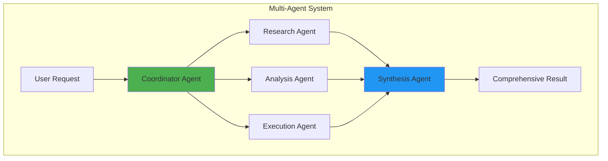
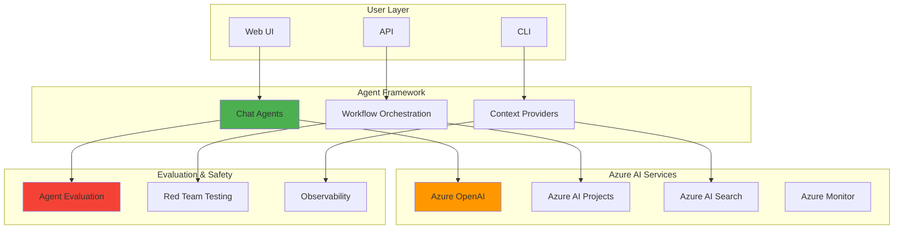

# Microsoft Agent Framework Documentation

## Overview

This documentation provides comprehensive architectural, technical, and business guidance for the Microsoft Agent Framework (msagentframework). The framework enables organizations to build, deploy, and manage AI agents using Azure AI services for transforming business processes across multiple domains.

## Documentation Structure

### 📋 [ARCHITECTURE.md](ARCHITECTURE.md)
**Technical architecture and system design**

Covers:
- System architecture diagrams
- Component architecture
- Technology stack
- Data flow patterns
- Security architecture
- Deployment architecture
- Design principles
- Integration points

**Audience**: Software architects, platform engineers, technical leads

---

### 💼 [AGENTIC_AI_VALUE.md](AGENTIC_AI_VALUE.md)
**Business value proposition and process reimagination**

Covers:
- Traditional vs. Agentic AI comparison
- Business value propositions
- Domain-specific process transformation
- ROI metrics and business impact
- Why agentic AI simplifies processes
- Implementation roadmap

**Audience**: Business leaders, decision makers, product managers

---

### 🐍 [PYTHON_MODULES.md](PYTHON_MODULES.md)
**Detailed documentation of all Python modules**

Covers:
- Core agent modules with mermaid diagrams
- Multi-agent workflow modules
- Evaluation and testing frameworks
- Domain-specific agent implementations
- Utility and support modules
- Module dependencies

**Audience**: Developers, data scientists, ML engineers

---

### 🔄 [GITHUB_WORKFLOWS.md](GITHUB_WORKFLOWS.md)
**CI/CD pipeline and GitHub Actions workflows**

Covers:
- Workflow architecture
- Step-by-step execution breakdown
- Secret management
- Azure authentication
- Agent testing procedures
- Evaluation framework integration
- Red team security testing
- Best practices and optimization

**Audience**: DevOps engineers, platform engineers, security engineers

---

### 🎯 [USE_CASES.md](USE_CASES.md)
**Real-world business use cases and domain applications**

Covers:
- Retail & E-Commerce
- Manufacturing & Supply Chain
- Healthcare & Medical Imaging
- Smart Home & IoT
- Financial Services
- Engineering & Design
- Customer Service & Support
- Cross-industry patterns and benefits

**Audience**: Business analysts, solution architects, domain experts

---

## Quick Start Guide

### For Business Leaders
1. Start with [AGENTIC_AI_VALUE.md](AGENTIC_AI_VALUE.md) to understand ROI and business transformation
2. Review [USE_CASES.md](USE_CASES.md) for relevant industry examples
3. Reference [ARCHITECTURE.md](ARCHITECTURE.md) for high-level system overview

### For Developers
1. Begin with [ARCHITECTURE.md](ARCHITECTURE.md) for system understanding
2. Deep dive into [PYTHON_MODULES.md](PYTHON_MODULES.md) for implementation details
3. Reference [GITHUB_WORKFLOWS.md](GITHUB_WORKFLOWS.md) for CI/CD setup

### For DevOps/Platform Engineers
1. Start with [GITHUB_WORKFLOWS.md](GITHUB_WORKFLOWS.md) for deployment pipelines
2. Review [ARCHITECTURE.md](ARCHITECTURE.md) for infrastructure requirements
3. Reference [PYTHON_MODULES.md](PYTHON_MODULES.md) for observability and monitoring

## Key Concepts

### What is Agentic AI?

Agentic AI represents autonomous, intelligent systems that can:
- **Understand** natural language and context
- **Reason** through complex multi-step problems
- **Plan** execution strategies dynamically
- **Act** by calling tools and APIs
- **Learn** from evaluation and feedback

### Multi-Agent Architecture



### Core Framework Components

| Component | Purpose | Documentation |
|-----------|---------|---------------|
| **ChatAgent** | Chat-based interactions with streaming | [PYTHON_MODULES.md](PYTHON_MODULES.md) |
| **WorkflowBuilder** | Multi-agent orchestration | [PYTHON_MODULES.md](PYTHON_MODULES.md) |
| **AzureAIAgentClient** | Azure AI integration | [ARCHITECTURE.md](ARCHITECTURE.md) |
| **Evaluation Framework** | Quality assurance & testing | [PYTHON_MODULES.md](PYTHON_MODULES.md) |
| **Red Team Testing** | Security validation | [GITHUB_WORKFLOWS.md](GITHUB_WORKFLOWS.md) |

## Architecture Overview

### High-Level System Design



## Technology Stack

### Core Technologies
- **Python 3.12+**: Primary programming language
- **Azure OpenAI**: LLM inference and embeddings
- **Azure AI Projects**: Agent lifecycle management
- **Azure AI Search**: Knowledge base and vector search
- **Streamlit**: Interactive web interfaces

### Key Libraries
- `agent-framework`: Core agent functionality
- `agent-framework-azure-ai`: Azure integrations
- `azure-ai-evaluation`: Quality metrics
- `pyrit`: Red team testing
- `opentelemetry`: Observability

## Getting Started

### Prerequisites
- Azure subscription with AI services
- Python 3.12 or later
- Azure CLI configured
- GitHub repository access

### Installation
```bash
pip install -r requirements.txt
```

### Basic Usage Example
```python
from agent_framework import ChatAgent
from agent_framework.azure import AzureAIAgentClient

async with AzureAIAgentClient() as client:
    async with ChatAgent(
        chat_client=client,
        instructions="You are a helpful assistant."
    ) as agent:
        result = await agent.run("Hello, how can you help?")
        print(result.text)
```

## Documentation Map

### By Role

#### Business Decision Maker
```
START → AGENTIC_AI_VALUE.md → USE_CASES.md → Implementation Roadmap
```

#### Software Architect
```
START → ARCHITECTURE.md → PYTHON_MODULES.md → Integration Planning
```

#### Developer
```
START → PYTHON_MODULES.md → Code Examples → GITHUB_WORKFLOWS.md
```

#### DevOps Engineer
```
START → GITHUB_WORKFLOWS.md → ARCHITECTURE.md → Deployment Setup
```

### By Use Case

#### Implementing Retail Agent
```
USE_CASES.md (Retail) → PYTHON_MODULES.md (stretailadv.py) → ARCHITECTURE.md (Integration)
```

#### Setting Up CI/CD
```
GITHUB_WORKFLOWS.md → Secret Setup → Azure Configuration → Testing
```

#### Evaluating Agent Quality
```
PYTHON_MODULES.md (agenteval.py) → GITHUB_WORKFLOWS.md (Evaluation Step) → Metrics Review
```

## Visual Documentation Index

### Architecture Diagrams
- System Architecture ([ARCHITECTURE.md](ARCHITECTURE.md))
- Component Architecture ([ARCHITECTURE.md](ARCHITECTURE.md))
- Data Flow ([ARCHITECTURE.md](ARCHITECTURE.md))
- Security Architecture ([ARCHITECTURE.md](ARCHITECTURE.md))
- Deployment Architecture ([ARCHITECTURE.md](ARCHITECTURE.md))

### Process Flows
- Traditional vs. Agentic AI ([AGENTIC_AI_VALUE.md](AGENTIC_AI_VALUE.md))
- Domain-specific workflows ([USE_CASES.md](USE_CASES.md))
- CI/CD Pipeline ([GITHUB_WORKFLOWS.md](GITHUB_WORKFLOWS.md))

### Module Diagrams
- Agent implementations ([PYTHON_MODULES.md](PYTHON_MODULES.md))
- Workflow patterns ([PYTHON_MODULES.md](PYTHON_MODULES.md))
- Evaluation framework ([PYTHON_MODULES.md](PYTHON_MODULES.md))

## Key Takeaways

### Why Agentic AI?
✅ **Autonomous**: Self-directed problem solving  
✅ **Intelligent**: Context-aware reasoning  
✅ **Scalable**: Infinite parallel processing  
✅ **Safe**: Built-in evaluation and testing  
✅ **Fast**: 90%+ reduction in task completion time  

### Framework Advantages
✅ **Azure-native**: Seamless cloud integration  
✅ **Multi-agent**: Specialized team collaboration  
✅ **Production-ready**: Evaluation & security built-in  
✅ **Domain-flexible**: Retail, manufacturing, healthcare, IoT, finance  
✅ **Developer-friendly**: Python-first, async-native  

### Business Impact
✅ **Efficiency**: 60-80% reduction in operational costs  
✅ **Quality**: 30-50% improvement in decision accuracy  
✅ **Speed**: 90-95% faster task completion  
✅ **Scale**: 10-100x capacity increase  
✅ **ROI**: Measurable business outcomes  

## Support & Resources

### Azure AI Documentation
- [Azure OpenAI Service](https://learn.microsoft.com/azure/ai-services/openai/)
- [Azure AI Projects](https://learn.microsoft.com/azure/ai-studio/)
- [Azure AI Search](https://learn.microsoft.com/azure/search/)

### Agent Framework Resources
- [Agent Framework GitHub](https://github.com/microsoft/agent-framework)
- [Python SDK Documentation](https://pypi.org/project/agent-framework/)

### Best Practices
- Start with single-agent use case
- Implement evaluation from day one
- Use red team testing before production
- Monitor with Azure Application Insights
- Iterate based on user feedback

## Contributing

This documentation is maintained alongside the codebase. For updates or corrections:
1. Review the relevant documentation file
2. Submit changes via pull request
3. Ensure mermaid diagrams render correctly
4. Update this README if adding new documents

## Version History

- **v1.0** (2026-01): Initial comprehensive documentation
  - Architecture overview
  - Business value analysis
  - Python module documentation
  - GitHub workflows guide
  - Use case library

---

**Last Updated**: January 2026  
**Framework Version**: Microsoft Agent Framework Oct 2025  
**Maintained By**: Repository Contributors
