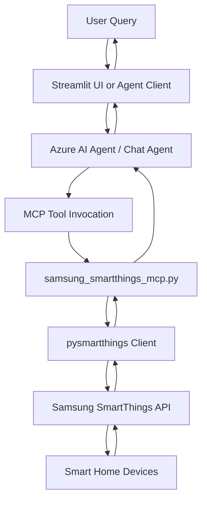
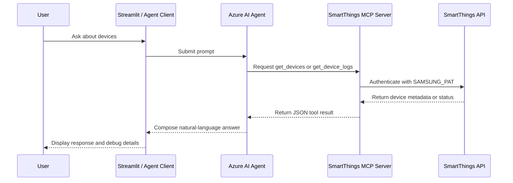
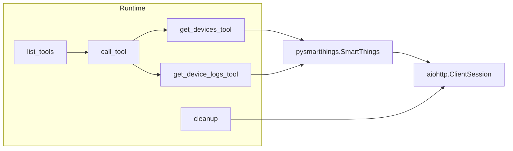

# Samsung SmartThings MCP Server

This guide documents the SmartThings MCP implementation in this repository and keeps the SmartThings architecture and workflow artifacts under `docs/`.

## Related Files

- `../samsung_smartthings_mcp.py` - MCP server exposed over stdio
- `../stsmartthings_agent.py` - Example agent that connects to the local MCP server
- `../stsmartthings.py` - Streamlit app that consumes the Azure AI Foundry agent and handles MCP approvals
- `../stsamdevices.py` - Standalone device listing script
- [`ARCHITECTURE.md`](ARCHITECTURE.md) - Platform-level architecture
- [`PYTHON_MODULES.md`](PYTHON_MODULES.md) - Module-by-module details

## Overview

The SmartThings implementation supports two related execution patterns:

1. **Direct local tool execution** in `stsmartthings.py` and `stsamdevices.py`
2. **Hosted MCP execution** through `samsung_smartthings_mcp.py` and `stsmartthings_agent.py`

Both patterns use the same SmartThings Personal Access Token (`SAMSUNG_PAT`) and the same `pysmartthings` device access model.



## End-to-End Workflow



## Tool Contracts

### `get_devices`

Returns all SmartThings devices, device metadata, and component capability lists.

**Input**
- No parameters

**Output shape**
- `success`
- `device_count`
- `devices[]`
  - `device_id`
  - `label`
  - `name`
  - `type`
  - `components`

### `get_device_logs`

Returns detailed information for a single device, including component-level attributes and health data when available.

**Input**
- `device_id` - SmartThings device identifier

**Output shape**
- `success`
- `device`
  - `device_id`
  - `label`
  - `name`
  - `type`
  - `location_id`
  - `room_id`
  - `components`
  - `health`
- `timestamp`

## Execution Modes

### 1. MCP server mode

Use this when the agent should discover SmartThings tools through the Model Context Protocol.

```bash
python samsung_smartthings_mcp.py
```

What happens:
1. `.env` is loaded
2. `SAMSUNG_PAT` is read
3. The stdio MCP server starts
4. Tools are advertised through `list_tools()`
5. Tool requests are routed through `call_tool()`
6. SmartThings data is returned as JSON text payloads

### 2. Example agent mode

Use the example agent to validate MCP connectivity from a Python client.

```bash
python stsmartthings_agent.py
```

What happens:
1. A `HostedMCPTool` points to `stdio://samsung_smartthings_mcp.py`
2. A chat agent is created with SmartThings instructions
3. A thread is created
4. Example user prompts are submitted
5. Response streaming prints tool-backed answers

### 3. Streamlit + Azure AI Foundry mode

Use the Streamlit app when an existing Azure AI Foundry agent is already configured and should handle SmartThings interactions in a browser UI.

```bash
streamlit run stsmartthings.py
```

What happens:
1. The app sends the prompt to the `smartthingsagent` configured in Azure AI Foundry
2. The agent may emit `mcp_approval_request` events
3. The app logs those events and approves them automatically
4. Local fallback execution logic can capture tool results for display
5. The final response and debug trail are shown side-by-side

## Setup Summary

1. Install dependencies from the repo root:
   ```bash
   pip install -r requirements.txt
   pip install mcp aiohttp python-dotenv
   ```
2. Create a SmartThings personal access token with at least:
   - `r:devices:*`
   - `r:locations:*` (optional)
3. Add the token to `.env`:
   ```bash
   SAMSUNG_PAT=your-token-here
   ```
4. If using Azure AI Foundry, also configure:
   - `AZURE_AI_PROJECT`
   - Azure authentication via CLI or managed credentials

## Architecture Notes



Key implementation details from `samsung_smartthings_mcp.py`:
- Reuses a global `aiohttp.ClientSession`
- Lazily constructs the SmartThings API client
- Serializes tool results as JSON text for MCP transport
- Supports graceful cleanup after stdio server shutdown

## Troubleshooting

### MCP library missing
- Install `mcp`
- Re-run `python samsung_smartthings_mcp.py`

### `SAMSUNG_PAT` not set
- Add the token to `.env`
- Restart the app or shell session

### No devices returned
- Verify the account actually has SmartThings devices
- Confirm the PAT scopes are sufficient
- Check device connectivity in the SmartThings app

### Device lookup failures
- Call `get_devices` first to find a valid `device_id`
- Then use `get_device_logs` for the chosen device

## Related Documentation

- [`SMARTTHINGS_MCP_SETUP.md`](SMARTTHINGS_MCP_SETUP.md)
- [`SMARTTHINGS_MCP_CONFIGURATION.md`](SMARTTHINGS_MCP_CONFIGURATION.md)
- [`README.md`](README.md)
