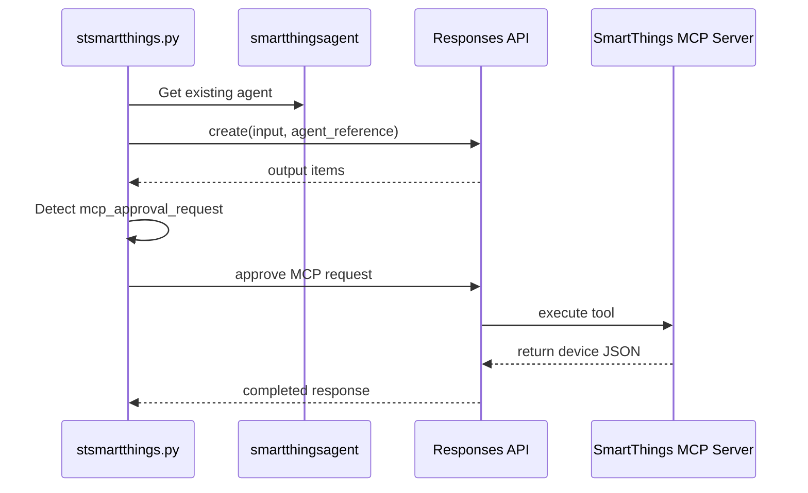
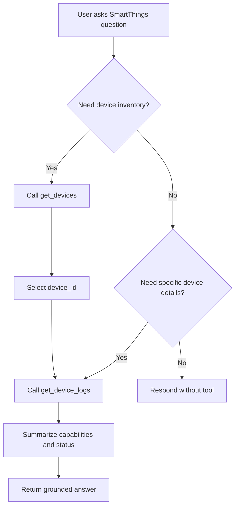

# Adding SmartThings MCP Tools to an Existing Agent

This document explains how the existing `smartthingsagent` should be configured to use the SmartThings MCP server, with the configuration artifact now kept inside `docs/`.

## Configuration Options

### Option A: Azure AI Foundry portal

Register the MCP server on the existing agent:

- **Name**: `samsung-smartthings`
- **Transport**: stdio / local process
- **Command**: `python`
- **Arguments**: `samsung_smartthings_mcp.py`
- **Working directory**: repository root
- **Environment**:
  - `SAMSUNG_PAT=<your token>`

### Option B: Configuration file pattern

If your deployment uses a configuration object, the MCP server should conceptually map like this:

```json
{
  "mcpServers": {
    "samsung-smartthings": {
      "command": "python",
      "args": ["samsung_smartthings_mcp.py"],
      "cwd": "/path/to/msagentframework",
      "env": {
        "SAMSUNG_PAT": "${env:SAMSUNG_PAT}"
      }
    }
  }
}
```

### Option C: Python client pattern

The repository’s example client uses `HostedMCPTool` in `stsmartthings_agent.py`:

```python
smartthings_mcp = HostedMCPTool(
    name="Samsung SmartThings",
    url="stdio://samsung_smartthings_mcp.py",
    approval_mode="never_require"
)
```

## Configuration Workflow


## How the Existing App Uses It

`stsmartthings.py` assumes the Foundry-side agent already exists and then:

1. Retrieves the existing `smartthingsagent`
2. Sends the user prompt through the Responses API
3. Detects `mcp_approval_request` outputs
4. Automatically approves them
5. Polls until the response completes
6. Surfaces debug logs and response text in the UI



## Tool Usage Guidance for the Agent

The agent should follow this decision pattern:



## Troubleshooting

### Server cannot be launched
- Confirm the working directory is the repository root
- Confirm `python` resolves in the execution environment
- Test `python samsung_smartthings_mcp.py` locally first

### Tool approval loops or missing tool output
- Verify the agent actually returns MCP approval requests
- Confirm the approval logic in `stsmartthings.py` is enabled
- Check that the configured tool names align with the agent instructions

### Authentication issues
- Ensure `SAMSUNG_PAT` is passed into the server environment
- Recreate the token if it no longer has the required scopes

## Related Documents

- [`SMARTTHINGS_MCP.md`](SMARTTHINGS_MCP.md)
- [`SMARTTHINGS_MCP_SETUP.md`](SMARTTHINGS_MCP_SETUP.md)
