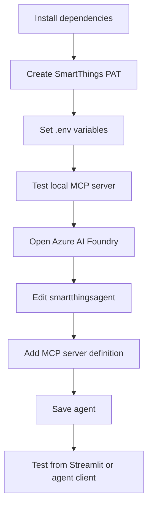
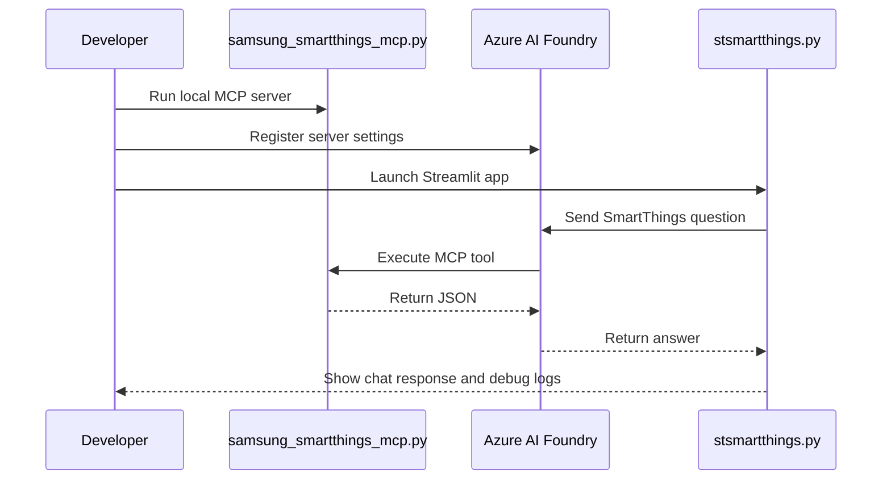

# Running the Samsung SmartThings MCP Server

This setup guide is stored in `docs/` so the SmartThings implementation, architecture, and operating steps stay together.

## Quick Start

### 1. Confirm the server entry point

The MCP server entry point is:

```text
../samsung_smartthings_mcp.py
```

### 2. Install runtime dependencies

```bash
pip install -r requirements.txt
pip install mcp aiohttp python-dotenv
```

### 3. Add credentials

Create or update `.env` in the repository root:

```bash
SAMSUNG_PAT=your-token-here
AZURE_AI_PROJECT=your-project-endpoint
```

### 4. Validate the local MCP server

```bash
python samsung_smartthings_mcp.py
```

If startup succeeds, stop it with `Ctrl+C`.

## Azure AI Foundry Setup Workflow



## Configure in Azure AI Foundry

1. Open Azure AI Foundry at `https://ai.azure.com`
2. Open the target project
3. Find the existing agent named `smartthingsagent`
4. Open the tool or MCP server configuration area
5. Add a local stdio MCP server using:
   - **Name**: `samsung-smartthings`
   - **Command**: `python`
   - **Arguments**: `samsung_smartthings_mcp.py`
   - **Working directory**: repository root
   - **Environment variables**:
     - `SAMSUNG_PAT=<your token>`
6. Save the agent

## Agent Instruction Guidance

Use instructions that tell the agent how to sequence the tools:

1. Call `get_devices` when the user asks what devices exist
2. Use the returned `device_id` values to call `get_device_logs`
3. Summarize capabilities and current status in plain language
4. Avoid inventing devices or capabilities that are not returned by the tool

## Validation Workflow



## Test the Streamlit Experience

```bash
streamlit run stsmartthings.py
```

Suggested prompts:
- `What SmartThings devices do I have?`
- `Show me more detail for device <device_id>`

## Expected Signals

When the flow is healthy, the debug panel in `stsmartthings.py` should show:
- Trace creation
- Agent lookup
- Response creation
- MCP approval requests when emitted by the Foundry agent
- Approval events
- Final response extraction

## Troubleshooting

### MCP server fails at startup
- Install `mcp`
- Confirm `.env` includes `SAMSUNG_PAT`
- Run from the repository root so relative paths resolve correctly

### Authentication issues
- Recreate the SmartThings PAT if needed
- Ensure it includes `r:devices:*`
- Verify the PAT belongs to the same SmartThings account that owns the devices

### Tools are not invoked
- Check the Foundry agent has the MCP server attached
- Check agent instructions mention the SmartThings tools
- Confirm the question actually requires device discovery or device details

## Related Documents

- [`SMARTTHINGS_MCP.md`](SMARTTHINGS_MCP.md)
- [`SMARTTHINGS_MCP_CONFIGURATION.md`](SMARTTHINGS_MCP_CONFIGURATION.md)
