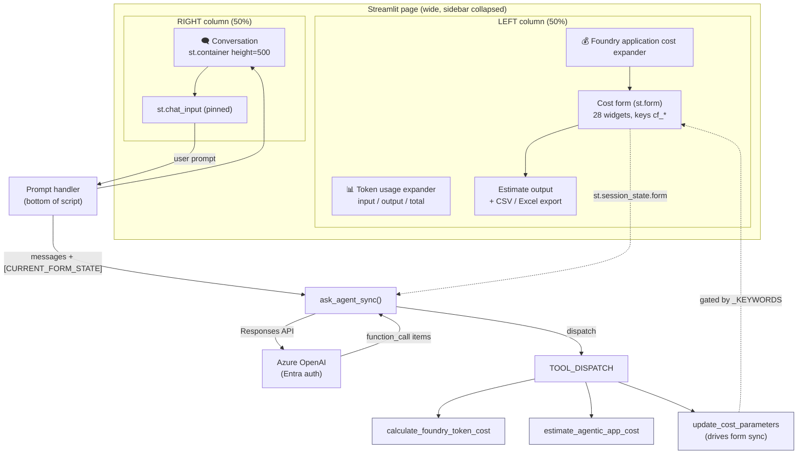
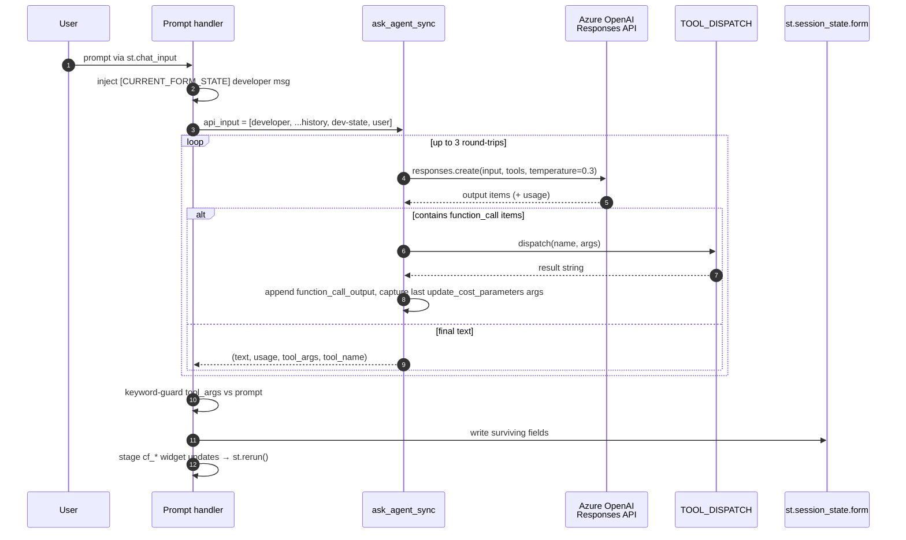
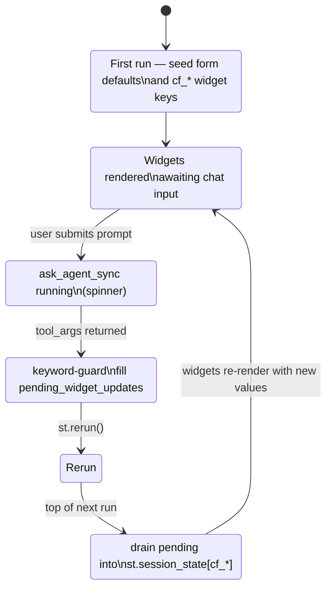
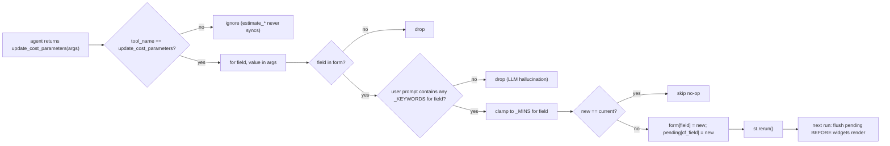
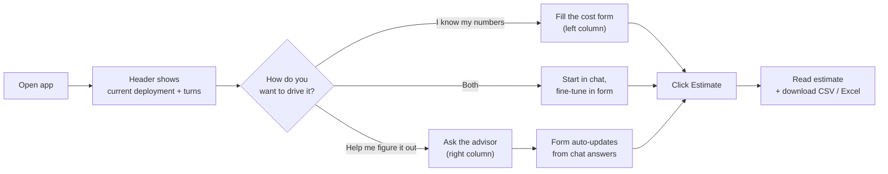
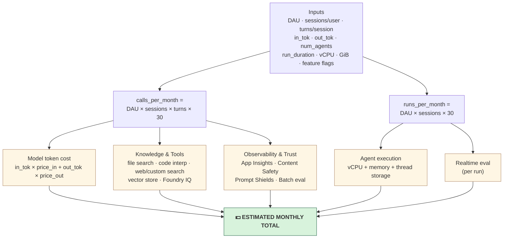

# stpricing.py — Microsoft Foundry Pricing & Agent Advisor

A single-page Streamlit application that combines an **interactive cost calculator**
for Microsoft Foundry agentic AI applications with a **chat advisor agent**
(Azure OpenAI Responses API + function calling). The chat agent can read and
mutate the calculator form through tool calls, keeping the UI and the
conversation perfectly in sync.

- **Source:** [stpricing.py](../stpricing.py)
- **Run:** `streamlit run stpricing.py`
- **Stack:** Streamlit · Azure OpenAI Responses API · Microsoft Entra (DefaultAzureCredential) · openpyxl / pandas (optional, for Excel export)

---

## 1. High-level architecture



Key idea: the LLM never writes Streamlit state directly. It expresses intent
through `update_cost_parameters(...)`, and the Python side gates those updates
against the user's latest message before applying them to the form.

---

## 2. File map

| Section | Lines (approx) | Purpose |
|---------|----------------|---------|
| Imports & `load_dotenv()` | 1–32 | Streamlit, Azure OpenAI SDK, Entra credentials |
| `st.set_page_config` + custom CSS | 35–60 | Compact "fits-on-one-screen" layout |
| `FOUNDRY_PRICING_PER_1K` | 67–80 | Per-1K-token list pricing for supported models |
| `EXTRA_FOUNDRY_FEES` | 82–110 | Non-token charges (agents, tools, search, eval) |
| `_resolve_model_key()` | 113–121 | Fuzzy model-name → pricing-table key |
| `calculate_foundry_token_cost()` | 127–138 | **Tool 1** — single-call token cost |
| `estimate_agentic_app_cost()` | 141–253 | **Tool 2** — full monthly app estimate |
| `update_cost_parameters()` | 259–264 | **Tool 3** — partial form sync from chat |
| `_build_cost_rows()` | 267–360 | Re-runs the math and returns rows for CSV/XLSX export |
| `SYSTEM_PROMPT` | 366–390 | Agent persona + strict tool-calling rules |
| `TOOLS_SCHEMA` | 392–490 | JSON schema published to the Responses API |
| `get_client()` (cached) | 497–506 | `AzureOpenAI` with Entra bearer token |
| `ask_agent_sync()` | 509–562 | Tool-calling loop, returns text + usage + last tool args |
| Session-state initialisation | 568–625 | `messages`, `usage_total`, `turns`, `form` defaults, pending widget flush |
| Header (title + model badge) | 631–650 | Top bar |
| Right column (chat) | 657–672 | Conversation container + `st.chat_input` |
| Left column (cost UI) | 673–805 | Token usage expander + cost form + export buttons |
| Prompt handler | 811–end  | Sends prompt, applies tool results, gates form sync |

---

## 3. Pricing tables

### 3.1 Token pricing — `FOUNDRY_PRICING_PER_1K`

USD per **1,000 tokens** for both input and output. The table is the single
source of truth for both tools and the live session-cost widget.

| Model | Input | Output |
|-------|------:|-------:|
| `gpt-4o` | $0.0025 | $0.0100 |
| `gpt-4o-mini` | $0.00015 | $0.0006 |
| `gpt-4.1` | $0.0020 | $0.0080 |
| `gpt-4.1-mini` | $0.0004 | $0.0016 |
| `gpt-4.1-nano` | $0.0001 | $0.0004 |
| `gpt-5` / `gpt-5-chat` | $0.0050 | $0.0150 |
| `gpt-5-mini` / `gpt-5.4-mini` | $0.0010 | $0.0030 |
| `o1` | $0.0150 | $0.0600 |
| `o3-mini` | $0.0011 | $0.0044 |

`_resolve_model_key(model)` normalises the user/agent's spelling: it lowercases,
then accepts an exact key or a prefix match either direction; failing that it
defaults to `gpt-4o-mini`.

### 3.2 Non-token fees — `EXTRA_FOUNDRY_FEES`

Grouped by capability:

- **Agent execution** — `agent_vcpu_per_hour` ($0.0994), `agent_memory_gib_per_hour` ($0.0118), `thread_storage_per_gb_month` ($0.10)
- **Knowledge & tools** — file-search vector storage ($0.11/GB/day, 1 GB free), code interpreter ($0.033/session), Bing/custom search ($14/1K txn), Foundry vector store ($0.10/GB/day), Azure AI Search Basic dedicated index ($75/mo)
- **Foundry IQ** — AI Search Basic / S1 / S2 ($75 / $250 / $1000 per month), agentic reasoning ($2.50/1K queries), retrieval token rates ($0.022 or $0.10 per 1M depending on reasoning level)
- **Observability & trust** — App Insights ingestion ($2.30/GB), Content Safety ($1.00/1K), realtime eval ($1.00/1K runs), batch eval ($0.80/1K rows), Prompt Shields ($0.75/1K), Red Team (free preview)

> Values are reasonable **estimation defaults** — overwrite them with your
> negotiated/committed pricing where it matters.

---

## 4. Tools exposed to the agent

The three tools are declared in `TOOLS_SCHEMA` and dispatched through
`TOOL_DISPATCH`.

### 4.1 `calculate_foundry_token_cost(model, input_tokens, output_tokens)`

Single model-call cost. Returns a one-line string:

```
Model=gpt-4o-mini | input=1200 tok @ $0.00015/1K = $0.00018 | output=300 tok @ $0.00060/1K = $0.00018 | total=$0.00036
```

### 4.2 `estimate_agentic_app_cost(...)`

Full monthly estimate. Required arguments: `use_case`, `model`,
`daily_active_users`, `sessions_per_user_per_day`, `turns_per_session`,
`avg_input_tokens_per_turn`, `avg_output_tokens_per_turn`. All other knobs
(number of agents, run duration, vCPU/memory, feature toggles, Foundry IQ
settings, etc.) are optional.

**Math overview** (per month, where `calls = DAU × sessions × turns × 30`):

| Bucket | Formula |
|--------|---------|
| Input token cost | `calls × avg_input_tok × price_in / 1000` |
| Output token cost | `calls × avg_output_tok × price_out / 1000` |
| vCPU | `runs × num_agents × (duration_sec / 3600) × vCPU × $0.0994` |
| Memory | `runs × num_agents × (duration_sec / 3600) × GiB × $0.0118` |
| Thread storage | `thread_gb × $0.10` |
| File-search storage | `max(vector_gb − 1, 0) × 30 × $0.11` |
| Code interpreter | `runs × $0.033` |
| Web / custom search | `calls / 1000 × $14` (each, if enabled) |
| Vector store | `vector_gb × 30 × $0.10` |
| Foundry IQ search | flat tier monthly fee |
| Foundry IQ reasoning | `queries / 1000 × $2.50` |
| Foundry IQ retrieval | `queries × ret_tok_per_query / 1e6 × rate` |
| App Insights | `gb × $2.30` |
| Content Safety / Prompt Shields | `calls / 1000 × $1.00 / $0.75` |
| Realtime eval | `total_runs / 1000 × $1.00` |
| Batch eval | `batch_rows / 1000 × $0.80` |

Returns a formatted multi-section text block; the same math also drives the CSV
/ Excel export via `_build_cost_rows()`.

> ⚠️ **Known quirk:** `_build_cost_rows()` reads `tier` from `kw` even when
> `uses_foundry_iq` is `False` (line ~344). It still works because there's an
> `else` branch that sets `tier`, but the IQ rows are emitted with `$0.00`
> regardless of whether IQ is enabled.

### 4.3 `update_cost_parameters(**kwargs)`

The form-sync hook. Accepts any subset of cost parameters. The function itself
just returns a confirmation string — the **real** effect happens in the prompt
handler, which mirrors the accepted keys into `st.session_state.form` (see
§7.3).

---

## 5. Agent runtime — `ask_agent_sync`

```python
client.responses.create(model=deployment, input=api_input, tools=TOOLS_SCHEMA, temperature=0.3)
```

Behaviour:

1. Prepends a `developer`-role system prompt (Responses API replacement for
   `system`).
2. Loops up to **3 round-trips**: any `function_call` items returned by the
   model are executed locally via `TOOL_DISPATCH`; results are appended as
   `function_call_output` items and the loop continues. The loop exits as soon
   as the model returns no function calls (i.e. a final text answer).
3. Aggregates `response.usage.input_tokens` + `output_tokens` across all
   round-trips.
4. Captures only the **last `update_cost_parameters`** call's arguments as
   `last_tool_args` / `last_tool_name`. `estimate_agentic_app_cost` is
   intentionally ignored for form sync because its required-everything contract
   would clobber user-tuned values.
5. Deployment is taken from `AZURE_OPENAI_CHAT_DEPLOYMENT_NAME` →
   `AZURE_OPENAI_DEPLOYMENT` → fallback `gpt-5.4-mini`.

Auth is via `DefaultAzureCredential` + `get_bearer_token_provider` against
`https://cognitiveservices.azure.com/.default`. No API keys are stored in code.

### 5.1 Tool-call round-trip loop



---

## 6. System prompt rules (`SYSTEM_PROMPT`)

Distilled:

1. Only call `update_cost_parameters` for fields **explicitly mentioned in the
   user's latest message** — never echo back unchanged values.
2. A `[CURRENT_FORM_STATE]` developer message is injected before each user turn
   so the agent always has the current calculator state.
3. Ask one short clarifying question if information is missing.
4. Call `estimate_agentic_app_cost` / `calculate_foundry_token_cost` once
   enough info exists.
5. Keep replies ≤180 words, bullet points where useful.

These rules are duplicated in code as a defensive **server-side keyword guard**
(§7.3), because LLMs sometimes ignore prompt instructions.

---

## 7. Streamlit UI flow

### 7.1 Layout

- Page is wide-mode with the sidebar collapsed; CSS shrinks the block-container
  padding and hides the Streamlit header/footer to fit a single screen.
- Two columns at 50/50 with a medium gap:
  - **Right** — conversation in a fixed-height (`500px`) bordered container, then
    `st.chat_input` pinned to the column.
  - **Left** — fixed-height (`600px`) container holding two expanders: token
    usage and the full cost form.

### 7.2 Session state

| Key | Shape | Purpose |
|-----|-------|---------|
| `messages` | `list[{role, content, usage?}]` | Chat history (assistant entries carry their per-turn usage dict) |
| `usage_total` | `{input, output, total}` | Cumulative tokens across the session |
| `turns` | `int` | Turn counter shown in header |
| `form` | `dict` (28 keys) | Source of truth for the cost calculator; mirrored to widget keys `cf_*` |
| `pending_widget_updates` | `dict[str, Any]` (transient) | Staged widget writes that get flushed at the **top** of the next run |

The pending-updates pattern is required because Streamlit forbids assigning to
`st.session_state[widget_key]` after the widget has been instantiated in the
same run. The handler stages updates after `ask_agent_sync` returns, calls
`st.rerun()`, and the very next run drains `pending_widget_updates` into
`session_state` before any widget renders.



### 7.3 Form-sync guard (the most important code in the file)

After each chat turn, the prompt handler:

1. Reads `tool_args` (only present when the agent called `update_cost_parameters`).
2. Lowercases the user's prompt.
3. For each `(field, value)` returned by the agent, checks `_KEYWORDS[field]`
   for at least one substring in the user's prompt. If none match, the field is
   **dropped** as an LLM hallucination.
4. Clamps numeric values to `_MINS[field]` (matches widget `min_value`).
5. Skips no-op writes where `form[field] == new_value`.
6. Persists surviving fields to `form` and stages a corresponding `cf_*` widget
   update in `pending_widget_updates`.
7. Calls `st.rerun()` so the widget keys are refreshed on the next pass.

This double-guard (system prompt + keyword whitelist) is what makes the chat
feel responsive without ever overwriting a value the user typed manually.



### 7.4 Cost form

A single `st.form("cost_form")` with two sub-columns (`cc1`, `cc2`):

- **Left sub-column:** use case + model + traffic (DAU, sessions, turns, in/out
  tokens) + agent execution (count, duration, vCPU, GiB).
- **Right sub-column:** Knowledge & Tools toggles + Foundry IQ + Observability
  & Trust.

On submit, every widget value is written back into `st.session_state.form`,
`estimate_agentic_app_cost` is called, the formatted result is shown in a
`st.code` block, and CSV / Excel download buttons are rendered. Excel export
falls back to disabled-CSV-button if `openpyxl` isn't installed.

### 7.5 Token usage panel

Live session totals (input / output / total) in three metrics, plus the last
five turns rendered as a small caption. The "Foundry application cost"
expander also computes a live `session_cost = tokens × pricing[model]` for the
**current deployment** (not the form's model) so users see real spending as the
conversation progresses.

---

## 8. Environment variables

| Variable | Required | Purpose |
|----------|:--------:|---------|
| `AZURE_OPENAI_ENDPOINT` | ✅ | Resource URL passed to `AzureOpenAI(azure_endpoint=...)` |
| `AZURE_OPENAI_CHAT_DEPLOYMENT_NAME` | ⭕ | Preferred deployment name; falls back to next |
| `AZURE_OPENAI_DEPLOYMENT` | ⭕ | Secondary fallback; final fallback hardcoded to `gpt-5.4-mini` |
| `AZURE_OPENAI_API_VERSION` | ⭕ | Defaults to `2025-03-01-preview` |

Auth uses **`DefaultAzureCredential`** (developer-friendly chain: env vars →
Azure CLI → VS Code → Managed Identity). The identity must have
**Cognitive Services User** (or stronger) on the Azure OpenAI resource.

---

## 9. Running locally

```powershell
# from repo root, with .venv already created
.\.venv\Scripts\Activate.ps1
pip install -r requirements.txt
az login                              # ensures DefaultAzureCredential works
$env:AZURE_OPENAI_ENDPOINT = "https://<your-resource>.openai.azure.com/"
$env:AZURE_OPENAI_CHAT_DEPLOYMENT_NAME = "gpt-5.4-mini"
streamlit run stpricing.py
```

Optional for Excel export: `pip install openpyxl pandas`.

---

## 10. How to use the page

Once `streamlit run stpricing.py` opens the app in your browser, you'll see a
single screen split 50/50: the **cost calculator** on the left and the **chat
advisor** on the right. You can drive an estimate purely through the form,
purely through chat, or any mix of the two.

### 10.1 First look



### 10.2 Workflow A — drive everything from the form

1. **Pick a model** in the *Model* selectbox (left column). Prices come from
   `FOUNDRY_PRICING_PER_1K`.
2. **Enter traffic**: daily active users, sessions per user per day, turns per
   session, average input/output tokens per turn.
3. **Configure agent execution**: number of agents per session, average run
   duration in seconds, vCPU cores, memory (GiB).
4. **Toggle Knowledge & Tools** you'll use — file search, code interpreter,
   web/custom search, vector store size in GB.
5. **(Optional) Enable Foundry IQ** — pick AI Search tier (`basic`/`s1`/`s2`),
   monthly query volume, reasoning level (`low`/`medium`), and average
   retrieval tokens per query.
6. **Toggle Observability & Trust** — Content Safety, Prompt Shields, realtime
   eval, batch eval (with monthly row count), App Insights GB/month.
7. **Click `Estimate`**. The full breakdown renders in a code block below the
   form, and two download buttons appear:
   - **📥 Export CSV** — always available
   - **📥 Export Excel** — only if `openpyxl` is installed (otherwise the
     button is disabled with a hint)

### 10.3 Workflow B — chat first

Type a question or scenario into the chat input at the bottom of the right
column. Examples that work well:

- *"Cost for a 1,000-user copilot using gpt-4o-mini with file search?"*
- *"I have 3 agents per session, each running about 15 seconds. How does that
  change the bill?"*
- *"Add Foundry IQ on S1 with 50,000 queries per month, medium reasoning."*
- *"Bump output tokens to 600 per turn."*
- *"Just price one call: 4,500 input tokens, 800 output, gpt-5-mini."*

What happens behind the scenes for each message:

1. The current form values are injected as a `[CURRENT_FORM_STATE]` developer
   note so the agent never re-asks what you've already set.
2. The agent calls `update_cost_parameters(...)` with **only the fields you
   mentioned**.
3. The keyword guard (`_KEYWORDS`) drops anything the agent tried to set that
   you didn't actually mention in your latest message.
4. Surviving fields are written into `st.session_state.form` and the
   corresponding widgets refresh on the next run.
5. The agent replies in ≤180 words, often with a cost summary and at most one
   clarifying question.

> Tip: the form is **the source of truth**. If chat-driven sync surprises you,
> open the form, tweak the widget, click `Estimate`, and that value will be
> the baseline for the next chat turn.

### 10.4 Workflow C — hybrid (recommended)

1. Open with a sentence in chat: *"Estimate a customer-support copilot, 2,000
   DAU, gpt-4.1-mini, file search on."*
2. Watch the form populate. Anything you didn't say keeps its default.
3. Fine-tune the form widgets manually (e.g., raise `Memory (GiB) per agent`
   to 8, or enable Prompt Shields).
4. Click `Estimate` to lock in the official breakdown and export.
5. Continue iterating in chat: *"What if traffic doubles?"* or *"Switch to
   gpt-5-mini and recompute."*

### 10.5 Reading the panels

- **📊 Token usage (session)** — three live metrics (input / output / total)
  plus a "Last turns" mini-log of the most recent five chat exchanges. This
  reflects **chat token consumption**, not the simulated app.
- **💰 Foundry application cost — Session cost** — what your *current chat
  session* has cost so far, using the **deployment's** pricing (top-right
  header), not the form's selected model.
- **💰 Foundry application cost — Full app estimate** — the simulated monthly
  cost from the form. Sections (model tokens / agent execution / knowledge &
  tools / observability & trust) sum to the **ESTIMATED TOTAL / MONTH** line.

### 10.6 Exporting estimates

After clicking `Estimate`:

- **CSV** — flat table with `Category | Line Item | Detail | Monthly Cost (USD)`,
  including subtotals per category and a `TOTAL` row.
- **Excel** — same data via `pandas.DataFrame.to_excel` to a single
  `Estimate` sheet. Requires `openpyxl`.

Use these to paste into a deck, share with finance, or diff against prior
estimates.

### 10.7 Troubleshooting

| Symptom | Likely cause | Fix |
|---------|--------------|-----|
| `⚠️ Agent error: ...` in chat | Endpoint, deployment, or Entra auth misconfigured | Check env vars; re-run `az login`; verify role assignment on the AOAI resource |
| Form value changed unexpectedly after chat | Your message contained a keyword in `_KEYWORDS` for that field | Re-enter the value in the form widget; it becomes the new baseline |
| Chat agent re-asks what you already set | `[CURRENT_FORM_STATE]` may have been clipped by a very long history | Reset by refreshing the page (session state clears) |
| "Export Excel" button is disabled | `openpyxl` not installed | `pip install openpyxl pandas` |
| Foundry IQ rows show $0 even when enabled | Known quirk in `_build_cost_rows` (see §4.2) — IQ totals still flow through the estimate text block | Trust the text estimate; CSV column is informational |
| Estimate seems too low/high vs. your contract | Default fees in `EXTRA_FOUNDRY_FEES` are list prices | Edit the table to match your committed pricing |

---

## 11. Extension points

| You want to… | Touch this |
|--------------|-----------|
| Add a new model | Insert a row in `FOUNDRY_PRICING_PER_1K` |
| Change a fee | Update `EXTRA_FOUNDRY_FEES` (also reflected in CSV via `_build_cost_rows`) |
| Add a new cost dimension | (a) extend `estimate_agentic_app_cost` math, (b) mirror in `_build_cost_rows`, (c) add field to `TOOLS_SCHEMA` for both `estimate_agentic_app_cost` and `update_cost_parameters`, (d) add a widget under the cost form with key `cf_<field>`, (e) seed default in `st.session_state.form`, (f) add a keyword tuple to `_KEYWORDS` so the agent can sync it |
| Add a new tool the agent can call | (a) implement the Python function, (b) register it in `TOOL_DISPATCH`, (c) add the JSON schema to `TOOLS_SCHEMA`, (d) decide whether it should drive form sync (only `update_cost_parameters` does today) |
| Change the agent persona | Edit `SYSTEM_PROMPT` |
| Increase tool-call depth | Bump the `for _ in range(3)` loop in `ask_agent_sync` |

---

## 12. Security & data handling notes

- ✅ **No secrets in code** — uses Entra ID via `DefaultAzureCredential`.
- ✅ **No outbound calls** beyond Azure OpenAI; all pricing math is local.
- ⚠️ **Prompt injection surface** — the chat content is fed back into the model
  on every turn. The system prompt is locked to pricing/Foundry topics, but the
  agent will still answer arbitrary questions. If you embed this in a customer
  surface, harden the system prompt (refusal rules + topic gating) and consider
  enabling Prompt Shields on the deployment.
- ⚠️ **CSV export is user-controlled content** — values come from
  `st.session_state.form`, which the LLM can mutate. If you persist these
  estimates server-side, validate the numeric ranges before storing.

---

## 13. Glossary

- **Foundry IQ** — Azure AI Search + agentic reasoning bundle; priced as the
  Search tier (flat monthly) plus per-query reasoning and per-1M retrieval
  tokens.
- **Realtime eval** — evaluation that runs on **every** agent execution; cost
  scales with `total_agent_runs_month`.
- **Batch eval** — offline evaluation against a fixed dataset; cost scales with
  `batch_eval_rows_per_month`.
- **Thread storage** — Foundry's per-thread message persistence; billed
  per-GB-month.

---

## 14. Cost model at a glance


